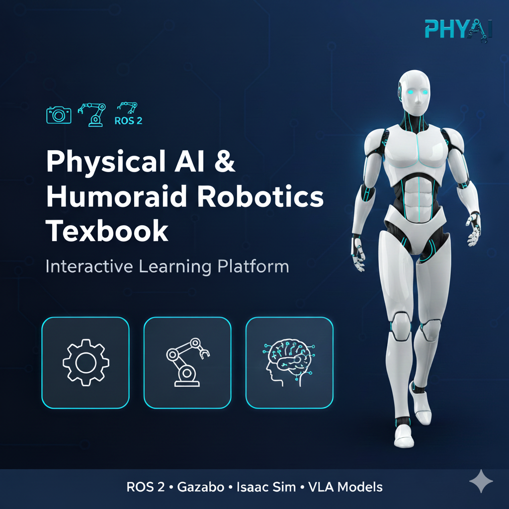

# 🤖 Physical AI & Humanoid Robotics Textbook

📚 Interactive textbook for learning [**Physical AI and Humanoid Robotics development**](https://mohsin-raza-developer.github.io/Physical-AI-Humanoid-Robotics-Textbook/) with ROS 2, Gazebo, Isaac Sim, and Vision-Language-Action models.



[](https://github.com/Mohsin-Raza-developer/Physical-AI-Humanoid-Robotics-Textbook/actions)
[](LICENSE)
[](https://mohsin-raza-developer.github.io/Physical-AI-Humanoid-Robotics-Textbook/)
[](https://github.com/Mohsin-Raza-developer/Physical-AI-Humanoid-Robotics-Textbook/commits/main)

## About

This open-source textbook teaches Physical AI and Humanoid Robotics fundamentals using ROS 2, Gazebo, Isaac Sim, and Vision-Language-Action models. Designed for students and professionals seeking to master embodied artificial intelligence and robot control systems.

**🚀 Live Textbook**: [Physical AI & Humanoid Robotics Textbook](https://mohsin-raza-developer.github.io/Physical-AI-Humanoid-Robotics-Textbook/)

## Features

- ✅ **Interactive Docusaurus-based textbook** - Rich, navigable content with search functionality
- ✅ **13-week structured curriculum** - Comprehensive learning path from basics to advanced concepts
- ✅ **Hands-on ROS 2, Gazebo, Isaac Sim tutorials** - Practical exercises with real-world applications
- ✅ **Real-world humanoid robotics examples** - Application-focused learning with industry-relevant scenarios
- 🚧 **RAG Chatbot (Coming Soon)** - AI-powered learning assistant with course content access
- 🚧 **Personalized content (Coming Soon)** - Adaptive learning paths based on skill level and interests

## Modules

| Module | Title | Description |
|--------|-------|-------------|
| 1 | **ROS 2 Fundamentals** | Learn ROS 2 architecture, nodes, topics, services, actions, launch files, and URDF for robot modeling |
| 2 | **Simulation with Gazebo/Unity** | Master robot simulation environments, physics engines, sensor modeling, and world creation |
| 3 | **Isaac Robot Framework** | Build and deploy robotic applications using NVIDIA Isaac Sim with comprehensive robot models |
| 4 | **Vision-Language-Action Models** | Explore VLA models for embodied AI and real-world interaction capabilities |

## Tech Stack

- **Documentation Framework**: Docusaurus v3 for static site generation
- **Robotics Framework**: ROS 2 Humble Hawksbill (LTS)
- **Programming Languages**: Python 3.10+, C++
- **Visualization**: Mermaid.js for diagrams and charts
- **Deployment**: GitHub Pages
- **CI/CD**: GitHub Actions for automated builds and deployments

## Getting Started

### View Online

Visit the live textbook at: [https://mohsin-raza-developer.github.io/Physical-AI-Humanoid-Robotics-Textbook/](https://mohsin-raza-developer.github.io/Physical-AI-Humanoid-Robotics-Textbook/)

### Local Development

To run the textbook locally for development or offline viewing:

1. **Clone the repository:**
   ```bash
   git clone https://github.com/Mohsin-Raza-developer/Physical-AI-Humanoid-Robotics-Textbook.git
   cd Physical-AI-Humanoid-Robotics-Textbook
   ```

2. **Install dependencies:**
   ```bash
   npm install
   ```

3. **Start development server:**
   ```bash
   npm start
   ```

4. **Open your browser** and navigate to [http://localhost:3000](http://localhost:3000)

### Build for Production

To build the static site for deployment:

```bash
npm run build
```

## Contributing

We welcome contributions to improve this textbook! 

### How to Help

- **Report Issues**: Found a typo, error, or have a suggestion? [Open an issue](https://github.com/Mohsin-Raza-developer/Physical-AI-Humanoid-Robotics-Textbook/issues/new)
- **Submit Fixes**: Fork the repository, make improvements, and create a pull request
- **Add Content**: Contribute new lessons, exercises, or examples
- **Review Content**: Help review and improve existing content for accuracy and clarity


## License

This project is licensed under the MIT License - see the [LICENSE](LICENSE) file for details.

## Acknowledgments

- **Docusaurus** - Static site generator for documentation
- **ROS 2 Community** - Robot Operating System developers and maintainers
- **Open Robotics** - For the continued development of ROS ecosystem
- **NVIDIA Isaac** - For the Isaac Sim platform
- **GitHub Pages** - For hosting the live textbook
- **All contributors** - For improving the quality and accuracy of this textbook