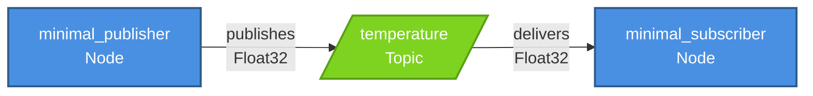

# ROS 2 Architecture

**Estimated Time**: 40 minutes

:::info Prerequisites
Before starting this lesson, ensure you have:
- Completed "Weeks 1-2: Physical AI Foundations"
- Basic Python programming knowledge (functions, classes, loops)
- ROS 2 Humble installed on Ubuntu 22.04 (or WSL2/Docker)
- Terminal/command-line familiarity
- Text editor (VS Code, Sublime Text, or nano)
:::

## Learning Objectives

After completing this lesson, you will be able to:
- Understand the ROS 2 architecture and how it differs from traditional programming
- Explain the role of nodes, topics, and the publish-subscribe pattern
- Identify the components of the ROS 2 graph
- Create basic publisher and subscriber nodes in Python
- Run and verify ROS 2 nodes using command-line tools

---

## 1. Real-World Analogy: Restaurant Kitchen

Before diving into technical details, let's understand ROS 2 through a familiar scenario.

Imagine a busy restaurant kitchen during dinner service. The head chef (a node) calls out orders as they come in, the sous chef (another node) prepares ingredients and announces when prep is complete, and the line cook (yet another node) plates the dishes and calls out when meals are ready for service. Each person has a specific role and communicates by calling out information to the kitchen.

Here's the key: they don't hand things to each other directly. Instead, they announce information on the "pass"—the counter where completed dishes are placed (this is like a topic). Anyone who needs that information listens for it. The sous chef doesn't need to know which line cook will use the prepped vegetables; they just announce "vegetables ready!" and whoever needs them takes them. The line cook doesn't care who prepped the garnish; they just listen for "garnish ready!" and use it.

This loose coupling is powerful: if a new pastry chef joins the team, they can start listening for ingredients they need without the sous chef changing how they work. If the head chef leaves and a new one arrives, the kitchen keeps running because everyone still communicates through the same "pass."

:::tip In ROS 2 Terms
**Nodes** are independent programs that communicate by **publishing messages** to **topics** (the "pass") and **subscribing to topics** to receive messages. Publishers don't need to know who's listening, and subscribers don't need to know who's publishing. This decoupled architecture makes robot systems flexible and scalable.
:::

---

## 2. Technical Concepts

### 2.1 What is ROS 2?

**ROS 2** (Robot Operating System 2) is not an operating system in the traditional sense. It's a **middleware framework** that provides communication infrastructure for distributed robot systems. Think of it as the nervous system that coordinates all parts of a robot.

**Key Characteristics**:
- **Middleware, not an OS**: ROS 2 runs on top of Linux, Windows, or macOS
- **Communication layer**: Connects sensors, actuators, processing, and AI algorithms
- **Built on DDS**: Uses Data Distribution Service for real-time, reliable communication
- **Language-agnostic**: Supports Python, C++, and other languages
- **Distributed**: Components can run on different machines or processors
- **Industry standard**: Widely used in research, industry, and production robotics

**ROS 2 vs. ROS 1**: ROS 2 is the successor to ROS 1, with improved real-time performance, security, multi-platform support, and production-ready features. If you're starting new projects, always use ROS 2.

---

### 2.2 The ROS 2 Graph

The **ROS 2 graph** is the network of all running nodes and their connections through topics, services, and actions. For now, we'll focus on the most common pattern: **nodes communicating via topics**.

**Graph Components**:

1. **Nodes**: Independent executables (Python scripts, C++ programs) that perform specific tasks
2. **Topics**: Named channels for one-way, asynchronous data flow
3. **Publishers**: Send messages to topics
4. **Subscribers**: Receive messages from topics
5. **Messages**: Typed data structures (Float32, String, Image, LaserScan, etc.)

**Visualization**: You can see the live ROS 2 graph using command-line tools:
```bash
ros2 node list        # List all running nodes
ros2 topic list       # List all active topics
ros2 topic echo /temp # Show messages on a topic
rqt_graph            # Visual graph (GUI tool)
```

**Behind the scenes**: ROS 2 uses **DDS** (Data Distribution Service) as the underlying middleware layer. DDS handles discovery, message routing, and Quality of Service (QoS) settings. As a beginner, you rarely interact with DDS directly—ROS 2 abstracts it for you.

---

### 2.3 Nodes

A **node** is a process that performs a specific computational task. In our restaurant analogy, each person (chef, sous chef, line cook) is a node.

**Examples of Real Robot Nodes**:
- **Camera driver node**: Publishes images from a camera sensor
- **Object detection node**: Subscribes to images, runs AI model, publishes bounding boxes
- **Motor controller node**: Subscribes to velocity commands, controls motors
- **Path planner node**: Subscribes to sensor data, publishes navigation goals

**Node Characteristics**:
- **Unique names**: Each node has a unique name in the ROS 2 graph (e.g., `camera_node`, `motor_controller`)
- **Namespaces**: You can organize nodes hierarchically: `/robot1/camera`, `/robot2/camera`
- **Lifecycle**: Nodes initialize, run (spin), and shut down gracefully

**Basic Node Lifecycle**:
```python
rclpy.init()                    # 1. Initialize ROS 2
node = Node('my_node_name')     # 2. Create node
rclpy.spin(node)                # 3. Keep node running (process messages/callbacks)
node.destroy_node()             # 4. Clean up
rclpy.shutdown()                # 5. Shutdown ROS 2
```

---

### 2.4 Topics and Messages

**Topics** are named channels that allow nodes to exchange data asynchronously. In our restaurant analogy, the "pass" counter is a topic where completed dishes (messages) are placed.

**Key Properties of Topics**:
- **Named channels**: Topics have names like `/temperature`, `/camera/image`, `/cmd_vel`
- **Typed**: Each topic has a specific message type (Float32, String, Image, etc.)
- **Unidirectional**: Data flows one way—from publishers to subscribers
- **Many-to-many**: One publisher can send to many subscribers, and one topic can have many publishers

**Message Types**:

ROS 2 provides standard message types organized into packages:

| Package | Message Type | Use Case | Example Field |
|---------|--------------|----------|---------------|
| `std_msgs` | `Float32`, `String`, `Int32` | Simple data | `data: 20.5` |
| `geometry_msgs` | `Twist`, `Pose`, `Point` | Robot motion | `linear.x: 0.5` |
| `sensor_msgs` | `Image`, `LaserScan`, `Imu` | Sensor data | `ranges: [0.5, 0.6, ...]` |
| Custom | `SensorData.msg` | Your own types | User-defined fields |

**Topic Naming Conventions**:
- Use descriptive names: `/temperature`, not `/t`
- Use underscores for multi-word topics: `/motor_speed`, `/battery_status`
- Avoid spaces and special characters
- Start with `/` for absolute names

---

### 2.5 Publisher-Subscriber Pattern

The **publish-subscribe pattern** (pub-sub) is the most common communication pattern in ROS 2. It enables **loose coupling** between components.

**How It Works**:
1. **Publisher** creates a topic and publishes messages to it
2. **Topic** exists as a named channel in the ROS 2 graph
3. **Subscriber(s)** subscribe to the topic by name
4. Messages flow: Publisher → Topic → Subscriber(s)

**Key Benefits**:
- **Asynchronous**: Publisher sends messages without waiting for subscribers
- **Decoupled**: Publishers and subscribers don't know about each other
- **Scalable**: Easy to add new publishers or subscribers without code changes
- **Flexible**: You can change who publishes/subscribes by just running different nodes

**Comparison to Other Patterns**:
- **vs. Direct function calls**: Pub-sub allows distribution across processes/machines
- **vs. Services** (covered in Week 4): Topics are one-way and async; services are request-response
- **vs. Actions** (covered in Week 4): Topics are continuous; actions are goal-oriented with feedback

**QoS (Quality of Service)**: Advanced topic for controlling reliability, durability, and history. We'll use default QoS settings for now.

---

## 3. Code Examples

Now let's see the pub-sub pattern in action with Python code.

### Example 1: Temperature Sensor Publisher

This node simulates a temperature sensor that publishes readings every second.

```python title="temp_publisher.py"
#!/usr/bin/env python3
"""
Temperature Sensor Publisher Example
=====================================
This node simulates a temperature sensor that publishes readings to a topic.

Expected Output:
  [INFO] [minimal_publisher]: Publishing temperature: 20.0°C
  [INFO] [minimal_publisher]: Publishing temperature: 20.1°C
  [INFO] [minimal_publisher]: Publishing temperature: 20.2°C
  ...
"""

# Import the ROS 2 Python library
import rclpy
from rclpy.node import Node

# Import the message type we'll use (Float32 for temperature)
from std_msgs.msg import Float32


class MinimalPublisher(Node):
    """
    A simple ROS 2 node that publishes temperature readings.

    This node demonstrates the basic publish-subscribe pattern by
    simulating a temperature sensor that sends readings every second.
    """

    def __init__(self):
        """Initialize the publisher node."""
        # Call the parent class (Node) constructor with the node name
        # This name will appear in 'ros2 node list'
        super().__init__('minimal_publisher')

        # Create a publisher that sends Float32 messages on the 'temperature' topic
        # The '10' is the queue size - how many messages to buffer if subscriber is slow
        self.publisher_ = self.create_publisher(Float32, 'temperature', 10)

        # Create a timer that calls timer_callback every 1.0 seconds
        # This is how we publish data at regular intervals
        self.timer = self.create_timer(1.0, self.timer_callback)

        # Initialize our temperature counter (starts at 20.0°C)
        self.counter = 0.0

        # Log that the publisher has started
        self.get_logger().info('Temperature Publisher started - publishing to "temperature" topic')

    def timer_callback(self):
        """
        This function is called every second by the timer.
        It creates a message, fills it with data, and publishes it.
        """
        # Create a new Float32 message
        msg = Float32()

        # Set the temperature value (base temperature + counter)
        msg.data = 20.0 + self.counter

        # Publish the message to the 'temperature' topic
        self.publisher_.publish(msg)

        # Log the published value so we can see what's happening
        self.get_logger().info(f'Publishing temperature: {msg.data:.1f}°C')

        # Increment the counter for the next reading (simulates temperature change)
        self.counter += 0.1


def main(args=None):
    """
    Main function that initializes ROS 2 and runs the publisher node.
    """
    # Initialize the ROS 2 Python library
    # This MUST be called before creating any nodes
    rclpy.init(args=args)

    # Create an instance of our MinimalPublisher node
    node = MinimalPublisher()

    # Keep the node running and processing callbacks (like our timer)
    # This will run until interrupted (Ctrl+C)
    try:
        rclpy.spin(node)
    except KeyboardInterrupt:
        # Handle Ctrl+C gracefully
        node.get_logger().info('Publisher stopped by user')

    # Clean up the node
    node.destroy_node()

    # Shutdown the ROS 2 Python library
    rclpy.shutdown()


# This ensures main() only runs when the script is executed directly
# (not when imported as a module)
if __name__ == '__main__':
    main()
```

**How to Run**:
```bash
# Source ROS 2 environment
source /opt/ros/humble/setup.bash

# Run the publisher
python3 temp_publisher.py
```

**Expected Output**:
```
[INFO] [minimal_publisher]: Temperature Publisher started - publishing to "temperature" topic
[INFO] [minimal_publisher]: Publishing temperature: 20.0°C
[INFO] [minimal_publisher]: Publishing temperature: 20.1°C
[INFO] [minimal_publisher]: Publishing temperature: 20.2°C
...
```

---

### Example 2: Temperature Display Subscriber

This node listens to temperature readings and displays them.

```python title="temp_subscriber.py"
#!/usr/bin/env python3
"""
Temperature Display Subscriber Example
=======================================
This node listens to temperature readings published on a topic and displays them.

Expected Output:
  [INFO] [minimal_subscriber]: Received temperature: 20.0°C
  [INFO] [minimal_subscriber]: Received temperature: 20.1°C
  [INFO] [minimal_subscriber]: Received temperature: 20.2°C
  ...
"""

# Import the ROS 2 Python library
import rclpy
from rclpy.node import Node

# Import the message type we'll receive (Float32 for temperature)
from std_msgs.msg import Float32


class MinimalSubscriber(Node):
    """
    A simple ROS 2 node that subscribes to temperature readings.

    This node demonstrates how to receive messages from a topic by
    listening to the 'temperature' topic and displaying each reading.
    """

    def __init__(self):
        """Initialize the subscriber node."""
        # Call the parent class (Node) constructor with the node name
        # This name will appear in 'ros2 node list'
        super().__init__('minimal_subscriber')

        # Create a subscription to the 'temperature' topic
        # - Float32: The message type we expect to receive
        # - 'temperature': The topic name (must match the publisher's topic)
        # - listener_callback: The function to call when a message arrives
        # - 10: Queue size - how many messages to buffer if processing is slow
        self.subscription = self.create_subscription(
            Float32,
            'temperature',
            self.listener_callback,
            10
        )

        # Prevent unused variable warning
        # (subscription needs to be stored to prevent garbage collection)
        self.subscription

        # Log that the subscriber has started
        self.get_logger().info('Temperature Subscriber started - listening to "temperature" topic')

    def listener_callback(self, msg):
        """
        This function is called automatically whenever a message arrives.

        Args:
            msg: The received Float32 message containing temperature data
        """
        # Extract the temperature value from the message
        temperature = msg.data

        # Display the received temperature
        self.get_logger().info(f'Received temperature: {temperature:.1f}°C')

        # Optional: You could add logic here to:
        # - Store temperatures in a list for averaging
        # - Trigger an alert if temperature exceeds a threshold
        # - Convert to Fahrenheit: (temperature * 9/5) + 32
        # - Publish the data to another topic


def main(args=None):
    """
    Main function that initializes ROS 2 and runs the subscriber node.
    """
    # Initialize the ROS 2 Python library
    # This MUST be called before creating any nodes
    rclpy.init(args=args)

    # Create an instance of our MinimalSubscriber node
    node = MinimalSubscriber()

    # Keep the node running and processing incoming messages
    # This will run until interrupted (Ctrl+C)
    try:
        rclpy.spin(node)
    except KeyboardInterrupt:
        # Handle Ctrl+C gracefully
        node.get_logger().info('Subscriber stopped by user')

    # Clean up the node
    node.destroy_node()

    # Shutdown the ROS 2 Python library
    rclpy.shutdown()


# This ensures main() only runs when the script is executed directly
# (not when imported as a module)
if __name__ == '__main__':
    main()
```

**How to Run** (in a second terminal):
```bash
# Source ROS 2 environment
source /opt/ros/humble/setup.bash

# Run the subscriber
python3 temp_subscriber.py
```

**Expected Output**:
```
[INFO] [minimal_subscriber]: Temperature Subscriber started - listening to "temperature" topic
[INFO] [minimal_subscriber]: Received temperature: 20.0°C
[INFO] [minimal_subscriber]: Received temperature: 20.1°C
[INFO] [minimal_subscriber]: Received temperature: 20.2°C
...
```

:::tip Running Both Together
Open two terminal windows side by side. Run the publisher in Terminal 1 and the subscriber in Terminal 2. You'll see the subscriber display the same values the publisher is sending—demonstrating the publish-subscribe pattern in action!
:::

---

## 4. Visualization: ROS 2 Graph

The diagram below shows how our temperature publisher and subscriber communicate through the `/temperature` topic:



**Diagram Explanation**:
- **Blue rectangles**: ROS 2 nodes (our publisher and subscriber)
- **Green cylinder**: The `/temperature` topic acting as a message bus
- **Arrows**: Direction of data flow (publisher → topic → subscriber)
- **Labels**: Message type (`Float32`) being transmitted

**Key Insights from the Diagram**:
1. **Decoupling**: The publisher and subscriber don't connect directly—they only know the topic name
2. **One-to-Many**: If we added another subscriber, it would also receive messages from the same topic
3. **Asynchronous**: The publisher sends messages without waiting for the subscriber to process them
4. **Type Safety**: Both must use the same message type (`Float32`) or communication fails

---

## 5. Hands-on Exercise: Build a Temperature Monitoring System

Now it's your turn to build a ROS 2 publisher and subscriber from scratch!

**Objective**: Create a temperature monitoring system where one node publishes simulated sensor data and another node displays it.

**Estimated Time**: 20 minutes

---

### Setup

**Step 1**: Create a workspace directory
```bash
mkdir -p ~/ros2_temperature_ws
cd ~/ros2_temperature_ws
```

**Step 2**: Source ROS 2 environment
```bash
source /opt/ros/humble/setup.bash
```

**Step 3**: Verify ROS 2 is sourced
```bash
ros2 --version
```
**Expected Output**: `ros2 cli version: 0.18.x`

---

### Instructions

#### Task 1: Create the Temperature Publisher

Create a file named `temp_publisher.py` with the following requirements:

**Requirements**:
- **Node name**: `temperature_publisher`
- **Topic**: `temperature` (type: `std_msgs/Float32`)
- **Publish rate**: 1 Hz (every 1 second)
- **Temperature simulation**: Start at 20.0°C, increase by 0.1°C each message
- **Logging**: Log each published temperature value

**Hints**:
- Import: `from std_msgs.msg import Float32`
- Use `self.create_publisher(Float32, 'temperature', 10)`
- Use `self.create_timer(1.0, self.timer_callback)` for 1 Hz publishing
- Create a counter variable to track temperature increments

:::warning Important
Don't forget to call `rclpy.init()` before creating the node and `rclpy.spin()` to keep it running!
:::

---

#### Task 2: Create the Temperature Subscriber

Create a file named `temp_subscriber.py` with the following requirements:

**Requirements**:
- **Node name**: `temperature_subscriber`
- **Topic**: `temperature` (type: `std_msgs/Float32`)
- **Callback**: Display received temperature values
- **Logging**: Use `self.get_logger().info()` to print values

**Hints**:
- Use `self.create_subscription(Float32, 'temperature', self.listener_callback, 10)`
- Access message data with `msg.data`
- The callback function receives one parameter: the message

:::warning Important
Make sure the topic name matches exactly between publisher and subscriber (case-sensitive)!
:::

---

#### Task 3: Make Scripts Executable (Optional)

```bash
chmod +x temp_publisher.py temp_subscriber.py
```

Add shebang line at the top of each file:
```python
#!/usr/bin/env python3
```

---

### Validation

**Test Your Solution**:

**Terminal 1 - Start Publisher**:
```bash
cd ~/ros2_temperature_ws
source /opt/ros/humble/setup.bash
python3 temp_publisher.py
```

**Terminal 2 - Start Subscriber**:
```bash
cd ~/ros2_temperature_ws
source /opt/ros/humble/setup.bash
python3 temp_subscriber.py
```

**Expected Output**:

**Terminal 1 (Publisher)**:
```
[INFO] [temperature_publisher]: Publishing temperature: 20.0°C
[INFO] [temperature_publisher]: Publishing temperature: 20.1°C
[INFO] [temperature_publisher]: Publishing temperature: 20.2°C
...
```

**Terminal 2 (Subscriber)**:
```
[INFO] [temperature_subscriber]: Received temperature: 20.0°C
[INFO] [temperature_subscriber]: Received temperature: 20.1°C
[INFO] [temperature_subscriber]: Received temperature: 20.2°C
...
```

**Verification Checklist**:
- ✅ Publisher logs show temperature values increasing by 0.1°C
- ✅ Subscriber logs show same values as publisher (with slight delay)
- ✅ No error messages about topics not found
- ✅ Both nodes run continuously until you press Ctrl+C
- ✅ Temperature values match between publisher and subscriber

---

### Common Mistakes and Troubleshooting

#### Mistake 1: "Package 'std_msgs' not found"

**Symptom**:
```
ModuleNotFoundError: No module named 'std_msgs'
```

**Cause**: ROS 2 environment not sourced in current terminal

**Solution**:
```bash
source /opt/ros/humble/setup.bash
# Then run your script again
python3 temp_publisher.py
```

**Prevention**: Add to `~/.bashrc` to source automatically:
```bash
echo "source /opt/ros/humble/setup.bash" >> ~/.bashrc
```

---

#### Mistake 2: Subscriber Receives Nothing

**Symptom**: Publisher shows output, but subscriber terminal is silent

**Possible Causes**:
- Topic name mismatch (publisher uses `temperature`, subscriber uses `temp`)
- Subscriber started before publisher and QoS mismatch
- Not calling `rclpy.spin()`

**Solution**:

1. Check topic names match exactly:
   ```bash
   ros2 topic list
   ```
   Should show `/temperature`

2. Verify messages are being published:
   ```bash
   ros2 topic echo /temperature
   ```

3. Ensure `rclpy.spin(node)` is in subscriber's `main()` function

**Prevention**: Use string constants for topic names in both files

---

#### Mistake 3: "Node has already been added to an executor"

**Symptom**:
```
RuntimeError: Node has already been added to an executor
```

**Cause**: Calling `rclpy.spin()` multiple times or not properly shutting down node

**Solution**: Only call `rclpy.spin(node)` once and ensure proper shutdown:
```python
try:
    rclpy.spin(node)
except KeyboardInterrupt:
    pass
finally:
    node.destroy_node()
    rclpy.shutdown()
```

---

#### Mistake 4: Temperature Doesn't Increase

**Symptom**: Same temperature value published repeatedly (20.0, 20.0, 20.0...)

**Cause**: Forgot to increment counter variable or using wrong variable

**Solution**:
- Ensure you have a counter as instance variable: `self.counter = 0.0`
- Increment in timer callback: `self.counter += 0.1`
- Use counter in temperature: `msg.data = 20.0 + self.counter`

---

#### Mistake 5: "rclpy.init() has already been called"

**Symptom**:
```
RuntimeError: rclpy.init() has already been called
```

**Cause**: Calling `rclpy.init()` multiple times without shutdown

**Solution**:
- Only call `rclpy.init()` once in `main()` function
- Remove any duplicate `rclpy.init()` calls
- Ensure `rclpy.shutdown()` is called before re-initializing

---

### Extension Ideas (Advanced Challenges)

For students who finish early or want extra practice:

**Extension 1: Add Temperature Alert Threshold**
- Modify subscriber to print a warning when temperature exceeds 25.0°C
- Use colored output (red) for alerts
- Example: `[WARNING] Temperature critical: 25.2°C`

**Extension 2: Add Temperature Statistics**
- Track minimum, maximum, and average temperature in subscriber
- Print statistics every 10 messages
- Calculate running average

**Extension 3: Create a Second Publisher (Multi-Sensor)**
- Create a second publisher node for humidity data
- Publish humidity on `/humidity` topic
- Modify subscriber to subscribe to both topics

**Extension 4: Add Timestamp to Messages**
- Use ROS 2's `Header` message type
- Include timestamp in each published message
- Display timestamp in subscriber along with temperature
- Calculate message latency

---

## Check Your Understanding

Test your knowledge with these questions. Try to answer them before viewing the solutions!

**Question 1**: What is the difference between a node and a topic in ROS 2?

**Question 2**: In the publisher-subscriber pattern, does the publisher need to know how many subscribers are listening to a topic?

**Question 3**: What would happen if you start the subscriber before the publisher? Will messages be lost?

**Question 4**: Why is it important to call `rclpy.spin()` in your ROS 2 program?

**Question 5**: If you have two publishers sending messages to the same topic, what happens? Can a subscriber receive messages from both?

<details>
<summary>📖 View Answers</summary>

**Answer 1**: A **node** is a process (program) that performs computation, like a temperature sensor or motor controller. A **topic** is a named channel (like a message bus) that nodes use to send and receive messages. Nodes are active entities that run code, while topics are passive communication channels.

**Answer 2**: No, the publisher does not need to know how many (if any) subscribers are listening. This is called "loose coupling." The publisher just sends messages to the topic regardless of who's listening. This makes the system flexible—you can add or remove subscribers without changing the publisher code.

**Answer 3**: It depends on QoS (Quality of Service) settings. With default settings (volatile durability), messages published before a subscriber joins are lost. However, if you use "transient local" durability, the subscriber can receive recent messages even if it wasn't running when they were published. The connection may take a moment to establish, so very early messages might be missed.

**Answer 4**: `rclpy.spin()` keeps your node running and processes incoming messages, timers, and callbacks. Without it, your program would execute the setup code and then immediately exit, so subscribers wouldn't receive any messages and timers wouldn't fire. Think of `spin()` as the main loop that keeps your robot program alive.

**Answer 5**: Yes, multiple publishers can send to the same topic, and yes, a subscriber will receive messages from all of them. The subscriber can't tell which publisher sent each message unless you include that information in the message itself (like a sender ID field). Messages are interleaved in the order they arrive at the subscriber.

</details>

---

## Additional Resources

**Official ROS 2 Documentation**:
- [Understanding ROS 2 Nodes](https://docs.ros.org/en/humble/Tutorials/Beginner-CLI-Tools/Understanding-ROS2-Nodes/Understanding-ROS2-Nodes.html)
- [Understanding ROS 2 Topics](https://docs.ros.org/en/humble/Tutorials/Beginner-CLI-Tools/Understanding-ROS2-Topics/Understanding-ROS2-Topics.html)
- [Writing a Simple Publisher and Subscriber (Python)](https://docs.ros.org/en/humble/Tutorials/Beginner-Client-Libraries/Writing-A-Simple-Py-Publisher-And-Subscriber.html)

**Community Resources**:
- [ROS Answers - Topic Communication](https://answers.ros.org/questions/scope:all/sort:activity-desc/tags:ros2-topics/)
- [ROS 2 Examples Repository](https://github.com/ros2/examples/tree/humble/rclpy)

**Video Tutorials** (External):
- The Construct - ROS 2 Basics
- ROS 2 Official Tutorials Playlist

---

## Next Lesson

**[Week 3 Lesson 2: Nodes and Packages →](./week-3-lesson-2-nodes-packages)**

In the next lesson, you'll learn how to:
- Organize code into ROS 2 packages
- Use the colcon build system
- Understand package structure (`package.xml`, `setup.py`)
- Create a workspace with multiple packages
- Build and install ROS 2 packages
