# Nodes and Packages

**Estimated Time**: 45 minutes

:::info Prerequisites
Before starting this lesson, ensure you have:
- Completed "Week 3 Lesson 1: ROS 2 Architecture"
- Understanding of nodes, topics, and publish-subscribe pattern
- Basic Python programming knowledge
- ROS 2 Humble installed on Ubuntu 22.04 (or WSL2/Docker)
- Familiarity with terminal commands and file navigation
:::

## Learning Objectives

After completing this lesson, you will be able to:
- Understand how ROS 2 packages organize code and resources
- Create a basic ROS 2 package with the correct structure
- Use the colcon build system to compile and install packages
- Understand the purpose of `package.xml` and `setup.py` files
- Organize a ROS 2 workspace with multiple packages

---

## 1. Real-World Analogy: Company Departments

Before diving into the technical details, let's understand ROS 2 packages through a familiar concept.

Think of a large company with different departments: Accounting, Marketing, Sales, HR, and IT. Each department is self-contained—Accounting has its own team, tools, spreadsheets, and specific responsibilities like handling invoices and payroll. Marketing has its own people and resources for creating campaigns and analyzing customer data. Sales focuses on closing deals with their own CRM tools.

Here's what makes this structure powerful: each department knows exactly what it's responsible for, and anyone in the company knows where to go for specific needs. Need to hire someone? Go to HR, not Sales. Need financial reports? Go to Accounting, not Marketing. The departments are independent but collaborate when needed—Marketing provides leads to Sales, Sales sends invoices to Accounting.

This organizational structure prevents chaos. Imagine if every employee's desk had a mix of accounting spreadsheets, marketing brochures, sales contracts, and HR forms all jumbled together. Nothing would get done!

:::tip In ROS 2 Terms
**Packages** are organizational units that group related code (nodes, message definitions, launch files, configuration) with clear dependencies and responsibilities. Just like company departments, packages keep related functionality together and make it easy to find, reuse, and maintain code. Your robot's "perception package" handles camera and sensor processing, while the "navigation package" handles path planning—each with its own clear purpose.
:::

---

## 2. Technical Concepts

### 2.1 What is a ROS 2 Package?

A **ROS 2 package** is a directory containing related ROS 2 code and resources. It's the fundamental unit of organization in ROS 2.

**Key Characteristics**:
- **Organization unit**: Groups nodes, messages, services, actions, launch files, and configuration files
- **Buildable unit**: Managed by the colcon build system
- **Reusable**: Can be shared across projects and with the ROS 2 community
- **Self-contained**: Declares all its dependencies explicitly

**Benefits of Using Packages**:
1. **Modularity**: Each package has a single, well-defined purpose
2. **Reusability**: Use the same package in multiple robots or projects
3. **Collaboration**: Easily share packages with team members and the community
4. **Version control**: Each package can have its own git repository
5. **Dependency management**: ROS 2 automatically resolves and installs required packages

**Examples of Common ROS 2 Packages**:
- `sensor_msgs`: Standard message definitions for sensors (Image, LaserScan, Imu)
- `geometry_msgs`: Message definitions for geometry (Pose, Twist, Point)
- `tf2`: Coordinate frame transformation library
- `nav2_bringup`: Navigation stack launcher
- Your custom packages: `my_robot_description`, `my_robot_control`

---

### 2.2 ROS 2 Workspace Structure

A **workspace** is a top-level directory that contains one or more packages and manages the build process.

**Standard Workspace Structure**:
```
ros2_ws/              # Workspace root
├── src/              # Source space (your packages go here)
│   ├── package_1/
│   ├── package_2/
│   └── package_3/
├── build/            # Build space (generated by colcon)
├── install/          # Install space (executable files)
└── log/              # Log files from builds
```

**Understanding the Four Spaces**:

1. **Source space (`src/`)**: 
   - Where you create and edit your packages
   - This is the only directory you should version control with git
   - All your custom code lives here

2. **Build space (`build/`)**:
   - Intermediate files created during compilation
   - Generated automatically by colcon
   - Never edit manually—colcon manages this

3. **Install space (`install/`)**:
   - Compiled executables and libraries
   - Setup scripts for sourcing your workspace
   - Generated automatically by colcon

4. **Log space (`log/`)**:
   - Build logs and error messages
   - Useful for debugging build failures
   - Generated automatically by colcon

**Important**: Only `src/` should be tracked in version control. Add `build/`, `install/`, and `log/` to your `.gitignore`.

**Sourcing the Workspace**:
After building, you must source the workspace to use your packages:
```bash
source ~/ros2_ws/install/setup.bash
```
This adds your workspace's packages to ROS 2's search path.

---

### 2.3 Python Package Structure

For Python-based ROS 2 packages, you need specific files and a particular directory structure.

**Required Files**:
- `package.xml`: Package metadata and dependencies
- `setup.py`: Python package installation configuration
- `setup.cfg`: Additional setup settings

**Standard Python Package Structure**:
```
my_robot_pkg/
├── package.xml          # Package manifest
├── setup.py             # Python configuration
├── setup.cfg            # Setup configuration
├── resource/
│   └── my_robot_pkg     # Package marker (empty file)
├── my_robot_pkg/        # Python source directory (matches package name)
│   ├── __init__.py      # Python package marker
│   ├── node_1.py        # Your ROS 2 nodes
│   └── node_2.py
├── launch/              # Launch files (optional)
│   └── my_launch.py
├── config/              # Configuration files (optional)
│   └── params.yaml
└── README.md            # Documentation
```

**Key Points**:
- The nested `my_robot_pkg/my_robot_pkg/` structure is required for Python packages
- The inner directory name must match the package name
- `__init__.py` makes the inner directory a Python package (can be empty)
- `launch/` and `config/` directories are optional but commonly used

---

### 2.4 Understanding package.xml

The `package.xml` file is the **package manifest**—it describes your package to ROS 2.

**Required Fields**:
- `<name>`: Package name (must match directory name)
- `<version>`: Version number (semantic versioning)
- `<description>`: Brief description of the package
- `<maintainer>`: Who maintains the package
- `<license>`: Software license (e.g., Apache-2.0, MIT)

**Example package.xml**:
```xml
<?xml version="1.0"?>
<package format="3">
  <name>my_robot_pkg</name>
  <version>0.1.0</version>
  <description>My first ROS 2 package</description>
  <maintainer email="you@example.com">Your Name</maintainer>
  <license>Apache-2.0</license>

  <buildtool_depend>ament_python</buildtool_depend>

  <depend>rclpy</depend>
  <depend>std_msgs</depend>

  <test_depend>ament_copyright</test_depend>
  <test_depend>ament_flake8</test_depend>

  <export>
    <build_type>ament_python</build_type>
  </export>
</package>
```

**Dependency Types**:

| Tag | Purpose | Example |
|-----|---------|---------|
| `<buildtool_depend>` | Tools needed to build | `ament_python`, `ament_cmake` |
| `<depend>` | Runtime dependencies | `rclpy`, `std_msgs` |
| `<build_depend>` | Compile-time only | C++ headers |
| `<exec_depend>` | Runtime only | Python libraries |
| `<test_depend>` | Testing tools | `pytest`, `ament_flake8` |

**Best Practice**: Use `<depend>` when you need a package at both build and runtime (most common for Python).

---

### 2.5 The Colcon Build System

**Colcon** is ROS 2's build tool—think of it as the construction manager for your workspace.

**What Colcon Does**:
- Reads `package.xml` to understand dependencies
- Builds packages in the correct order (dependencies first)
- Compiles code and generates executables
- Creates setup scripts for sourcing
- Supports parallel builds for speed

**Common Colcon Commands**:

```bash
# Build all packages in workspace
colcon build

# Build only a specific package
colcon build --packages-select my_robot_pkg

# Build with verbose output (useful for debugging)
colcon build --event-handlers console_direct+

# Build with symbolic links (faster iteration during development)
colcon build --symlink-install

# Clean rebuild (when things go wrong)
rm -rf build/ install/ log/
colcon build
```

**Build Process Flow**:
1. Colcon scans `src/` for packages
2. Reads each `package.xml` to identify dependencies
3. Builds packages in dependency order
4. Installs executables to `install/` space
5. Creates `setup.bash` scripts for sourcing

**After Building, Always Source**:
```bash
source install/setup.bash
```
This is required for ROS 2 to find your packages and executables.

---

## 3. Code Example: Complete Package

Let's examine a complete, minimal ROS 2 package. You can find this example in the course repository.

**Package Contents**:

**`package.xml`** - Package Metadata:
```xml
<?xml version="1.0"?>
<package format="3">
  <name>my_robot_pkg</name>
  <version>0.1.0</version>
  <description>Example package</description>
  <maintainer email="student@example.com">Student</maintainer>
  <license>Apache-2.0</license>

  <buildtool_depend>ament_python</buildtool_depend>
  <depend>rclpy</depend>
  <depend>std_msgs</depend>

  <export>
    <build_type>ament_python</build_type>
  </export>
</package>
```

**`setup.py`** - Python Configuration:
```python
from setuptools import find_packages, setup

setup(
    name='my_robot_pkg',
    version='0.1.0',
    packages=find_packages(exclude=['test']),
    install_requires=['setuptools'],
    zip_safe=True,
    maintainer='Student',
    maintainer_email='student@example.com',
    description='Example package',
    license='Apache-2.0',
    entry_points={
        'console_scripts': [
            'talker = my_robot_pkg.talker_node:main',
        ],
    },
)
```

**Key Point**: The `entry_points` section creates executable commands. `talker = my_robot_pkg.talker_node:main` means:
- Command name: `talker`
- Python module: `my_robot_pkg.talker_node`
- Function to call: `main()`

**`my_robot_pkg/talker_node.py`** - Simple Publisher Node:
```python
#!/usr/bin/env python3
import rclpy
from rclpy.node import Node
from std_msgs.msg import String

class TalkerNode(Node):
    def __init__(self):
        super().__init__('talker_node')
        self.publisher_ = self.create_publisher(String, 'chatter', 10)
        self.timer = self.create_timer(1.0, self.timer_callback)
        self.count = 0
        self.get_logger().info('Talker started')

    def timer_callback(self):
        msg = String()
        msg.data = f'Hello ROS 2! Count: {self.count}'
        self.publisher_.publish(msg)
        self.get_logger().info(f'Publishing: "{msg.data}"')
        self.count += 1

def main(args=None):
    rclpy.init(args=args)
    node = TalkerNode()
    try:
        rclpy.spin(node)
    except KeyboardInterrupt:
        pass
    node.destroy_node()
    rclpy.shutdown()

if __name__ == '__main__':
    main()
```

**How to Build and Run**:
```bash
# Navigate to workspace
cd ~/ros2_ws

# Build the package
colcon build --packages-select my_robot_pkg

# Source the workspace
source install/setup.bash

# Run the node
ros2 run my_robot_pkg talker
```

**Expected Output**:
```
[INFO] [talker_node]: Talker started
[INFO] [talker_node]: Publishing: "Hello ROS 2! Count: 0"
[INFO] [talker_node]: Publishing: "Hello ROS 2! Count: 1"
...
```

---

## 4. Visualization: ROS 2 Workspace and Package Structure

### Diagram 1: Workspace Organization

```mermaid
graph TD
    classDef wsStyle fill:#E8F4F8,stroke:#2E5C8A,stroke-width:2px
    classDef srcStyle fill:#D4E6F1,stroke:#2E5C8A,stroke-width:2px
    classDef pkgStyle fill:#A9CCE3,stroke:#2E5C8A,stroke-width:2px
    classDef genStyle fill:#F9E79F,stroke:#D4AC0D,stroke-width:2px

    WS[ros2_ws/<br/>Workspace Root]
    SRC[src/<br/>Source Space<br/>📁 Your packages<br/>✅ Git tracked]
    BUILD[build/<br/>Build Space<br/>⚙️ Intermediate<br/>❌ Not tracked]
    INSTALL[install/<br/>Install Space<br/>📦 Executables<br/>❌ Not tracked]
    LOG[log/<br/>Logs<br/>📄 Build logs<br/>❌ Not tracked]
    PKG1[package_1/]
    PKG2[package_2/]
    PKG3[package_3/]

    WS --> SRC
    WS --> BUILD
    WS --> INSTALL
    WS --> LOG
    SRC --> PKG1
    SRC --> PKG2
    SRC --> PKG3

    class WS wsStyle
    class SRC srcStyle
    class PKG1,PKG2,PKG3 pkgStyle
    class BUILD,INSTALL,LOG genStyle
```



**Key Insights**:
1. **Only src/ is yours**: Edit code here, track with git
2. **build/, install/, log/ are auto-generated**: Colcon creates and manages them
3. **Multiple packages per workspace**: Normal and recommended
4. **Workspace isolation**: Each project gets its own workspace

---

### Diagram 2: Package Internal Structure

```mermaid
graph TD
    classDef pkgStyle fill:#A9CCE3,stroke:#2E5C8A,stroke-width:2px
    classDef fileStyle fill:#D5F4E6,stroke:#27AE60,stroke-width:2px
    classDef dirStyle fill:#FAD7A0,stroke:#E67E22,stroke-width:2px

    PKG[my_robot_pkg/]
    XML[package.xml<br/>📋 Metadata]
    SETUP[setup.py<br/>🐍 Config]
    CFG[setup.cfg<br/>⚙️ Settings]
    RES[resource/]
    SRC[my_robot_pkg/]
    INIT[__init__.py]
    NODE[talker_node.py]

    PKG --> XML
    PKG --> SETUP
    PKG --> CFG
    PKG --> RES
    PKG --> SRC
    SRC --> INIT
    SRC --> NODE

    class PKG pkgStyle
    class XML,SETUP,CFG fileStyle
    class RES,SRC dirStyle
```



**Key Insights**:
1. **Nested directory structure**: `my_robot_pkg/my_robot_pkg/` is required
2. **Three required files**: package.xml, setup.py, setup.cfg
3. **__init__.py is mandatory**: Makes directory a Python package
4. **Name consistency**: Package name, directory names, and imports must match

---

## 5. Hands-on Exercise: Create Your First Package

Time to build your own ROS 2 package from scratch!

**Objective**: Create a complete package with proper structure, build it with colcon, and run a node.

**Estimated Time**: 25 minutes

---

### Setup

**Step 1**: Create workspace
```bash
mkdir -p ~/ros2_ws/src
cd ~/ros2_ws/src
```

**Step 2**: Source ROS 2
```bash
source /opt/ros/humble/setup.bash
```

**Step 3**: Verify sourcing
```bash
ros2 --version
```
Expected: `ros2 cli version: 0.18.x`

---

### Instructions

#### Task 1: Create Package

Use the ROS 2 package creation tool:

```bash
cd ~/ros2_ws/src
ros2 pkg create my_robot_pkg --build-type ament_python --dependencies rclpy std_msgs
```

This creates:
- Package directory with correct structure
- `package.xml` with rclpy and std_msgs dependencies
- `setup.py` and `setup.cfg` files
- Python package structure

:::tip What Happened?
The `ros2 pkg create` command is a shortcut that sets up all the boilerplate files and directories automatically. This saves you from creating everything manually!
:::

---

#### Task 2: Create a Publisher Node

Create `my_robot_pkg/my_robot_pkg/talker_node.py`:

**Requirements**:
- Node name: `talker_node`
- Topic: `chatter` (type: `std_msgs/String`)
- Publish rate: 1 Hz
- Message: "Hello ROS 2! Count: X" (incrementing X)

**Hints**:
- Use `from std_msgs.msg import String`
- Create timer with `self.create_timer(1.0, self.timer_callback)`
- Use counter variable to track count
- Don't forget shebang: `#!/usr/bin/env python3`

:::warning Important
The file must be in `my_robot_pkg/my_robot_pkg/` (nested directory)!
:::

---

#### Task 3: Configure setup.py

Edit `my_robot_pkg/setup.py` and add your node to the `entry_points`:

```python
entry_points={
    'console_scripts': [
        'talker = my_robot_pkg.talker_node:main',
    ],
},
```

This creates the `talker` executable that runs your node's `main()` function.

---

#### Task 4: Build the Package

```bash
cd ~/ros2_ws
colcon build --packages-select my_robot_pkg
```

Watch for:
- "Starting \>\>\> my_robot_pkg"
- "Finished \<\<\< my_robot_pkg"
- No error messages

---

#### Task 5: Source and Run

```bash
# Source your workspace
source ~/ros2_ws/install/setup.bash

# Run the node
ros2 run my_robot_pkg talker
```

---

### Validation

**Expected Output**:
```
[INFO] [talker_node]: Talker started
[INFO] [talker_node]: Publishing: "Hello ROS 2! Count: 0"
[INFO] [talker_node]: Publishing: "Hello ROS 2! Count: 1"
[INFO] [talker_node]: Publishing: "Hello ROS 2! Count: 2"
...
```

**Verification Checklist**:
- ✅ Package builds without errors
- ✅ `ros2 pkg list | grep my_robot_pkg` shows your package
- ✅ Node runs and publishes messages every second
- ✅ Count increments with each message
- ✅ No import errors or module not found errors

**Additional Verification**:
```bash
# List topics (in another terminal)
ros2 topic list
# Should show /chatter

# Echo messages
ros2 topic echo /chatter
# Should display messages being published
```

---

### Common Mistakes

#### Mistake 1: "Package not found after build"

**Symptom**: `Package 'my_robot_pkg' not found`

**Cause**: Forgot to source the workspace

**Solution**:
```bash
cd ~/ros2_ws
source install/setup.bash
ros2 run my_robot_pkg talker
```

**Prevention**: Add to `~/.bashrc`:
```bash
source ~/ros2_ws/install/setup.bash
```

---

#### Mistake 2: "No executable found"

**Symptom**: `No executable found`

**Causes**:
- Entry point not in `setup.py`
- Entry point name mismatch
- Didn't rebuild after editing `setup.py`

**Solution**:
1. Check `setup.py` has: `'talker = my_robot_pkg.talker_node:main'`
2. Rebuild:
   ```bash
   cd ~/ros2_ws
   colcon build --packages-select my_robot_pkg
   source install/setup.bash
   ```

---

#### Mistake 3: "Module not found"

**Symptom**: `ModuleNotFoundError: No module named 'my_robot_pkg.talker_node'`

**Cause**: File in wrong location or missing `__init__.py`

**Solution**:
Verify structure:
```
my_robot_pkg/
├── my_robot_pkg/
│   ├── __init__.py      ← Must exist!
│   └── talker_node.py   ← Your code here
└── setup.py
```

---

#### Mistake 4: "package.xml not found"

**Symptom**: `Package 'my_robot_pkg' not found` during build

**Cause**: Running `colcon build` from wrong directory

**Solution**:
Always run from workspace root:
```bash
cd ~/ros2_ws  # Not ~/ros2_ws/src!
colcon build
```

---

#### Mistake 5: "Setup script not found"

**Symptom**: `bash: install/setup.bash: No such file or directory`

**Cause**: Build failed or didn't run

**Solution**:
1. Check if `install/` exists
2. Rebuild with verbose output:
   ```bash
   colcon build --event-handlers console_direct+
   ```
3. Fix any errors shown

---

### Extension Ideas

**Extension 1: Add a Subscriber**
- Create `listener_node.py` subscribing to `/chatter`
- Add entry point in `setup.py`
- Run both and verify communication

**Extension 2: Add Documentation**
- Write comprehensive `README.md`
- Document installation, usage, dependencies
- Include example commands

**Extension 3: Add Launch File**
- Create `launch/` directory
- Write launch file starting both nodes
- Use parameters

**Extension 4: Multi-Package Workspace**
- Create second package
- Make it depend on first package
- Verify dependency resolution

---

## Check Your Understanding

**Question 1**: What is the difference between a ROS 2 workspace and a ROS 2 package?

**Question 2**: Why do we need to source the workspace after building?

**Question 3**: What happens if you forget to add your node to the `entry_points` in `setup.py`?

**Question 4**: Can you have multiple packages in the same workspace? Can they depend on each other?

**Question 5**: What is the purpose of the `package.xml` file?

<details>
<summary>📖 View Answers</summary>

**Answer 1**: A **workspace** is a directory that contains one or more packages and manages the build process (has `src/`, `build/`, `install/`, `log/`). A **package** is a single organizational unit inside `src/` containing related ROS 2 code. Workspace = container; packages = contents.

**Answer 2**: Sourcing (`source install/setup.bash`) adds your workspace's packages to ROS 2's search path. Without it, `ros2 run` can't find your nodes and `ros2 pkg list` won't show your packages. Each terminal needs sourcing.

**Answer 3**: Build succeeds, but `ros2 run` fails with "No executable found." The entry point creates the command-line executable. Without it, there's no way to run your node.

**Answer 4**: Yes to both! Multiple packages in one workspace is normal and recommended. Packages can depend on each other—declare with `<depend>package_a</depend>` in `package.xml`. Colcon builds in dependency order automatically.

**Answer 5**: `package.xml` is the package manifest describing metadata (name, version, author, license) and **dependencies**. ROS 2 uses it to understand what packages yours needs, what build system to use, and how to build/install your package properly.

</details>

---

## Additional Resources

**Official ROS 2 Documentation**:
- [Creating a Workspace](https://docs.ros.org/en/humble/Tutorials/Beginner-Client-Libraries/Creating-A-Workspace/Creating-A-Workspace.html)
- [Creating Your First ROS 2 Package](https://docs.ros.org/en/humble/Tutorials/Beginner-Client-Libraries/Creating-Your-First-ROS2-Package.html)
- [Colcon Tutorial](https://docs.ros.org/en/humble/Tutorials/Beginner-Client-Libraries/Colcon-Tutorial.html)

**Community Resources**:
- [ROS Answers - Package Structure](https://answers.ros.org/questions/scope:all/sort:activity-desc/tags:ros2-package/)
- [Colcon Documentation](https://colcon.readthedocs.io/)

**Video Tutorials**:
- The Construct - ROS 2 Package Creation
- ROS 2 Workspace Setup

---

## Next Lesson

**Week 4 Lesson 1: Services and Actions** *(Coming Soon)*

In the next lesson, you'll learn:
- ROS 2 services for request-response communication
- Implementing service clients and servers
- ROS 2 actions for long-running tasks
- Handling feedback and cancellation in actions
- Choosing between topics, services, and actions
