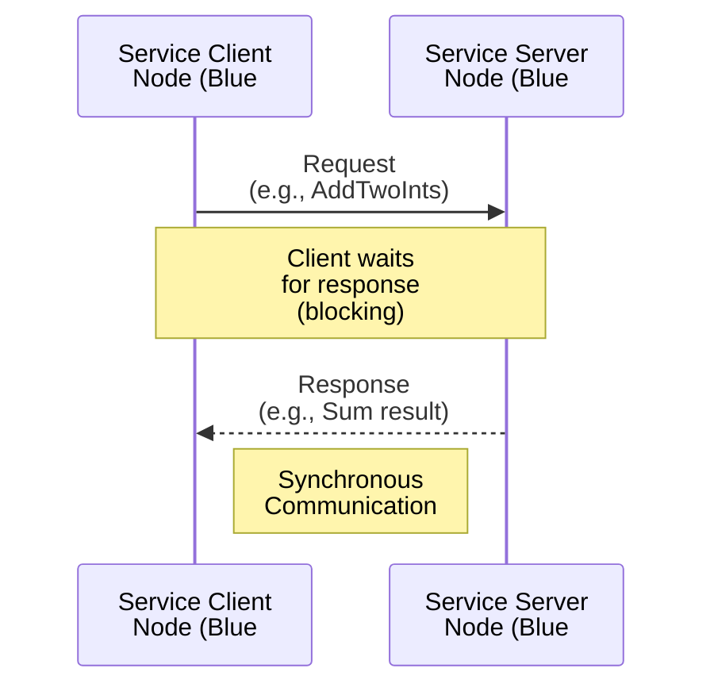
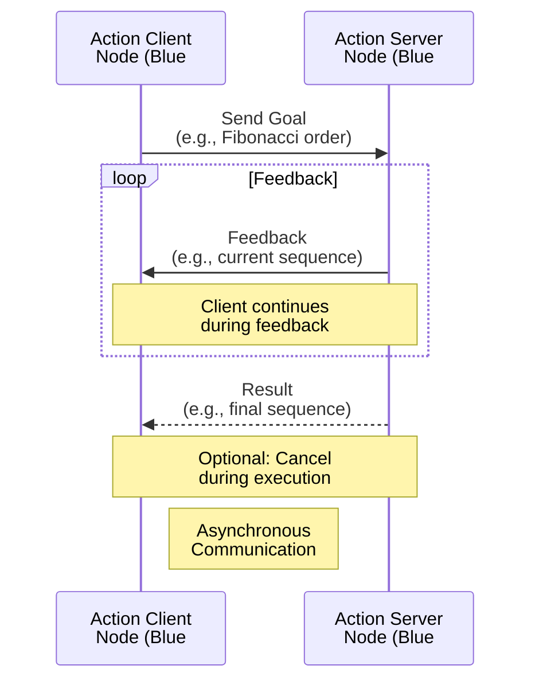

# Week 4 Lesson 1: Services and Actions

**Estimated Time**: 50 minutes  
**Prerequisites**: Completed Week 3 lessons on ROS 2 Architecture and Packages

## Learning Objectives

After this lesson, you will be able to:
- Understand the differences between topics (asynchronous), services (synchronous), and actions (asynchronous with feedback)
- Implement ROS 2 service servers and clients
- Create ROS 2 action servers and clients with feedback and goals
- Choose the appropriate communication pattern for different robot tasks
- Run and test service and action clients using command-line tools

---

## 1. Real-World Analogy: Customer Service Desk and Food Delivery

Think of a restaurant with three different ways to communicate with staff:

**Topics (like calling out orders)**: The kitchen staff announces "Salmon ready!" or "Dessert station needed!" These are one-way, continuous announcements that anyone can listen to. This is like the publish-subscribe pattern—useful for sharing information that's constantly updated.

**Services (like at the customer service desk)**: You approach the desk, make a specific request (like "I need a refund for my meal"), and wait while the staff member processes your request. They give you a direct response. This is synchronous—you make a request and wait for the answer before continuing. The interaction is complete once you get your response.

**Actions (like food delivery with tracking)**: You place an order for delivery. Instead of waiting in place, you can do other things while the order is being prepared. The delivery service provides you continuous updates ("Your order is being prepared," "Your food is out for delivery," "Estimated arrival in 10 minutes"). If needed, you can cancel the order. This is asynchronous like topics but with goal management, feedback, and results.

In ROS 2, each communication pattern serves a specific purpose: topics for continuous data sharing, services for simple request-response tasks, and actions for long-running operations that need feedback.

---

## 2. Technical Concepts

### 2.1 What are Services in ROS 2?

Services provide **synchronous request-response** communication between nodes using Remote Procedure Call (RPC) patterns. This means when a client calls a service, it waits for the server to process the request and return a response before continuing.

**Service Structure**:
- **Service Server**: Node that implements the service functionality
- **Service Client**: Node that calls the service
- **Service Type**: Defines the request/response format (e.g., `std_srvs/srv/SetBool`)

**When to Use Services**:
- Configuration changes (enable/disable a sensor)
- Simple computations (calculate distance between two points)
- One-time data queries (get current robot status)
- Tasks with definite completion time

**Service Command-Line Tools**:
```bash
# List services
ros2 service list

# Get service type
ros2 service type <service_name>

# Call service from command line
ros2 service call <service_name> <service_type> <request_data>
```

### 2.2 Service Implementation in Python

To implement a service server in Python:

1. **Import the service type**: `from example_interfaces.srv import AddTwoInts`
2. **Create the service server**: Use `create_service()` method
3. **Define a callback function**: Processes request and returns response

Here's an example service server:

```python
import rclpy
from rclpy.node import Node
from example_interfaces.srv import AddTwoInts


class CalculatorService(Node):
    def __init__(self):
        super().__init__('calculator_service')
        # Create the service server
        self.service = self.create_service(
            AddTwoInts,
            '/add_two_ints',
            self.handle_add_two_ints
        )
        self.get_logger().info('Service server started, waiting for requests...')

    def handle_add_two_ints(self, request, response):
        # Calculate the sum
        response.sum = request.a + request.b
        # Log the request and response
        self.get_logger().info(
            f'Received request: {request.a} + {request.b} = {response.sum}'
        )
        # Return the response
        return response


def main(args=None):
    rclpy.init(args=args)
    calculator_service = CalculatorService()
    try:
        rclpy.spin(calculator_service)
    except KeyboardInterrupt:
        calculator_service.get_logger().info('Shutting down service server...')
    finally:
        calculator_service.destroy_node()
        rclpy.shutdown()


if __name__ == '__main__':
    main()
```

For a service client, you need to:
1. **Create the service client**: Use `create_client()` method
2. **Wait for service availability**: Check if service is ready
3. **Send request**: Create and send request object
4. **Handle response**: Process the response when it arrives

### 2.3 What are Actions in ROS 2?

Actions manage **long-running tasks** with optional feedback and cancellation. Unlike services, actions are asynchronous like topics, but they include goal management, progress feedback, and result reporting.

**Action Components**:
- **Goal**: The request sent to the action server (what to do)
- **Feedback**: Messages sent periodically during execution (progress updates)
- **Result**: The final outcome after the action completes (success/failure data)

**Action Structure**:
- **Action Server**: Node that executes long-running tasks and sends feedback
- **Action Client**: Node that sends goals and receives feedback/results
- **Action Type**: Defines goal, feedback, and result formats (e.g., `example_interfaces/action/Fibonacci`)

**When to Use Actions**:
- Navigation tasks (driving to a specific location)
- Complex robot movements (arm trajectory planning)
- File downloads/uploads
- Any process that takes a significant amount of time
- Operations that provide useful feedback during execution

### 2.4 Action Implementation in Python

To implement an action server in Python:

1. **Import the action type**: `from example_interfaces.action import Fibonacci`
2. **Create the action server**: Use `ActionServer` class
3. **Define execution callback**: Process the goal and send feedback/results

Here's an example action server:

```python
import time
import rclpy
from rclpy.action import ActionServer
from rclpy.node import Node
from example_interfaces.action import Fibonacci


class FibonacciActionServer(Node):
    def __init__(self):
        super().__init__('fibonacci_action_server')
        # Create the action server
        self._action_server = ActionServer(
            self,
            Fibonacci,
            '/fibonacci_action',
            self.execute_fibonacci_goal
        )
        self.get_logger().info('Action server started, waiting for goals...')

    def execute_fibonacci_goal(self, goal_handle):
        self.get_logger().info('Executing goal...')
        # Accept the goal
        goal_handle.execute()
        
        # Generate the Fibonacci sequence
        feedback_msg = Fibonacci.Feedback()
        feedback_msg.sequence = [0, 1]  # Initialize sequence
        
        # Generate the Fibonacci sequence up to the requested order
        for i in range(1, goal_handle.request.order):
            # Calculate next Fibonacci number
            if i < len(feedback_msg.sequence):
                continue
            else:
                next_num = feedback_msg.sequence[-1] + feedback_msg.sequence[-2]
                feedback_msg.sequence.append(next_num)
            
            # Publish feedback periodically
            if i % 2 == 0:  # Provide feedback every 2 iterations
                self.get_logger().info(f'Feedback: Current sequence: {feedback_msg.sequence}')
                goal_handle.publish_feedback(feedback_msg)
                time.sleep(0.5)  # Simulate some processing time
        
        # Complete the goal
        goal_handle.succeed()
        
        # Create the result
        result = Fibonacci.Result()
        result.sequence = feedback_msg.sequence
        
        self.get_logger().info(f'Goal succeeded with result: {result.sequence}')
        
        return result


def main(args=None):
    rclpy.init(args=args)
    fibonacci_action_server = FibonacciActionServer()
    try:
        rclpy.spin(fibonacci_action_server)
    except KeyboardInterrupt:
        fibonacci_action_server.get_logger().info('Shutting down action server...')
    finally:
        fibonacci_action_server.destroy_node()
        rclpy.shutdown()


if __name__ == '__main__':
    main()
```

### 2.5 Choosing Between Topics, Services, and Actions

| Feature | Topics | Services | Actions |
|---------|--------|----------|---------|
| Communication | One-way (publish/subscribe) | Two-way (request/response) | Three-way (goal/feedback/result) |
| Synchronization | Asynchronous | Synchronous | Asynchronous |
| Duration | Continuous | Short-lived | Long-running |
| Feedback | No | No | Yes |
| Cancellation | N/A | N/A | Yes |
| Best for | Data streaming | Simple queries | Complex tasks |

**Use Topics for**:
- Continuous data streams (sensor readings, robot pose)
- Broadcasting information (status, alarms)
- Multi-consumer scenarios (many nodes listening)
- Asynchronous, decoupled communication

**Use Services for**:
- Simple request-response tasks
- Synchronous operations
- One-time tasks with immediate results
- Configuration changes
- Tasks that complete quickly

**Use Actions for**:
- Long-running tasks
- Tasks requiring feedback during execution
- Tasks that can be canceled
- Operations with intermediate states
- Complex robot behaviors (navigation, manipulation)

---

## 3. Code Examples

### Example 1: Calculator Service Server

This example demonstrates how to create a ROS 2 service server that performs calculations.

```python
#!/usr/bin/env python3
"""
Service Server Example - Calculator Service

This example demonstrates how to create a ROS 2 service server that performs
calculations. The server receives two integers and returns their sum.

Service Type: example_interfaces/srv/AddTwoInts
- Request: a (int64), b (int64)
- Response: sum (int64)
"""

import rclpy
from rclpy.node import Node
from example_interfaces.srv import AddTwoInts


class CalculatorService(Node):
    """
    A ROS 2 service server that adds two integers together.
    """
    
    def __init__(self):
        super().__init__('calculator_service')
        
        # Create the service server
        # The service name is '/add_two_ints'
        # The service type is AddTwoInts
        # The callback function is handle_add_two_ints
        self.service = self.create_service(
            AddTwoInts, 
            '/add_two_ints', 
            self.handle_add_two_ints
        )
        
        self.get_logger().info('Service server started, waiting for requests...')

    def handle_add_two_ints(self, request, response):
        """
        Callback function for handling service requests.
        
        Args:
            request: The AddTwoInts service request object containing a and b
            response: The AddTwoInts service response object to be returned
            
        Returns:
            The response object with the calculated sum
        """
        # Calculate the sum
        response.sum = request.a + request.b
        
        # Log the request and response
        self.get_logger().info(
            f'Received request: {request.a} + {request.b} = {response.sum}'
        )
        
        # Return the response
        return response


def main(args=None):
    """
    Main function to initialize and run the service server.
    """
    # Initialize the ROS 2 Python client library
    rclpy.init(args=args)
    
    # Create an instance of the CalculatorService node
    calculator_service = CalculatorService()
    
    try:
        # Start the ROS 2 event loop
        # This will keep the service server running and responsive
        # to incoming requests
        rclpy.spin(calculator_service)
    except KeyboardInterrupt:
        # Handle Ctrl+C gracefully
        calculator_service.get_logger().info('Shutting down service server...')
    finally:
        # Clean up the node
        calculator_service.destroy_node()
        rclpy.shutdown()


if __name__ == '__main__':
    main()
```

### Example 2: Calculator Service Client

This example demonstrates how to create a ROS 2 service client that makes calculation requests.

```python
#!/usr/bin/env python3
"""
Service Client Example - Calculator Service Client

This example demonstrates how to create a ROS 2 service client that makes
calculation requests to the calculator service server.

Service Type: example_interfaces/srv/AddTwoInts
- Request: a (int64), b (int64)
- Response: sum (int64)
"""

import sys
import rclpy
from rclpy.node import Node
from example_interfaces.srv import AddTwoInts


class CalculatorClient(Node):
    """
    A ROS 2 service client that sends requests to the calculator service.
    """
    
    def __init__(self):
        super().__init__('calculator_client')
        
        # Create the service client
        # The service name is '/add_two_ints'
        # The service type is AddTwoInts
        self.client = self.create_client(AddTwoInts, '/add_two_ints')
        
        # Wait for the service to become available
        while not self.client.wait_for_service(timeout_sec=1.0):
            self.get_logger().info('Waiting for service /add_two_ints...')
            
        self.get_logger().info('Service client ready')
        
    def send_request(self, a, b):
        """
        Send a request to the service server and wait for the response.
        
        Args:
            a (int): First integer to add
            b (int): Second integer to add
            
        Returns:
            The sum of a and b returned by the service
        """
        # Create a request object
        request = AddTwoInts.Request()
        request.a = a
        request.b = b
        
        # Log the request
        self.get_logger().info(f'Sending request: {a} + {b}')
        
        # Call the service asynchronously
        self.future = self.client.call_async(request)
        
        # We'll wait for the response in the main function (not in this method)
        return self.future


def main(args=None):
    """
    Main function to initialize and run the service client.
    """
    # Initialize the ROS 2 Python client library
    rclpy.init(args=args)
    
    # Create an instance of the CalculatorClient node
    calculator_client = CalculatorClient()
    
    # Define the values to add
    a = 5
    b = 3
    
    # Send the request
    future = calculator_client.send_request(a, b)
    
    try:
        # Spin until the future is complete (i.e., response is received)
        while rclpy.ok():
            rclpy.spin_once(calculator_client)
            
            # Check if the future is complete
            if future.done():
                try:
                    # Get the response
                    response = future.result()
                    
                    # Log the result
                    calculator_client.get_logger().info(
                        f'Result: {a} + {b} = {response.sum}'
                    )
                    
                    # Exit the loop
                    break
                except Exception as e:
                    calculator_client.get_logger().error(f'Service call failed: {e}')
                    break
    except KeyboardInterrupt:
        calculator_client.get_logger().info('Shutting down service client...')
    finally:
        # Clean up the node
        calculator_client.destroy_node()
        rclpy.shutdown()
        return 0


if __name__ == '__main__':
    sys.exit(main())
```

### Example 3: Fibonacci Action Server

This example demonstrates how to create a ROS 2 action server that simulates processing with feedback.

```python
#!/usr/bin/env python3
"""
Action Server Example - Fibonacci Action Server

This example demonstrates how to create a ROS 2 action server that generates
a Fibonacci sequence with feedback during execution.

Action Type: example_interfaces/action/Fibonacci
- Goal: order (int32) - number of Fibonacci numbers to generate
- Feedback: sequence (int32[]) - current sequence during generation
- Result: sequence (int32[]) - final Fibonacci sequence
"""

import time
import rclpy
from rclpy.action import ActionServer
from rclpy.node import Node
from example_interfaces.action import Fibonacci


class FibonacciActionServer(Node):
    """
    A ROS 2 action server that generates a Fibonacci sequence.
    """
    
    def __init__(self):
        super().__init__('fibonacci_action_server')
        
        # Create the action server
        # The action name is '/fibonacci_action'
        # The action type is Fibonacci
        # The callback function is execute_fibonacci_goal
        self._action_server = ActionServer(
            self,
            Fibonacci,
            '/fibonacci_action',
            self.execute_fibonacci_goal
        )
        
        self.get_logger().info('Action server started, waiting for goals...')

    def execute_fibonacci_goal(self, goal_handle):
        """
        Execute callback for the action server.
        
        This function runs when a goal is received and handles the
        long-running task of generating a Fibonacci sequence.
        
        Args:
            goal_handle: The goal handle for this specific goal
            
        Returns:
            Fibonacci.Result object containing the final sequence
        """
        self.get_logger().info('Executing goal...')
        
        # Accept the goal
        goal_handle.execute()
        
        # Generate the Fibonacci sequence
        feedback_msg = Fibonacci.Feedback()
        feedback_msg.sequence = [0, 1]  # Initialize sequence
        
        # Check if the order is too small
        if goal_handle.request.order < 1:
            # Return empty sequence if order is less than 1
            result = Fibonacci.Result()
            result.sequence = feedback_msg.sequence[:goal_handle.request.order]
            return result
            
        # Generate the Fibonacci sequence up to the requested order
        for i in range(1, goal_handle.request.order):
            # Calculate next Fibonacci number
            if i < len(feedback_msg.sequence):
                # If we already have this number, skip
                continue
            else:
                # Calculate the next number in the sequence
                next_num = feedback_msg.sequence[-1] + feedback_msg.sequence[-2]
                feedback_msg.sequence.append(next_num)
            
            # Publish feedback periodically
            if i % 2 == 0:  # Provide feedback every 2 iterations
                progress = int((i / goal_handle.request.order) * 100)
                self.get_logger().info(f'Feedback: {progress}% complete - Current sequence: {feedback_msg.sequence}')
                goal_handle.publish_feedback(feedback_msg)
                
                # Simulate some processing time
                time.sleep(0.5)
        
        # Complete the goal
        goal_handle.succeed()
        
        # Create the result
        result = Fibonacci.Result()
        result.sequence = feedback_msg.sequence
        
        self.get_logger().info(f'Goal succeeded with result: {result.sequence}')
        
        return result


def main(args=None):
    """
    Main function to initialize and run the action server.
    """
    # Initialize the ROS 2 Python client library
    rclpy.init(args=args)
    
    # Create an instance of the FibonacciActionServer node
    fibonacci_action_server = FibonacciActionServer()
    
    try:
        # Start the ROS 2 event loop
        # This will keep the action server running and responsive
        # to incoming goals
        rclpy.spin(fibonacci_action_server)
    except KeyboardInterrupt:
        # Handle Ctrl+C gracefully
        fibonacci_action_server.get_logger().info('Shutting down action server...')
    finally:
        # Clean up the node
        fibonacci_action_server.destroy_node()
        rclpy.shutdown()


if __name__ == '__main__':
    main()
```

### Example 4: Fibonacci Action Client

This example demonstrates how to create a ROS 2 action client that sends goals and receives feedback.

```python
#!/usr/bin/env python3
"""
Action Client Example - Fibonacci Action Client

This example demonstrates how to create a ROS 2 action client that sends
goals to the action server and receives feedback.

Action Type: example_interfaces/action/Fibonacci
- Goal: order (int32) - number of Fibonacci numbers to generate
- Feedback: sequence (int32[]) - current sequence during generation
- Result: sequence (int32[]) - final Fibonacci sequence
"""

import sys
import rclpy
from rclpy.action import ActionClient
from rclpy.node import Node
from example_interfaces.action import Fibonacci


class FibonacciActionClient(Node):
    """
    A ROS 2 action client that sends goals to the fibonacci action server.
    """
    
    def __init__(self):
        super().__init__('fibonacci_action_client')
        
        # Create the action client
        # The action name is '/fibonacci_action'
        # The action type is Fibonacci
        self._action_client = ActionClient(self, Fibonacci, '/fibonacci_action')
        
    def send_goal(self, order):
        """
        Send a goal to the action server and wait for the result.
        
        Args:
            order (int): Number of Fibonacci numbers to generate
        """
        # Wait for the action server to be available
        self.get_logger().info('Waiting for action server...')
        self._action_client.wait_for_server()
        
        # Create a goal message
        goal_msg = Fibonacci.Goal()
        goal_msg.order = order
        
        self.get_logger().info(f'Sending goal with order: {order}')
        
        # Send the goal asynchronously
        self._send_goal_future = self._action_client.send_goal_async(
            goal_msg,
            feedback_callback=self.feedback_callback
        )
        
        # Add a callback for when the goal is accepted
        self._send_goal_future.add_done_callback(self.goal_response_callback)
        
    def goal_response_callback(self, future):
        """
        Callback function when the goal response is received.
        
        Args:
            future: Future object containing the goal response
        """
        goal_handle = future.result()
        if not goal_handle.accepted:
            self.get_logger().info('Goal rejected')
            return

        self.get_logger().info('Goal accepted')
        
        # Request the result asynchronously
        self._get_result_future = goal_handle.get_result_async()
        self._get_result_future.add_done_callback(self.result_callback)
        
    def feedback_callback(self, feedback_msg):
        """
        Callback function for handling feedback from the action server.
        
        Args:
            feedback_msg: Feedback message from the action server
        """
        self.get_logger().info(
            f'Received feedback: Current sequence length: {len(feedback_msg.feedback.sequence)}'
        )
        
    def result_callback(self, future):
        """
        Callback function for handling the result from the action server.
        
        Args:
            future: Future object containing the result
        """
        result = future.result().result
        self.get_logger().info(f'Result: {result.sequence}')
        
        # Shutdown after receiving the result
        rclpy.shutdown()


def main(args=None):
    """
    Main function to initialize and run the action client.
    """
    # Initialize the ROS 2 Python client library
    rclpy.init(args=args)
    
    # Create an instance of the FibonacciActionClient node
    action_client = FibonacciActionClient()
    
    # Send a goal with order 10 (to generate 10 Fibonacci numbers)
    action_client.send_goal(10)
    
    try:
        # Start spinning to process callbacks
        rclpy.spin(action_client)
    except KeyboardInterrupt:
        action_client.get_logger().info('Shutting down action client...')
    finally:
        # Clean up the node
        action_client.destroy_node()


if __name__ == '__main__':
    sys.exit(main())
```

:::tip
When using services and actions in your own projects:
- Always check if a service is available before calling it with `wait_for_service()`
- Use appropriate timeouts when waiting for service responses
- Implement proper error handling for network issues or service failures
- Make sure your action servers handle cancellation requests if needed
:::

---

## 4. Visualizations

### Service Communication Pattern

This sequence diagram shows the synchronous request-response pattern of ROS 2 services. The Service Client sends a request to the Service Server, then waits for the response. The server processes the request and sends back the response. This is a blocking interaction—the client pauses execution until the response is received.



### Action Communication Pattern

This sequence diagram shows the asynchronous goal-feedback-result pattern of ROS 2 actions. The Action Client sends a goal to the Action Server, then continues execution. The server sends periodic feedback messages during the long-running task. Finally, the server sends the result when the task is complete. The client can also send a cancel request during execution.



---

## 5. Hands-on Exercise: Implement Robot Control Service and Action

**Objective**: Create both a service for simple robot control tasks and an action for complex robot movements with feedback.

**Estimated Time**: 30 minutes

### Setup

**Step 1**: Create a workspace directory
```bash
mkdir -p ~/ros2_services_ws/src
cd ~/ros2_services_ws/src
```

**Step 2**: Verify ROS 2 environment is sourced
```bash
source /opt/ros/humble/setup.bash
```

**Step 3**: Create a package for your service and action examples
```bash
cd ~/ros2_services_ws/src
ros2 pkg create robot_control_pkg --build-type ament_python --dependencies rclpy std_msgs builtin_interfaces example_interfaces
```

**Step 4**: Navigate to your package
```bash
cd robot_control_pkg
ls -la
```
**Expected Output**: Should show standard ROS 2 package structure with `package.xml`, `setup.py`, etc.

### Instructions

**Task 1: Create the Service Server**

Create a file `robot_control_pkg/robot_control_pkg/motor_service_server.py`:

**Requirements**:
- **Node name**: `motor_service_server`
- **Service name**: `/control_motor` (use `example_interfaces/srv/SetBool`)
- **Functionality**: Accept a boolean request to enable/disable motor
- **Response**: Return success status and message
- **Logging**: Log when service is called and result

💡 **Hints**:
- Import: `from example_interfaces.srv import SetBool`
- Use `self.create_service(SetBool, '/control_motor', self.handle_motor_request)`
- In callback, return `SetBool.Response(success=True, message='Motor enabled')`

⚠️ **Important**: The SetBool service has boolean `data` field in request and `success` and `message` fields in response.

**Task 2: Create the Service Client**

Create a file `robot_control_pkg/robot_control_pkg/motor_service_client.py`:

**Requirements**:
- **Node name**: `motor_service_client`
- **Service name**: `/control_motor` (matches server)
- **Functionality**: Call service with `data=True` to enable motor
- **Response handling**: Print service response
- **Service wait**: Wait for service to be available before calling

💡 **Hints**:
- Use `self.create_client(SetBool, '/control_motor')`
- Implement `wait_for_service()` with timeout
- Create request: `request = SetBool.Request()`
- Set `request.data = True` to enable motor

⚠️ **Important**: Always check if service is available before attempting to call it.

**Task 3: Create the Action Server**

Create a file `robot_control_pkg/robot_control_pkg/navigation_action_server.py`:

**Requirements**:
- **Node name**: `navigation_action_server`
- **Action name**: `/navigate_to_pose`
- **Action type**: Use `example_interfaces/action/Fibonacci` for this example (for simplicity)
- **Functionality**: Simulate navigation with feedback and result
- **Feedback**: Send progress updates during execution
- **Result**: Return success result at completion

💡 **Hints**:
- Import: `from example_interfaces.action import Fibonacci`
- Use `ActionServer(node, Fibonacci, '/navigate_to_pose', self.execute_navigate_goal)`
- In execution callback, use `goal_handle.publish_feedback()` for updates
- Return `Fibonacci.Result()` for final result

⚠️ **Important**: The action execution must be implemented as a separate function that takes `goal_handle` as parameter.

**Task 4: Create the Action Client**

Create a file `robot_control_pkg/robot_control_pkg/navigation_action_client.py`:

**Requirements**:
- **Node name**: `navigation_action_client`
- **Action name**: `/navigate_to_pose` (matches server)
- **Functionality**: Send navigation goal and handle feedback/results
- **Feedback callback**: Print feedback updates
- **Result callback**: Print final result

💡 **Hints**:
- Use `ActionClient(node, Fibonacci, '/navigate_to_pose')`
- Use `send_goal_async()` to send goals asynchronously
- Define feedback and result callbacks
- For Fibonacci, send a goal with `order` field (e.g., `order=5`)

⚠️ **Important**: The action client should wait for the action server to be available, similar to services.

**Task 5: Configure setup.py for Executables**

Edit `robot_control_pkg/setup.py` and add the following to the `entry_points` section:

```python
'console_scripts': [
    'motor_service_server = robot_control_pkg.motor_service_server:main',
    'motor_service_client = robot_control_pkg.motor_service_client:main',
    'navigation_action_server = robot_control_pkg.navigation_action_server:main',
    'navigation_action_client = robot_control_pkg.navigation_action_client:main',
],
```

⚠️ **Important**: Remember to rebuild the package after changing setup.py.

### Validation

**Test Your Solution**:

**Terminal 1 - Start Service Server**:
```bash
cd ~/ros2_services_ws
source /opt/ros/humble/setup.bash
colcon build --packages-select robot_control_pkg
source install/setup.bash
ros2 run robot_control_pkg motor_service_server
```

**Terminal 2 - Start Action Server**:
```bash
cd ~/ros2_services_ws
source install/setup.bash
ros2 run robot_control_pkg navigation_action_server
```

**Terminal 3 - Test Service**:
```bash
cd ~/ros2_services_ws
source install/setup.bash
ros2 run robot_control_pkg motor_service_client
```

**Terminal 4 - Test Action**:
```bash
cd ~/ros2_services_ws
source install/setup.bash
ros2 run robot_control_pkg navigation_action_client
```

**Expected Output**:

**Terminal 1 (Service Server)**:
```
[INFO] [motor_service_server]: Service server started, waiting for requests...
[INFO] [motor_service_server]: Received request to enable motor
[INFO] [motor_service_server]: Motor enabled successfully
```

**Terminal 2 (Action Server)**:
```
[INFO] [navigation_action_server]: Action server started, waiting for goals...
[INFO] [navigation_action_server]: Executing navigation goal...
[INFO] [navigation_action_server]: Feedback: 20% complete
[INFO] [navigation_action_server]: Feedback: 40% complete
[INFO] [navigation_action_server]: Feedback: 60% complete
[INFO] [navigation_action_server]: Feedback: 80% complete
[INFO] [navigation_action_server]: Navigation completed successfully
```

**Terminal 3 (Service Client)**:
```
[INFO] [motor_service_client]: Waiting for service /control_motor...
[INFO] [motor_service_client]: Calling service with enable=True
[INFO] [motor_service_client]: Service response: Success=True, Message=Motor enabled
```

**Terminal 4 (Action Client)**:
```
[INFO] [navigation_action_client]: Waiting for action server /navigate_to_pose...
[INFO] [navigation_action_client]: Sending navigation goal
[INFO] [navigation_action_client]: Received feedback: 20% complete
[INFO] [navigation_action_client]: Received feedback: 40% complete
[INFO] [navigation_action_client]: Received feedback: 60% complete
[INFO] [navigation_action_client]: Received feedback: 80% complete
[INFO] [navigation_action_client]: Navigation result: Movement completed successfully
```

**Verification Checklist**:
- [ ] Service server starts without errors
- [ ] Action server starts without errors
- [ ] Service client successfully calls the service
- [ ] Action client sends goal and receives feedback
- [ ] Both service and action complete successfully
- [ ] All logging messages appear as expected

### Common Mistakes

**Mistake 1: "Service not found after client starts"**

- **Symptom**: Client shows timeout error or "service not available"

- **Cause**: Service server isn't running when client tries to call

- **Solution**:
  1. Always start service server first, then client
  2. Check service is running:
     ```bash
     ros2 service list | grep control_motor
     ```

- **Prevention**: Include `wait_for_service()` with timeout in client

**Mistake 2: "Action server not found"**

- **Symptom**: Action client times out waiting for server

- **Cause**: Action server not running or name mismatch

- **Solution**:
  1. Verify action server is running:
     ```bash
     ros2 action list | grep navigate_to_pose
     ```
  2. Check action name matches in client and server code

- **Prevention**: Include `wait_for_server()` in action client

**Mistake 3: "Import errors for service/action types"**

- **Symptom**: 
  ```
  ModuleNotFoundError: No module named 'example_interfaces.srv'
  ```

- **Cause**: Missing dependencies in package.xml

- **Solution**:
  1. Check package.xml includes the dependency:
     ```xml
     <depend>example_interfaces</depend>
     ```
  2. Rebuild package after adding dependencies:
     ```bash
     colcon build --packages-select robot_control_pkg
     ```

**Mistake 4: Action Execution Function Issues**

- **Symptom**: Action server accepts goal but doesn't execute properly

- **Cause**: Execution callback doesn't properly handle goal_handle

- **Solution**:
  1. Ensure execution function accepts `goal_handle` as parameter
  2. Check the goal_handle is accepted at the beginning:
     ```python
     goal_handle.accept()
     ```
  3. Ensure function returns appropriate result type

**Mistake 5: Entry Points Not Added**

- **Symptom**: `ros2 run robot_control_pkg motor_service_server` fails with "No executable found"

- **Cause**: Executable not added to setup.py

- **Solution**:
  1. Verify entry points in setup.py
  2. Rebuild package after changes:
     ```bash
     colcon build --packages-select robot_control_pkg
     source install/setup.bash
     ```

:::warning
Remember to always source your ROS 2 environment before running any ROS 2 commands. If you're working in multiple terminals, you need to source the ROS 2 setup file in each terminal.
:::

### Extension Ideas (Advanced)

**Extension 1: Add Service to Stop Robot Motion**

- Create a service that immediately stops all robot motion
- Make it work even when an action is currently running
- Implement appropriate safety checks in the service

**Expected Outcome**: Service instantly stops robot regardless of current tasks

**Extension 2: Action with Goal Preemption**

- Create an action server that can be preempted by new goals
- If a new navigation goal is received while executing another, cancel the old one
- Return appropriate result for canceled goals

**Expected Outcome**: New goals can interrupt existing ones

**Extension 3: Service with Complex Request/Response**

- Create a custom service type using .srv files
- Define your own request/response structure (e.g., for robot calibration)
- Implement both server and client for your custom service

**Expected Outcome**: Custom service handling complex robot operations

**Extension 4: Action with Cancellation Support**

- Enhance your action server to properly handle cancellation requests
- Add functionality to clean up when a goal is canceled
- Create a client that demonstrates goal cancellation

**Expected Outcome**: Actions can be properly canceled with cleanup

---

## 6. Check Your Understanding

**Question 1**: What is the main difference between ROS 2 services and topics?

**Question 2**: When would you use an action instead of a service in a robot application?

**Question 3**: In the service communication model, does the client need to wait for the response before continuing?

**Question 4**: What are the three components of an action in ROS 2?

**Question 5**: If you were building a robot that needs to navigate to different locations throughout the day, which communication pattern would be most appropriate and why?

<details>
<summary>View Answers</summary>

**Answer 1**: The main difference is **synchronization**. **Services** provide synchronous request-response communication—you send a request and wait for a response before continuing. **Topics** provide asynchronous publish-subscribe communication—you publish data and subscribers receive it without any direct response. Services are for specific requests with responses, while topics are for continuous data streaming.

**Answer 2**: Use an **action** for long-running tasks that need feedback during execution or can be canceled. Examples include navigation to a location, complex robot arm movements, file downloads, or any process that takes a significant amount of time. Services are better for quick, simple operations that have immediate results.

**Answer 3**: Yes, in the service communication model, the client typically waits for the response before continuing (synchronous). When you call `client.call(request)`, the client code pauses until the service server responds. The client is blocked during the service execution. Some implementations allow asynchronous calls, but the standard pattern is synchronous.

**Answer 4**: The three components of an action in ROS 2 are:
1. **Goal**: The request sent to the action server (what to do)
2. **Feedback**: Messages sent periodically during execution (progress updates)
3. **Result**: The final outcome after the action completes (success/failure data)

**Answer 5**: **Actions** would be most appropriate for robot navigation. Navigation is a long-running task that benefits from feedback (e.g., "50% to destination", "rerouting due to obstacle"), can be canceled (e.g., "abort navigation"), and requires goal management (defining destination). A service would be inappropriate since navigation takes time and you don't want the client blocked, and topics wouldn't be suitable since navigation has a specific goal with intermediate states.

</details>

---

## 7. Additional Resources

**Official ROS 2 Documentation**:
- [Writing a Simple Service and Client (Python)](https://docs.ros.org/en/humble/Tutorials/Beginner-Client-Libraries/Writing-A-Simple-Py-Service-And-Client.html)
- [Writing a Simple Action Server and Client (Python)](https://docs.ros.org/en/humble/Tutorials/Beginner-Client-Libraries/Writing-A-Simple-Py-Action-Server-And-Client.html)
- [Understanding ROS 2 Actions](https://docs.ros.org/en/humble/Tutorials/Intermediate/Understanding-ROS2-Actions.html)

**Community Resources**:
- [ROS Answers - Services](https://answers.ros.org/questions/scope:all/sort:activity-desc/tags:ros2-services/)
- [ROS Answers - Actions](https://answers.ros.org/questions/scope:all/sort:activity-desc/tags:ros2-actions/)

**Video Tutorials** (External):
- The Construct - ROS 2 Services and Actions
- ROS 2 Service and Action Tutorial Series

---

## Next Lesson

**Week 4 Lesson 2: Building Packages**

In the next lesson, you'll learn how to:
- Create custom message and service definitions
- Use the colcon build system for message packages
- Understand dependencies between packages
- Build complex robot applications with multiple packages
- Debug common build issues