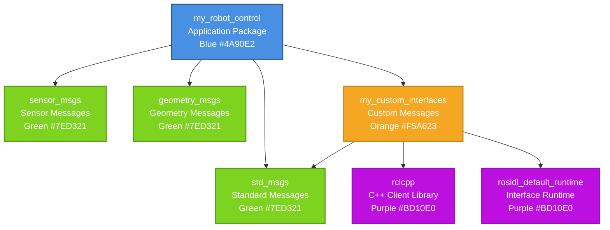

# Week 4 Lesson 2: Building Packages

**Estimated Time**: 55 minutes  
**Prerequisites**: Completed Week 3 lessons and Week 4 Lesson 1

## Learning Objectives

After this lesson, you will be able to:
- Create custom message and service definition files
- Build packages containing custom interfaces using colcon
- Understand and manage package dependencies
- Use the colcon build system for complex packages
- Debug common build issues in ROS 2 packages

---

## 1. Real-World Analogy: Supply Chain and Manufacturing

Think of creating a complex product like a smartphone. The final device is assembled from many different custom components: a custom processor, specialized camera modules, unique battery design, and proprietary software. Each component is built by a different specialized manufacturer using specific tools and materials.

The smartphone manufacturer doesn't create all these components from scratch. Instead, they source standardized parts (memory chips, screws, etc.) and integrate custom parts (custom camera, proprietary software) into the final product. Each component has a specification sheet that describes exactly what it does and how it connects to other components.

The supply chain ensures all components are available when needed for assembly. Quality control checks ensure each component meets specifications before assembly. If a defect is found, it needs to be traced back to the specific component.

**In ROS 2 terms**: Custom message and service definitions are like creating specification sheets for new custom components. The colcon build system is like the manufacturing process that assembles your robot software from all its components. Package dependencies are like the supply chain that ensures all required components are available. Just as a smartphone manufacturer relies on suppliers, your robot package can depend on other packages for various functionality.

---

## 2. Technical Concepts

### 2.1 Custom Message Definitions

Custom messages allow you to define your own data structures for communication between nodes. This is essential when the standard message types in packages like `std_msgs` and `sensor_msgs` don't meet your specific needs.

**Key Points**:
- **Purpose**: Define custom data structures for topics, services, and actions
- **File Extension**: `.msg` files for messages
- **Syntax**: Field type followed by field name (e.g., `float64 position`, `int32 velocity`)
- **Field Types**: Standard types (int8, int16, int32, int64, uint8, uint16, uint32, uint64, float32, float64, string, bool) and arrays
- **Complex Types**: Messages can include other messages as fields
- **File Location**: `msg/` subdirectory in package root

**Example Message Definition** (`SensorData.msg`):
```
# Custom sensor data message
float64 temperature
float32 humidity
int32[] readings
string sensor_name
bool is_active
```

**Usage**: Once defined, custom messages can be used in publishers, subscribers, services, and actions just like standard message types.

### 2.2 Custom Service Definitions

Custom services allow you to define your own request-response interfaces, extending beyond the standard services provided by ROS 2.

**Key Points**:
- **Purpose**: Define custom request-response interfaces
- **File Extension**: `.srv` files for services
- **Syntax**: Request fields above `---` separator, Response fields below
- **File Location**: `srv/` subdirectory in package root

**Example Service Definition** (`CalculateSum.srv`):
```
# Request (request data)
float64 first_number
float64 second_number
---
# Response (response data)
float64 sum
string error_message
```

**Components**:
- **Request**: Input parameters from client
- **Response**: Output parameters from server
- **Return**: Success/error indicators

### 2.3 Custom Action Definitions

Custom actions allow you to define your own goal-feedback-result interfaces for long-running tasks with progress updates.

**Key Points**:
- **Purpose**: Define custom goal-feedback-result interfaces
- **File Extension**: `.action` files for actions
- **Syntax**: Goal fields, Feedback fields, and Result fields separated by `---`
- **File Location**: `action/` subdirectory in package root

**Example Action Definition** (`MoveRobot.action`):
```
# Goal (what to do)
float64 target_x
float64 target_y
float64 target_theta
---
# Feedback (progress updates)
float64 current_x
float64 current_y
float64 current_theta
float64 distance_remaining
---
# Result (final outcome)
bool success
string message
```

**Components**:
- **Goal**: Parameters that define the action to perform
- **Feedback**: Data sent during action execution
- **Result**: Final outcome data when action completes

### 2.4 Package Dependencies

Understanding package dependencies is crucial for building complex robot applications that use multiple packages.

**Types of Dependencies**:
- **Build Dependencies**: Packages needed during compilation (e.g., message definitions, build tools)
- **Execution Dependencies**: Packages needed to run the built executables (e.g., runtime libraries)
- **Test Dependencies**: Packages needed for running tests

**Dependencies in package.xml**:
```xml
<buildtool_depend>ament_cmake</buildtool_depend>
<depend>rclcpp</depend>
<depend>std_msgs</depend>
<depend>sensor_msgs</depend>
<exec_depend>ros2launch</exec_depend>
<test_depend>ament_lint_auto</test_depend>
```

### 2.5 The Colcon Build System

The colcon build system is ROS 2's tool for building packages. It's improved from catkin in ROS 1, with better parallel builds and support for multiple build systems.

**Build Process Stages**:
1. **Source Stage**: Reading `package.xml` and `CMakeLists.txt` files
2. **Build Stage**: Compiling source code and generating message headers
3. **Install Stage**: Copying executables and resources to install space
4. **Log Stage**: Creating build logs

**Advanced Colcon Commands**:
```bash
# Build with specific packages
colcon build --packages-up-to my_robot_pkg

# Build and run tests
colcon build --packages-select my_robot_pkg --cmake-args --gtest-color=yes

# Build for specific architectures
colcon build --mixin release

# Build without specific packages (skip)
colcon build --packages-skip pkg1 pkg2
```

:::info
The colcon build system automatically determines build order based on dependencies, allowing for efficient parallel builds. This makes it much faster than the previous catkin build system.
:::

---

## 3. Code Examples

### Example 1: Custom Message Definition

This example shows how to define a custom message type for robot sensor data.

```
# Custom sensor data message
float64 temperature
float32 humidity
int32[] readings
string sensor_name
bool is_active
```

**How to Use**:
- Place in `msg/` directory of your package
- Add message generation dependency in `package.xml`
- Add message generation in `CMakeLists.txt`
- Build with `colcon build`
- Import in Python: `from my_robot_pkg.msg import SensorData`

### Example 2: Custom Service Definition

This example shows how to define a custom service for calculating sums with error handling.

```
# Request (request data)
float64 first_number
float64 second_number
---
# Response (response data)
float64 sum
string error_message
```

**How to Use**:
- Place in `srv/` directory of your package
- Add service generation dependency in `package.xml`
- Add service generation in `CMakeLists.txt`
- Build with `colcon build`
- Import in Python: `from my_robot_pkg.srv import CalculateSum`

### Example 3: Complete Package with Custom Interfaces

Here's the complete package structure demonstrating custom message and service definitions:

```
custom_interfaces_pkg/
├── package.xml            # Dependency declarations
├── CMakeLists.txt         # Build configuration
├── msg/                   # Custom message definitions
│   ├── SensorData.msg
│   └── RobotStatus.msg
├── srv/                   # Custom service definitions
│   └── CalculateSum.srv
├── action/                # Custom action definitions
│   └── MoveRobot.action
└── src/                   # Source files (for ament_cmake)
    └── ...                # C++ source files
```

**CMakeLists.txt configuration**:
```cmake
find_package(rosidl_default_generators REQUIRED)

rosidl_generate_interfaces(${PROJECT_NAME}
  "msg/SensorData.msg"
  "msg/RobotStatus.msg"
  "srv/CalculateSum.srv"
  "action/MoveRobot.action"
  DEPENDENCIES builtin_interfaces std_msgs geometry_msgs
)

ament_export_dependencies(rosidl_default_runtime)
```

:::tip
When creating custom interfaces, always run `colcon build` and source your workspace afterwards using `source install/setup.bash` to make the new message types available to ROS 2 tools.
:::

---

## 4. Visualizations

### Package Dependency Tree

This diagram shows a typical ROS 2 package dependency tree. The main application package (my_robot_control) depends directly on several other packages (std_msgs, sensor_msgs, geometry_msgs, my_custom_interfaces). These in turn may depend on other packages (rclcpp, rosidl_default_runtime). The colcon build system uses this dependency tree to determine the correct build order, with dependencies built first.



---

## 5. Hands-on Exercise: Create Custom Message and Service Types

**Objective**: Create a ROS 2 package with custom message and service definitions, then build and test the package using colcon.

**Estimated Time**: 35 minutes

### Setup

**Step 1**: Create a workspace directory
```bash
mkdir -p ~/ros2_custom_interfaces_ws/src
cd ~/ros2_custom_interfaces_ws/src
```

**Step 2**: Verify ROS 2 environment is sourced
```bash
source /opt/ros/humble/setup.bash
```

**Step 3**: Create a package for your custom interfaces
```bash
cd ~/ros2_custom_interfaces_ws/src
ros2 pkg create custom_interfaces_pkg --build-type ament_cmake --dependencies rclcpp rclpy std_msgs geometry_msgs builtin_interfaces
```

**Step 4**: Navigate to your package
```bash
cd custom_interfaces_pkg
ls -la
```
**Expected Output**: Should show standard ROS 2 package structure with `package.xml`, `CMakeLists.txt`, etc.

### Instructions

**Task 1: Create Custom Message Definitions**

Create the directory structure for message definitions:
```bash
mkdir -p msg
```

Create a file `msg/RobotStatus.msg` with the following content:
```
# Robot status message
float64 battery_voltage
bool is_charging
bool is_moving
int32 error_code
string robot_mode
```

**Task 2: Create Custom Service Definitions**

Create the directory structure for service definitions:
```bash
mkdir -p srv
```

Create a file `srv/RobotControl.srv` with the following content:
```
# Request data
string command  # "move_forward", "turn_left", "stop", etc.
float64 value   # Speed, angle, distance, etc.
---
# Response data
bool success
string message
```

**Task 3: Update package.xml**

Update the `package.xml` file to include the message generation dependencies:

Add these lines inside the `<package>` element (after the dependencies you already have):

```xml
<build_depend>rosidl_default_generators</build_depend>
<exec_depend>rosidl_default_runtime</exec_depend>
<member_of_group>rosidl_interface_packages</member_of_group>
```

**Task 4: Update CMakeLists.txt**

Update the `CMakeLists.txt` file to process the custom message and service definitions:

Add these lines after `find_package` calls:

```cmake
find_package(rosidl_default_generators REQUIRED)

rosidl_generate_interfaces(${PROJECT_NAME}
  "msg/RobotStatus.msg"
  "srv/RobotControl.srv"
  DEPENDENCIES builtin_interfaces std_msgs geometry_msgs
)
```

And make sure to add the rosidl dependency to your ament export:

```cmake
ament_export_dependencies(rosidl_default_runtime)
```

**Task 5: Build the Package**

```bash
cd ~/ros2_custom_interfaces_ws
colcon build --packages-select custom_interfaces_pkg
```

**Task 6: Source the Workspace and Verify**

```bash
source install/setup.bash
ros2 interface show custom_interfaces_pkg/msg/RobotStatus
ros2 interface show custom_interfaces_pkg/srv/RobotControl
```

### Validation

**Expected Output**:

**After Build**:
```
Starting >>> custom_interfaces_pkg
Finished <<< custom_interfaces_pkg [2.35s]
```

**After `ros2 interface show custom_interfaces_pkg/msg/RobotStatus`**:
```
float64 battery_voltage
bool is_charging
bool is_moving
int32 error_code
string robot_mode
```

**After `ros2 interface show custom_interfaces_pkg/srv/RobotControl`**:
```
string command
float64 value
---
bool success
string message
```

**Verification Checklist**:
- [ ] Package builds without errors
- [ ] Custom message definition is accessible via `ros2 interface show`
- [ ] Custom service definition is accessible via `ros2 interface show`
- [ ] Both definitions contain the correct fields and types
- [ ] No warnings during the build process

### Common Mistakes

**Mistake 1: "Package not found after build"**

- **Symptom**: Commands like `ros2 interface show` can't find your custom interfaces

- **Cause**: Workspace not sourced after building

- **Solution**:
  ```bash
  source ~/ros2_custom_interfaces_ws/install/setup.bash
  ```

- **Prevention**: Always source the workspace after building custom interfaces

**Mistake 2: Build Fails with "rosidl_generator" not found**

- **Symptom**:
  ```
  By not providing "Findrosidl_generator_cmake.cmake" ...
  ```

- **Cause**: Missing or incorrect rosidl dependencies in package.xml or CMakeLists.txt

- **Solution**:
  1. Check package.xml has build_depend on rosidl_default_generators
  2. Check package.xml has exec_depend on rosidl_default_runtime
  3. Check CMakeLists.txt has find_package(rosidl_default_generators REQUIRED)
  4. Rebuild the package:
     ```bash
     colcon build --packages-select custom_interfaces_pkg
     ```

**Mistake 3: Message Definition Syntax Errors**

- **Symptom**: Build fails with syntax error in message definition

- **Cause**: Incorrect message syntax (wrong type, missing field name, etc.)

- **Solution**:
  1. Check message files for correct syntax: `type field_name`
  2. Ensure no extra spaces or special characters
  3. Use only valid primitive types and properly defined message types

**Valid Types**:
- Basic: bool, byte, char, float32, float64, int8, uint8, int16, uint16, int32, uint32, int64, uint64, string
- Complex: type[array_size] for fixed arrays, type[] for unbounded arrays

**Mistake 4: Service Definition Syntax Errors**

- **Symptom**: Build fails with syntax error in service definition

- **Cause**: Incorrect service syntax (missing `---` separator, improper field format)

- **Solution**:
  1. Ensure exactly one `---` separator between request and response
  2. Request fields must be on top, response fields below separator
  3. Format is `type field_name` for each field

**Mistake 5: Dependency Not Declared**

- **Symptom**: Build succeeds but messages/services are not generated

- **Cause**: Missing `<member_of_group>rosidl_interface_packages</member_of_group>` in package.xml

- **Solution**:
  1. Add the member_of_group tag to package.xml
  2. Rebuild the package:
     ```bash
     colcon build --packages-select custom_interfaces_pkg
     ```

:::warning
Remember to always include `<member_of_group>rosidl_interface_packages</member_of_group>` in your package.xml when creating custom interfaces. Without this, your message and service definitions won't be processed during the build.
:::

### Extension Ideas (Advanced)

**Extension 1: Create Complex Message with Nested Messages**

- Create a RobotState message that includes RobotStatus as one of its fields
- Add an array of SensorData messages to RobotState
- Build and verify the nested message structure

**Expected Outcome**: Custom message containing other custom messages

**Extension 2: Create Action Definition**

- Create an action definition for robot navigation in `action/RobotNavigation.action`
- Include goal (destination), feedback (progress), and result (success/failure)
- Update build configuration to process action files

**Expected Outcome**: Complete action interface for robot navigation

**Extension 3: Cross-Package Message Usage**

- Create a second package that depends on your custom interfaces package
- Use the custom RobotStatus message in a publisher node in the second package
- Build both packages together

**Expected Outcome**: Messages used across different packages

**Extension 4: Add Validation Callbacks**

- Create a Python script that validates the structure of custom messages
- Check for required fields and correct types
- Integrate with the build process for quality assurance

**Expected Outcome**: Automated validation of message definitions

---

## 6. Check Your Understanding

**Question 1**: What is the directory structure for custom message and service definitions in a ROS 2 package?

**Question 2**: What are the three parts of a custom action definition file?

**Question 3**: In a service definition file, what separates the request fields from the response fields?

**Question 4**: If a package named `robot_control` depends on your custom interfaces package, what should be added to `robot_control`'s package.xml file?

**Question 5**: When you modify a custom message definition, what do you need to do before the changes take effect?

<details>
<summary>View Answers</summary>

**Answer 1**: Custom message definitions go in the `msg/` subdirectory of your package. Custom service definitions go in the `srv/` subdirectory. For action definitions, they go in the `action/` subdirectory. Example structure:
```
my_robot_pkg/
├── msg/
│   ├── CustomMessage1.msg
│   └── CustomMessage2.msg
├── srv/
│   ├── CustomService1.srv
│   └── CustomService2.srv
├── action/
│   └── CustomAction1.action
├── package.xml
└── CMakeLists.txt
```

**Answer 2**: A custom action definition has three parts separated by `---`:
1. **Goal** (above first `---`): The parameters that define the action to perform
2. **Feedback** (between the `---`): Progress updates sent during execution
3. **Result** (below second `---`): The final outcome when the action completes

**Answer 3**: Three dashes `---` on a line by themselves separate the request fields from the response fields in service definition files. Request fields go above the separator, response fields go below it.

**Answer 4**: You need to add a `<depend>custom_interfaces_pkg</depend>` (or whatever your custom package is named) to the `package.xml` file of the `robot_control` package. This tells the build system that `robot_control` depends on your custom interfaces package.

**Answer 5**: You need to rebuild the package with `colcon build` and then source the workspace with `source install/setup.bash`. The build process generates the necessary C++/Python code for the new message definitions, and sourcing the workspace makes these available to ROS 2 tools and other packages.

</details>

---

## 7. Additional Resources

**Official ROS 2 Documentation**:
- [Defining Custom Interfaces (Messages, Services, and Actions)](https://docs.ros.org/en/humble/Tutorials/Beginner-Client-Libraries/Custom-ROS2-Interface-Definitions.html)
- [Creating Custom msg and srv Files](https://docs.ros.org/en/humble/Tutorials/Creating-Your-First-ROS2-Package.html#creating-custom-msg-and-srv-files)
- [Using colcon to build packages](https://docs.ros.org/en/humble/Tutorials/Beginner-Client-Libraries/Creating-Your-First-ROS2-Package.html)

**Community Resources**:
- [ROS Answers - Custom Message Definitions](https://answers.ros.org/questions/scope:all/sort:activity-desc/tags:ros2-messages/)
- [ROS Index - Interface Definitions](https://index.ros.org/)

**Video Tutorials** (External):
- The Construct - Creating Custom Messages in ROS 2
- ROS 2 Custom Interface Tutorial Series

---

## Next Lesson

**Week 5 Lesson 1: Launch Files**

In the next lesson, you'll learn how to:
- Create launch files to start multiple nodes at once
- Use parameters to configure nodes at launch time
- Organize launch files for complex robot applications
- Implement conditional launch logic
- Use built-in launch features like logging and remapping