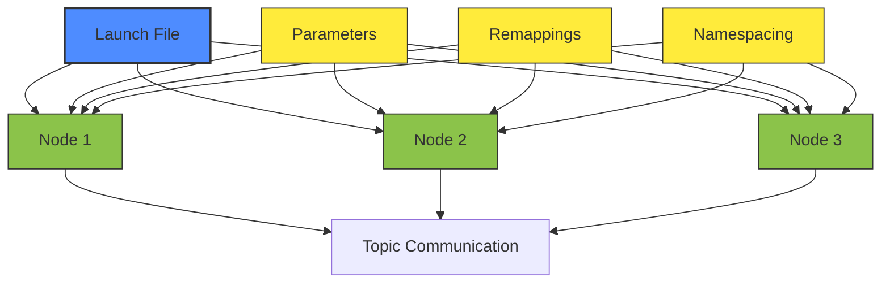

# Launch Files and Parameters

## Lesson Overview
- **Estimated Time**: 50 minutes
- **Prerequisites**: Week 3-4 lessons completed, basic Python knowledge
- **Learning Objectives**:
  - Create launch files to start multiple ROS 2 nodes simultaneously
  - Use parameters to configure nodes at launch time
  - Organize launch files for complex robot applications
  - Implement conditional launch logic
  - Use built-in launch features like logging and remapping

## Real-World Analogy: Computer Startup Scripts and Orchestra Conductors

Think of starting up a complex machine like an orchestra performance. Before the concert, the conductor doesn't start each musician one by one manually. Instead, they have a detailed score that tells each musician when to join, what sheet music to use, and how to adjust their instruments. The conductor gives a single signal, and the entire orchestra begins in a coordinated way according to the score.

Similarly, launching a robot system is like conducting an orchestra of software components. Each node is a "musician" in your robot system - a camera driver, a navigation algorithm, a motor controller, and a sensor fusion module. Rather than launching each component separately in different terminals, a launch file serves as the "score" that starts all the necessary nodes together with the correct configuration.

Just as musicians follow the conductor's timing, launch files can control when nodes start, how they're configured, and even restart them if they fail. This orchestration ensures all components are ready before the robot begins operation, much like how an orchestra waits for all members to be ready before beginning a performance.

**In ROS 2 terms**: Launch files are Python (or XML/YAML) scripts that coordinate the startup of multiple nodes with proper parameters, namespaces, and remappings. They act as the conductor that brings together all the components of your robot system in a coordinated way.

## Technical Concepts

### What are Launch Files?

Launch files in ROS 2 are scripts that start multiple nodes with specific configurations. They simplify complex system startup, ensure nodes start in correct order, manage parameters, and allow for reproducible setups across different environments.

- **Purpose**: Simplify complex system startup, ensure nodes start in correct order
- **File Types**: Python (`.launch.py`), XML (`.launch`), and YAML (`.yaml`) formats
- **Execution**: `ros2 launch <package_name> <launch_file>`
- **Benefits**: Reproducible setups, configuration management, process management

### Launch File Formats

1. **Python Launch Files** (`.launch.py`): Most flexible, programmatic control
2. **XML Launch Files** (`.launch`): Declarative, simpler syntax
3. **YAML Launch Files** (`.launch.yaml`): Human-readable, configuration-focused

Python launch files offer the most flexibility with conditional logic and programmatic node creation, but XML and YAML are simpler for basic configurations.

### Python Launch Files Structure

Basic Python launch files follow this structure:

```python
from launch import LaunchDescription
from launch.actions import DeclareLaunchArgument
from launch.substitutions import LaunchConfiguration
from launch_ros.actions import Node

def generate_launch_description():
    # Optional: declare launch arguments
    # my_arg = DeclareLaunchArgument('my_arg', default_value='default')

    return LaunchDescription([
        # Optional: include the declared arguments
        # my_arg,

        # Define the nodes to launch
        Node(
            package='demo_nodes_cpp',
            executable='talker',
            name='talker_node',
            parameters=[{'param1': 'value1'}],
            remappings=[('/topic1', '/remapped_topic1')]
        )
    ])
```

#### Key Components:
- **Import**: `from launch import LaunchDescription`, `from launch_ros.actions import Node`
- **LaunchDescription**: Main container for launch actions
- **Node Actions**: Define which nodes to run with their configurations
- **Launch Arguments**: Parameterize launch files with runtime arguments
- **Other Actions**: `ExecuteProcess`, `RegisterEventHandler`, `SetEnvironmentVariable`

### Launch Arguments and Parameters

Launch arguments allow you to pass values to launch files at runtime, while parameters configure nodes.

#### Launch Arguments Example:
```python
from launch.actions import DeclareLaunchArgument
from launch.substitutions import LaunchConfiguration

# Declare argument
use_sim_time = DeclareLaunchArgument(
    'use_sim_time',
    default_value='false',
    description='Use simulation time'
)

# Use in node
Node(
    package='my_package',
    executable='my_node',
    parameters=[{'use_sim_time': LaunchConfiguration('use_sim_time')}]
)
```

#### Parameter Files Example:
You can also load parameters from YAML files:

```python
Node(
    package='demo_nodes_cpp',
    executable='talker',
    name='talker_node',
    parameters=[
        {'param_name': 'param_value'},
        'path/to/params.yaml'  # Load from YAML file
    ]
)
```

### Advanced Launch Features

#### Remapping
Change topic/service names at launch time:
```python
Node(
    package='turtlesim',
    executable='turtle_teleop_key',
    name='teleop',
    remappings=[('/turtle1/cmd_vel', '/my_robot/cmd_vel')]
)
```

#### Namespacing
Group related nodes under a namespace:
```python
Node(
    package='my_package',
    executable='my_node',
    namespace='robot1'
)
```

## Diagrams

### Launch File Execution Flow

This diagram shows how a launch file orchestrates the startup of multiple ROS 2 nodes. The launch file serves as a central coordinator that starts each node with specific configurations (parameters, remappings, namespaces). Each node maintains its autonomy but starts with the setup defined in the launch file.



## Code Examples

### Example 1: Multi-Node Launch File

This example demonstrates a launch file that starts multiple nodes with parameters:

```python
#!/usr/bin/env python3
"""
Multi-node launch example for Week 5 Lesson 1 (Launch Files)

This launch file starts multiple nodes with parameters:
- A talker node that publishes messages
- A listener node that subscribes to messages
- A parameter server node with configuration parameters

Launch with: ros2 launch week5_lesson1_launch_example multi_node_launch.py
"""

from launch import LaunchDescription
from launch.actions import DeclareLaunchArgument
from launch.substitutions import LaunchConfiguration
from launch_ros.actions import Node


def generate_launch_description():
    # Declare launch arguments that can be passed to the launch file
    topic_name_arg = DeclareLaunchArgument(
        'topic_name',
        default_value='chatter',
        description='Name of the topic to publish to'
    )

    # Get the launch configuration
    topic_name = LaunchConfiguration('topic_name')

    # Create the talker node
    talker_node = Node(
        package='demo_nodes_cpp',
        executable='talker',
        name='talker_node',
        parameters=[
            {'topic_name': topic_name}
        ],
        remappings=[
            ('chatter', topic_name)
        ]
    )

    # Create the listener node
    listener_node = Node(
        package='demo_nodes_cpp',
        executable='listener',
        name='listener_node',
        parameters=[
            {'topic_name': topic_name}
        ],
        remappings=[
            ('chatter', topic_name)
        ]
    )

    # Create a parameter server node (simulated)
    param_server_node = Node(
        package='demo_nodes_py',
        executable='parameter_client',
        name='param_server',
        parameters=[
            {'param_a': 'value_a'},
            {'param_b': 42},
            {'param_c': True}
        ]
    )

    # Return the launch description containing all nodes
    return LaunchDescription([
        topic_name_arg,
        talker_node,
        listener_node,
        param_server_node
    ])
```

### Example 2: Launch File with Arguments

This example demonstrates how to create a launch file that accepts parameters at runtime:

```python
#!/usr/bin/env python3
"""
Parameterized launch example for Week 5 Lesson 1 (Launch Files)

This launch file demonstrates how to accept arguments at runtime:
- robot_name: Name of the robot instance
- use_sim_time: Whether to use simulation time
- log_level: Logging level for the nodes

Usage: ros2 launch week5_lesson1_launch_example parametrized_launch.py robot_name:=my_robot use_sim_time:=true
"""

from launch import LaunchDescription
from launch.actions import DeclareLaunchArgument, LogInfo
from launch.substitutions import LaunchConfiguration, TextSubstitution
from launch_ros.actions import Node


def generate_launch_description():
    # Declare launch arguments that can be passed to the launch file
    robot_name_arg = DeclareLaunchArgument(
        'robot_name',
        default_value='default_robot',
        description='Name of the robot instance'
    )

    use_sim_time_arg = DeclareLaunchArgument(
        'use_sim_time',
        default_value='false',
        description='Use simulation time'
    )

    log_level_arg = DeclareLaunchArgument(
        'log_level',
        default_value='info',
        description='Logging level for the nodes'
    )

    # Get the launch configurations
    robot_name = LaunchConfiguration('robot_name')
    use_sim_time = LaunchConfiguration('use_sim_time')
    log_level = LaunchConfiguration('log_level')

    # Create a simple node that uses these parameters
    param_demo_node = Node(
        package='demo_nodes_cpp',
        executable='talker',
        name=['talker_', robot_name],  # Use the robot name in the node name
        parameters=[
            {'use_sim_time': use_sim_time},
            {'log_level': log_level}
        ],
        arguments=['--ros-args', '--log-level', log_level]
    )

    # Add a log message to show the configuration being used
    log_message = LogInfo(
        msg=["Launching robot: ", robot_name,
             " with sim time: ", use_sim_time,
             " and log level: ", log_level]
    )

    # Return the launch description containing all nodes and arguments
    return LaunchDescription([
        robot_name_arg,
        use_sim_time_arg,
        log_level_arg,
        log_message,
        param_demo_node
    ])
```

### Example 3: Parameter Configuration File

Parameters can be loaded from external YAML files:

```yaml
# Parameter configuration file for ROS 2 launch example
# Used in Week 5 Lesson 1 (Launch Files)

talker_node:
  ros__parameters:
    topic_name: "chatter"
    publish_freq: 1.0  # Hz
    message_content: "Hello World"

listener_node:
  ros__parameters:
    topic_name: "chatter"
    queue_size: 10

param_server:
  ros__parameters:
    param_a: "value_a"
    param_b: 42
    param_c: true
    nested_params:
      sub_param1: "nested_value1"
      sub_param2: 123
```

## How to Run

1. Make sure you have ROS 2 Humble installed and sourced:
   ```bash
   source /opt/ros/humble/setup.bash
   ```

2. Build the demo packages if not already done:
   ```bash
   ros2 pkg list | grep demo_nodes
   ```

3. Launch the multi-node system:
   ```bash
   ros2 launch specs/004-content-module-1/code-examples/week5_lesson1_launch_example/multi_node_launch.py
   ```

   Or if you've built the package containing this launch file:
   ```bash
   ros2 launch week5_lesson1_launch_example multi_node_launch.py
   ```

4. You should see output from the talker and listener nodes

### Customization

You can pass launch arguments when running the launch file:
```bash
ros2 launch week5_lesson1_launch_example multi_node_launch.py topic_name:=my_custom_topic
```

This will make the nodes publish and subscribe to the topic named "my_custom_topic" instead of "chatter".

You can also run the parametrized launch example that accepts multiple arguments:
```bash
ros2 launch week5_lesson1_launch_example parametrized_launch.py robot_name:=my_robot use_sim_time:=true log_level:=debug
```

This demonstrates how launch files can accept runtime parameters to customize the system configuration.

## Hands-On Exercise: Create a Multi-Node Launch System

**Estimated Time**: 30 minutes

Create a launch file that starts multiple nodes with parameters and demonstrates the coordination of a simple robot system.

### Setup

**Step 1**: Create a workspace directory
```bash
mkdir -p ~/ros2_launch_ws/src
cd ~/ros2_launch_ws/src
```

**Step 2**: Verify ROS 2 environment is sourced
```bash
source /opt/ros/humble/setup.bash
```

**Step 3**: Create a package for your launch examples
```bash
cd ~/ros2_launch_ws/src
ros2 pkg create simple_robot_launch --build-type ament_python --dependencies rclpy std_msgs builtin_interfaces
```

**Step 4**: Navigate to your package and create required directories
```bash
cd simple_robot_launch
mkdir -p launch params
ls -la
```

**Expected Output**: Should show standard ROS 2 package structure with `package.xml`, `setup.py`, and new directories.

### Instructions

**Task 1: Create a Basic Launch File**

Create a file `launch/simple_robot.launch.py`:

**Requirements**:
- **Import**: Import necessary launch and ROS launch modules
- **LaunchDescription**: Return a LaunchDescription containing nodes
- **Two nodes**: Launch turtlesim_node and turtle_teleop_key
- **Unique names**: Give each node a unique name
- **Remapping**: Connect the teleop to control the simulation

**Hints**:
- Import: `from launch import LaunchDescription` and `from launch_ros.actions import Node`
- Use the Node action to define each node to run
- Remapping format: `remappings=[('/original_topic', '/new_topic')]`

**Important**: Make sure the launch file returns a LaunchDescription object containing your nodes.

**Task 2: Create a Parameterized Launch File**

Create a file `launch/param_robot.launch.py`:

**Requirements**:
- **Launch arguments**: Define at least one launch argument (e.g., robot_name)
- **Default values**: Provide reasonable defaults for arguments
- **Use arguments**: Use LaunchConfiguration to apply arguments to nodes
- **Conditional logic**: (Optional) Add simple conditional logic for different configurations

**Hints**:
- Import: `from launch.actions import DeclareLaunchArgument` and `from launch.substitutions import LaunchConfiguration`
- Declare arguments and reference them in nodes using LaunchConfiguration

**Important**: Remember to include your declared arguments in the LaunchDescription alongside the nodes.

**Task 3: Create a Parameter File**

Create a file `params/robot_params.yaml`:

**Requirements**:
- **YAML format**: Follow proper ROS 2 parameter file structure
- **Parameters**: Define at least 3 different parameters for one or more nodes
- **Structure**: Use the correct ROS 2 parameter format with `ros__parameters` key

**Hints**:
- Use the structure: `node_name: ros__parameters: param1: value1`
- For all nodes, use `/**:` to apply parameters globally

**Important**: Parameter files follow a specific structure that differs from regular YAML files.

**Task 4: Test Your Launch Files**

```bash
cd ~/ros2_launch_ws
colcon build --packages-select simple_robot_launch
source install/setup.bash

# Test the basic launch
ros2 launch simple_robot_launch simple_robot.launch.py

# In a new terminal, test the parameterized launch
ros2 launch simple_robot_launch param_robot.launch.py robot_name:=my_turtle
```

### Validation

**Test Your Solution**:

**Terminal 1 - Basic Launch**:
```bash
cd ~/ros2_launch_ws
source install/setup.bash
ros2 launch simple_robot_launch simple_robot.launch.py
```

**Expected Output**:
- Both turtlesim and teleop nodes start successfully
- No error messages in console
- Turtlesim window appears

**Terminal 2 - Parameterized Launch**:
```bash
cd ~/ros2_launch_ws
source install/setup.bash
ros2 launch simple_robot_launch param_robot.launch.py robot_name:=my_turtle
```

**Expected Output**:
- Nodes start with the parameterized configuration
- Node names reflect the passed argument

**Verification Checklist**:
- [ ] Basic launch file starts nodes successfully
- [ ] Parameterized launch accepts arguments
- [ ] Parameter file loads without syntax errors
- [ ] All nodes function as expected
- [ ] No errors in console output

### Common Mistakes

**Mistake 1: "Launch file not found"**

- **Symptom**: Command returns "No launch files found in package"

- **Cause**: Launch file not in the launch directory or incorrect file extension

- **Solution**:
  1. Ensure launch file is in the `launch/` directory
  2. Check file has `.launch.py` extension
  3. Rebuild the package after creating the launch file:
     ```bash
     colcon build --packages-select simple_robot_launch
     ```

- **Prevention**: Always place launch files in the `launch/` directory

**Mistake 2: Import Errors in Launch Files**

- **Symptom**:
  ```
  ModuleNotFoundError: No module named 'launch'
  ```

- **Cause**: Missing launch dependencies in package.xml

- **Solution**:
  1. Check package.xml includes:
     ```xml
     <depend>launch</depend>
     <depend>launch_ros</depend>
     ```
  2. Rebuild package after adding dependencies

**Mistake 3: Launch File Syntax Errors**

- **Symptom**: Launch command fails with Python syntax errors

- **Cause**: Incorrect Python syntax in launch file

- **Solution**:
  1. Check that the launch file has a function `generate_launch_description()` that returns `LaunchDescription`
  2. Ensure all nodes are in a list passed to LaunchDescription
  3. Verify proper indentation in Python code

**Mistake 4: Remapping Not Working**

- **Symptom**: Nodes don't connect to each other despite remappings in launch file

- **Cause**: Incorrect remapping syntax

- **Solution**:
  1. Use correct remapping format: `remappings=[('/original', '/new')]`
  2. Remember remappings are in the form [from_topic, to_topic]
  3. Check topic names with `ros2 topic list` to verify connections

**Mistake 5: Parameters Not Applied**

- **Symptom**: Nodes start but don't use expected parameter values

- **Cause**: Incorrect parameter structure or location

- **Solution**:
  1. Ensure parameters are in the right format: `parameters=[{'key': 'value'}]`
  2. For YAML files, use correct structure with `ros__parameters`:
     ```yaml
     node_name:
       ros__parameters:
         key: value
     ```

## Check Your Understanding

**Question 1**: What is the main purpose of ROS 2 launch files?

**Question 2**: What are the three formats that ROS 2 launch files can be written in?

**Question 3**: In a Python launch file, what function must be defined and what must it return?

**Question 4**: How do you pass a parameter to a launch file at runtime?

**Question 5**: What is the difference between a launch argument and a node parameter?

<details>
<summary>View Answers</summary>

**Answer 1**: The main purpose of ROS 2 launch files is to start multiple ROS 2 nodes simultaneously with specific configurations. They simplify complex system startup, ensure nodes start in the correct order, manage parameters, and allow for reproducible setups across different environments.

**Answer 2**: The three formats for ROS 2 launch files are: Python (`.launch.py`), XML (`.launch`), and YAML (`.launch.yaml`). Python launch files offer the most flexibility, while XML and YAML are simpler for basic configurations.

**Answer 3**: In a Python launch file, you must define a `generate_launch_description()` function that returns a `LaunchDescription` object containing the nodes and other actions to execute.

**Answer 4**: You pass parameters to a launch file at runtime using the syntax: `ros2 launch package_name launch_file.launch.py param_name:=value`. For example: `ros2 launch my_pkg my_launch.py use_sim_time:=true`.

**Answer 5**: A **launch argument** is a value passed to the launch file itself at runtime (e.g., which configuration to use), while a **node parameter** is a configuration value passed to an individual node (e.g., the robot's wheel radius). Launch arguments configure the launch process, node parameters configure the behavior of nodes.

</details>

## Summary

Launch files are powerful tools that allow you to orchestrate complex ROS 2 systems with a single command. By combining launch files with parameter configuration, you can create reusable, configurable robot systems that are easy to deploy and manage. Understanding launch files is crucial for robotics development as they simplify the process of starting multiple coordinated nodes, just like a conductor orchestrates an entire orchestra with a single score.

## Additional Resources

- [Creating Launch Files](https://docs.ros.org/en/humble/Tutorials/Intermediate/Launch/Creating-Launch-Files.html)
- [Launch System Documentation](https://docs.ros.org/en/humble/Tutorials/Intermediate/Launch/Launch-system.html)
- [ROS 2 Launch GitHub Repository](https://github.com/ros2/launch)