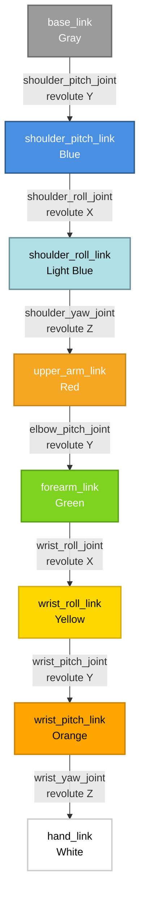
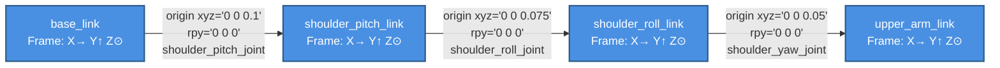

# Week 5 Lesson 2: URDF for Humanoids

**Estimated Time**: 50 minutes  
**Prerequisites**: Week 5 Lesson 1 (Launch Files), basic XML knowledge, ROS 2 Humble installed

## Learning Objectives

After this lesson, you will be able to:
- Understand the structure and purpose of Unified Robot Description Format (URDF) files
- Define robot links, joints, and visual/collision properties in URDF
- Model a 7-DOF humanoid arm with proper kinematic structure
- Create coordinate frames for robot components
- Visualize and validate robot models using RViz2
- Understand the relationship between URDF and forward kinematics

---

## 1. Real-World Analogy: Robot Blueprint/Assembly Instructions

Think of URDF like the assembly instructions for furniture from IKEA. Just as the instructions describe every part (screws, panels, hinges), how they connect (assembly steps), and where everything goes (final configuration), URDF specifies how a robot's physical components are structured and connected.

The IKEA manual has pages showing different views of the furniture: top view, side view, exploded view showing how parts connect. Similarly, URDF describes a robot from different perspectives: physical structure (links), connections between parts (joints), and how they move relative to each other.

When you follow IKEA instructions, you understand how the furniture will look and function. With URDF, ROS 2 nodes understand the robot's structure and can calculate where each part is located in space based on joint angles. Just as you can't connect the shelf before mounting the brackets (assembly dependency), robot controllers must understand the parent-child relationships in URDF to properly control the robot.

**In ROS 2 terms**: URDF is an XML format that describes a robot's physical structure—its links (rigid bodies), joints (connections), coordinate frames, and their spatial relationships. This allows ROS 2 tools, like RViz2 for visualization and MoveIt for motion planning, to understand the robot's kinematic structure.

---

## 2. Technical Concept: Understanding URDF Structure

### 2.1 What is URDF?

**Unified Robot Description Format (URDF)** is an XML-based format for representing a robot model. It describes the robot's physical structure including:
- **Links**: Rigid bodies (visual, collision, and inertial properties)
- **Joints**: Connections between links that allow specific types of motion
- **Coordinate frames**: Reference frames attached to each link
- **Transmissions**: How joints connect to actuators (motors)

URDF serves as the foundation for:
- Robot visualization in RViz2
- Physics simulation in Gazebo
- Motion planning in MoveIt
- Collision detection and avoidance

### 2.2 URDF Links: The Building Blocks

A link represents a rigid body in the robot - something that doesn't move internally. Each link can have three components:

1. **Visual**: How the link appears when visualized
2. **Collision**: How the link interacts in physics simulation
3. **Inertial**: Mass properties for dynamics simulation

Here's the basic structure of a link:

```xml
<link name="example_link">
  <visual>
    <geometry>
      <cylinder radius="0.05" length="0.3"/>
    </geometry>
    <material name="red"/>
  </visual>
  <collision>
    <geometry>
      <cylinder radius="0.05" length="0.3"/>
    </geometry>
  </collision>
  <inertial>
    <mass value="0.8"/>
    <inertia ixx="0.002" ixy="0" ixz="0" iyy="0.002" iyz="0" izz="0.0002"/>
  </inertial>
</link>
```

**Common geometry types**:
- `<box size="x y z"/>` for rectangular shapes
- `<cylinder radius="r" length="l"/>` for cylindrical shapes
- `<sphere radius="r"/>` for spherical shapes
- `<mesh filename="path"/>` for complex CAD models

### 2.3 URDF Joints: Connecting the Pieces

Joints define how links connect and move relative to each other. Each joint connects exactly two links: a parent and a child.

**Joint Types**:
- **Fixed**: No motion, rigid connection
- **Revolute**: Single axis of rotation with limits (like an elbow)
- **Continuous**: Single axis of rotation without limits (like a wheel)
- **Prismatic**: Single axis of translation
- **Floating**: 6DOF motion for simulation
- **Planar**: Motion on a plane

Here's a joint definition:

```xml
<joint name="elbow_joint" type="revolute">
  <parent link="upper_arm_link"/>
  <child link="forearm_link"/>
  <origin xyz="0 0 0.3" rpy="0 0 0"/>
  <axis xyz="0 1 0"/>
  <limit lower="-2.0" upper="2.0" effort="100" velocity="1.0"/>
</joint>
```

The key elements are:
- `parent` and `child`: Define the kinematic chain
- `origin`: Position and orientation of the child frame relative to parent
- `axis`: Direction of motion for revolute/prismatic joints
- `limit`: For revolute joints, define range of motion

### 2.4 Coordinate Frames and Transformations

Each link has its own coordinate frame following the right-hand rule:
- **X**: Points forward
- **Y**: Points left
- **Z**: Points up

The `origin` element in joints specifies how to transform from the parent frame to the child frame using:
- `xyz`: Position offset (X, Y, Z translation)
- `rpy`: Orientation (roll, pitch, yaw in radians)

Understanding coordinate frames is crucial for forward kinematics - calculating where the end effector is based on joint angles.

---

## 3. Code Example: 7-DOF Humanoid Arm

Let's look at a complete URDF for a 7-degree-of-freedom humanoid arm. This example demonstrates proper kinematic structure with shoulder, elbow, and wrist joints:

```xml
<?xml version="1.0"?>
<!-- 7-DOF Humanoid Arm URDF -->
<robot name="humanoid_arm">

  <!-- Base Link (Fixed to robot body) -->
  <link name="base_link">
    <visual>
      <geometry>
        <box size="0.1 0.1 0.1"/>
      </geometry>
      <material name="gray">
        <color rgba="0.5 0.5 0.5 1.0"/>
      </material>
    </visual>
    <collision>
      <geometry>
        <box size="0.1 0.1 0.1"/>
      </geometry>
    </collision>
    <inertial>
      <mass value="1.0"/>
      <inertia ixx="0.001" ixy="0" ixz="0" iyy="0.001" iyz="0" izz="0.001"/>
    </inertial>
  </link>

  <!-- Shoulder Pitch Link -->
  <link name="shoulder_pitch_link">
    <visual>
      <geometry>
        <cylinder radius="0.05" length="0.15"/>
      </geometry>
      <material name="blue">
        <color rgba="0 0 1 1"/>
      </material>
    </visual>
    <collision>
      <geometry>
        <cylinder radius="0.05" length="0.15"/>
      </geometry>
    </collision>
    <inertial>
      <mass value="0.5"/>
      <inertia ixx="0.001" ixy="0" ixz="0" iyy="0.001" iyz="0" izz="0.001"/>
    </inertial>
  </link>

  <!-- Shoulder Joint 1 (Pitch) -->
  <joint name="shoulder_pitch_joint" type="revolute">
    <parent link="base_link"/>
    <child link="shoulder_pitch_link"/>
    <origin xyz="0 0 0.1" rpy="0 0 0"/>
    <axis xyz="0 1 0"/>  <!-- Rotate around Y axis (pitch) -->
    <limit lower="-1.57" upper="1.57" effort="100" velocity="1.0"/>
  </joint>

  <!-- Shoulder Roll Link -->
  <link name="shoulder_roll_link">
    <visual>
      <geometry>
        <cylinder radius="0.05" length="0.1"/>
      </geometry>
      <material name="light_blue">
        <color rgba="0.5 0.5 1 1"/>
      </material>
    </visual>
    <collision>
      <geometry>
        <cylinder radius="0.05" length="0.1"/>
      </geometry>
    </collision>
    <inertial>
      <mass value="0.4"/>
      <inertia ixx="0.0005" ixy="0" ixz="0" iyy="0.0005" iyz="0" izz="0.0002"/>
    </inertial>
  </link>

  <!-- Shoulder Joint 2 (Roll) -->
  <joint name="shoulder_roll_joint" type="revolute">
    <parent link="shoulder_pitch_link"/>
    <child link="shoulder_roll_link"/>
    <origin xyz="0 0 0.075" rpy="0 0 0"/>
    <axis xyz="1 0 0"/>  <!-- Rotate around X axis (roll) -->
    <limit lower="-1.57" upper="1.57" effort="100" velocity="1.0"/>
  </joint>

  <!-- Upper Arm Link -->
  <link name="upper_arm_link">
    <visual>
      <geometry>
        <cylinder radius="0.04" length="0.3"/>
      </geometry>
      <origin xyz="0 0 0.15" rpy="0 0 0"/>
      <material name="red">
        <color rgba="1 0 0 1"/>
      </material>
    </visual>
    <collision>
      <geometry>
        <cylinder radius="0.04" length="0.3"/>
      </geometry>
      <origin xyz="0 0 0.15" rpy="0 0 0"/>
    </collision>
    <inertial>
      <mass value="0.8"/>
      <origin xyz="0 0 0.15" rpy="0 0 0"/>
      <inertia ixx="0.002" ixy="0" ixz="0" iyy="0.002" iyz="0" izz="0.0002"/>
    </inertial>
  </link>

  <!-- Shoulder Yaw Joint -->
  <joint name="shoulder_yaw_joint" type="revolute">
    <parent link="shoulder_roll_link"/>
    <child link="upper_arm_link"/>
    <origin xyz="0 0 0.05" rpy="0 0 0"/>
    <axis xyz="0 0 1"/>  <!-- Rotate around Z axis (yaw) -->
    <limit lower="-1.57" upper="1.57" effort="100" velocity="1.0"/>
  </joint>

  <!-- Elbow Joint and Forearm -->
  <link name="forearm_link">
    <visual>
      <geometry>
        <cylinder radius="0.035" length="0.25"/>
      </geometry>
      <origin xyz="0 0 0.125" rpy="0 0 0"/>
      <material name="green">
        <color rgba="0 1 0 1"/>
      </material>
    </visual>
    <collision>
      <geometry>
        <cylinder radius="0.035" length="0.25"/>
      </geometry>
      <origin xyz="0 0 0.125" rpy="0 0 0"/>
    </collision>
    <inertial>
      <mass value="0.6"/>
      <origin xyz="0 0 0.125" rpy="0 0 0"/>
      <inertia ixx="0.001" ixy="0" ixz="0" iyy="0.001" iyz="0" izz="0.0001"/>
    </inertial>
  </link>

  <!-- Elbow Joint (Pitch) -->
  <joint name="elbow_pitch_joint" type="revolute">
    <parent link="upper_arm_link"/>
    <child link="forearm_link"/>
    <origin xyz="0 0 0.3" rpy="0 0 0"/>
    <axis xyz="0 1 0"/>  <!-- Rotate around Y axis (pitch) -->
    <limit lower="-2.0" upper="2.0" effort="100" velocity="1.0"/>
  </joint>

  <!-- Wrist and Hand Links -->
  <link name="wrist_roll_link">
    <visual>
      <geometry>
        <box size="0.06 0.06 0.04"/>
      </geometry>
      <material name="yellow">
        <color rgba="1 1 0 1"/>
      </material>
    </visual>
    <collision>
      <geometry>
        <box size="0.06 0.06 0.04"/>
      </geometry>
    </collision>
    <inertial>
      <mass value="0.3"/>
      <inertia ixx="0.0001" ixy="0" ixz="0" iyy="0.0001" iyz="0" izz="0.0001"/>
    </inertial>
  </link>

  <joint name="wrist_roll_joint" type="revolute">
    <parent link="forearm_link"/>
    <child link="wrist_roll_link"/>
    <origin xyz="0 0 0.25" rpy="0 0 0"/>
    <axis xyz="1 0 0"/>  <!-- Rotate around X axis (roll) -->
    <limit lower="-1.57" upper="1.57" effort="50" velocity="1.0"/>
  </joint>

  <link name="wrist_pitch_link">
    <visual>
      <geometry>
        <box size="0.05 0.05 0.03"/>
      </geometry>
      <material name="orange">
        <color rgba="1 0.6 0"/>
      </material>
    </visual>
    <collision>
      <geometry>
        <box size="0.05 0.05 0.03"/>
      </geometry>
    </collision>
    <inertial>
      <mass value="0.2"/>
      <inertia ixx="0.00005" ixy="0" ixz="0" iyy="0.00005" iyz="0" izz="0.00005"/>
    </inertial>
  </link>

  <joint name="wrist_pitch_joint" type="revolute">
    <parent link="wrist_roll_link"/>
    <child link="wrist_pitch_link"/>
    <origin xyz="0 0 0.02" rpy="0 0 0"/>
    <axis xyz="0 1 0"/>  <!-- Rotate around Y axis (pitch) -->
    <limit lower="-1.57" upper="1.57" effort="50" velocity="1.0"/>
  </joint>

  <link name="hand_link">
    <visual>
      <geometry>
        <box size="0.1 0.08 0.05"/>
      </geometry>
      <origin xyz="0.05 0 0" rpy="0 0 0"/>
      <material name="white">
        <color rgba="1 1 1 1"/>
      </material>
    </visual>
    <collision>
      <geometry>
        <box size="0.1 0.08 0.05"/>
      </geometry>
      <origin xyz="0.05 0 0" rpy="0 0 0"/>
    </collision>
    <inertial>
      <mass value="0.2"/>
      <origin xyz="0.05 0 0" rpy="0 0 0"/>
      <inertia ixx="0.0001" ixy="0" ixz="0" iyy="0.0001" iyz="0" izz="0.0001"/>
    </inertial>
  </link>

  <joint name="wrist_yaw_joint" type="revolute">
    <parent link="wrist_pitch_link"/>
    <child link="hand_link"/>
    <origin xyz="0 0 0" rpy="0 0 0"/>
    <axis xyz="0 0 1"/>  <!-- Rotate around Z axis (yaw) -->
    <limit lower="-1.57" upper="1.57" effort="50" velocity="1.0"/>
  </joint>

  <!-- Materials -->
  <material name="gray">
    <color rgba="0.5 0.5 0.5 1.0"/>
  </material>
  <material name="blue">
    <color rgba="0 0 1 1"/>
  </material>
  <material name="light_blue">
    <color rgba="0.5 0.5 1 1"/>
  </material>
  <material name="red">
    <color rgba="1 0 0 1"/>
  </material>
  <material name="green">
    <color rgba="0 1 0 1"/>
  </material>
  <material name="yellow">
    <color rgba="1 1 0 1"/>
  </material>
  <material name="orange">
    <color rgba="1 0.6 0 1"/>
  </material>
  <material name="white">
    <color rgba="1 1 1 1"/>
  </material>

</robot>
```

This URDF creates a 7-DOF arm with:
- 3 DOF at the shoulder (pitch, roll, yaw) 
- 1 DOF at the elbow (pitch)
- 3 DOF at the wrist (roll, pitch, yaw)

### 2.4 Robot State Publisher and Visualization

To visualize this robot in RViz2, we need the `robot_state_publisher` node to publish the kinematic relationships and `joint_state_publisher` to simulate joint angles:

```python
from launch import LaunchDescription
from launch.actions import DeclareLaunchArgument
from launch.substitutions import LaunchConfiguration
from launch_ros.actions import Node
import os

def generate_launch_description():
    # Get the URDF file location
    urdf_file = os.path.join(
        os.path.dirname(__file__),
        'week5_lesson2_humanoid_arm.urdf'
    )
    
    with open(urdf_file, 'r') as infp:
        robot_desc = infp.read()

    return LaunchDescription([
        # Robot State Publisher
        Node(
            package='robot_state_publisher',
            executable='robot_state_publisher',
            name='robot_state_publisher',
            output='screen',
            parameters=[{
                'robot_description': robot_desc
            }],
        ),
        
        # Joint State Publisher (GUI)
        Node(
            package='joint_state_publisher_gui',
            executable='joint_state_publisher_gui',
            name='joint_state_publisher_gui',
            output='screen',
        ),
        
        # RViz2
        Node(
            package='rviz2',
            executable='rviz2',
            name='rviz2',
            output='screen',
        ),
    ])
```

---

## 4. Diagram: Robot Kinematic Tree

The kinematic structure of our 7-DOF arm follows a tree structure from base to end effector:



**Figure 1**: Kinematic tree of a 7-DOF humanoid arm. This diagram shows how links are connected through joints in a hierarchical structure from base_link to hand_link. Each joint allows specific types of motion (revolute around X, Y, or Z axis).

### Joint Coordinate Frames and Transformations

Understanding coordinate frames is crucial for working with URDF. Each link has its own coordinate frame, and the `origin` element in joints defines how child frames relate to parent frames:



**Figure 2**: Coordinate frames and transformations in a robot arm. Each link has its own coordinate system (X forward →, Y up ↑, Z out of page ⊙). The `origin` element in joint definitions specifies the position (xyz) and orientation (rpy) of the child frame relative to the parent frame. For example, shoulder_pitch_link's frame is translated 0.1m along the Z-axis from base_link's frame.

---

## 5. Hands-on Exercise: Model Your Own Robot Arm

### Objective
Create a 4-DOF robot arm in URDF format and visualize it in RViz2 with adjustable joint positions.

**Estimated Time**: 25 minutes

### Setup
1. Create a directory for your URDF project:
```bash
mkdir -p ~/ros2_urdf_ws
cd ~/ros2_urdf_ws
```

2. Create your URDF file:
```bash
touch simple_robot_arm.urdf
```

### Instructions

1. **Define the Robot Structure**
   Create a URDF for a 4-DOF robot arm with these specifications:
   - Base Link: 0.2×0.2×0.1m box
   - Shoulder Joint: Revolute (pitch) connecting to upper arm
   - Upper Arm Link: 0.06m radius, 0.4m length cylinder
   - Elbow Joint: Revolute (pitch) connecting to forearm
   - Forearm Link: 0.05m radius, 0.3m length cylinder
   - Wrist Joint: Revolute (roll) connecting to wrist link
   - Wrist Link: 0.04m radius, 0.1m length cylinder
   - End Effector Link: 0.05×0.05×0.05m box

2. **Add Joint Properties**
   For each revolute joint, specify:
   - Joint type: `revolute`
   - Parent and child links
   - Origin: position relative to parent
   - Axis: direction of rotation (shoulder and elbow: `xyz="0 1 0"`, wrist: `xyz="1 0 0"`)
   - Limits: `lower="-1.57" upper="1.57"` (±90 degrees in radians)

3. **Add Material Colors**
   Define at least 4 different materials:
   - Base link: Gray (`rgba="0.5 0.5 0.5 1"`)
   - Upper arm: Blue (`rgba="0 0 1 1"`)
   - Forearm: Red (`rgba="1 0 0 1"`)
   - Wrist: Green (`rgba="0 1 0 1"`)
   - End effector: Yellow (`rgba="1 1 0 1"`)

4. **Validate Your URDF**
   Before visualizing, check for syntax errors:
   ```bash
   check_urdf simple_robot_arm.urdf
   ```

### Validation
1. **Validate URDF Syntax**:
   ```bash
   check_urdf simple_robot_arm.urdf
   ```
   Expected: "Successfully Parsed XML" message

2. **Visualize in RViz2**:
   Create a launch file named `visualize_arm.launch.py` with the same structure as in the code example above, but with your URDF file.

3. **Launch Visualization**:
   ```bash
   ros2 launch visualize_arm.launch.py
   ```

   Expected: RViz2 shows your robot arm with 4 adjustable joints (shoulder, elbow, wrist, end effector connection)

### Common Mistakes
- **Joint parent/child mismatch**: Ensure all links referenced in joints are defined
- **Invalid URDF syntax**: Use XML validator if getting parsing errors
- **Joint limits in degrees**: Remember to use radians (1.57 ≈ 90°)
- **Missing materials**: Define all materials referenced in visual elements

### Extension Ideas (Advanced)
1. **Add More DOF**: Add a second wrist joint (yaw) for 5-DOF or shoulder roll for 5-DOF
2. **Create a Mobile Base**: Add a simple wheeled base for your arm
3. **Add a Simple Gripper**: Create a 2-finger gripper at the end
4. **Add Collision Geometry**: Create simplified collision meshes different from visual geometry

---

## 6. Check Your Understanding

<details>
<summary>1. What's the difference between a link's visual and collision properties in URDF?</summary>

**Visual properties** define how the link appears when visualized in tools like RViz2 (shape, color, texture). **Collision properties** define how the link interacts in physics simulations (shape used for collision detection). Visual geometry can be more detailed and colorful, while collision geometry is often simplified for performance.
</details>

<details>
<summary>2. If you want a robot joint that can rotate freely in both directions (like a wheel), what joint type should you use?</summary>

Use a **continuous** joint type. This is like a revolute joint but without limits, allowing unlimited rotation in both directions. A **revolute** joint has defined limits and restricts motion to a specific range.
</details>

<details>
<summary>3. What does the "origin" element in a joint definition specify?</summary>

The "origin" element specifies the **position and orientation** of the child link's coordinate frame relative to the parent link's frame. It has xyz (position offset) and rpy (roll-pitch-yaw orientation) attributes. This defines where the child link is located and how it's rotated compared to its parent.
</details>

<details>
<summary>4. Why is the robot_state_publisher node necessary for working with URDF models in ROS 2?</summary>

The robot_state_publisher node is necessary because it calculates and publishes the **transformations** between all the robot's coordinate frames based on the URDF model and current joint positions. Without these transforms in the TF tree, ROS 2 nodes can't understand where each part of the robot is located in space, which is essential for navigation, manipulation, and visualization.
</details>

---

## 7. Additional Resources

**Official ROS 2 Documentation**:
- [Building a Visual Robot Model from Scratch](https://docs.ros.org/en/humble/Tutorials/Intermediate/URDF/Building-a-Visual-Robot-Model-from-Scratch.html)
- [URDF Tutorials](https://docs.ros.org/en/humble/Tutorials/Intermediate/URDF/URDF-Main.html)
- [URDF XML Specification](http://wiki.ros.org/urdf/XML)

**Community Resources**:
- [ROS Answers - URDF](https://answers.ros.org/questions/scope:all/sort:activity-desc/tags:urdf/)

---

## Next Lesson

**Module 2 Overview: Physical AI Fundamentals**

In the next module, you'll transition from ROS 2 tools to core Physical AI concepts:
- Embodied intelligence and the perception-action cycle
- Sensorimotor learning in robots
- Dynamics of physical systems
- Control theory fundamentals for robotics
- Introduction to reinforcement learning for robot control

This concludes Module 1: ROS 2 Fundamentals. You now have the foundational knowledge to build, run, and coordinate distributed robotics systems!