```mermaid
graph TD
    %% Styling
    classDef wsStyle fill:#E8F4F8,stroke:#2E5C8A,stroke-width:2px,color:#000000
    classDef srcStyle fill:#D4E6F1,stroke:#2E5C8A,stroke-width:2px,color:#000000
    classDef pkgStyle fill:#A9CCE3,stroke:#2E5C8A,stroke-width:2px,color:#000000
    classDef genStyle fill:#F9E79F,stroke:#D4AC0D,stroke-width:2px,color:#000000

    %% Workspace root
    WS[ros2_ws/<br/>Workspace Root]

    %% Main directories
    SRC[src/<br/>Source Space<br/>📁 Your packages here<br/>✅ Git tracked]
    BUILD[build/<br/>Build Space<br/>⚙️ Intermediate files<br/>❌ Not git tracked]
    INSTALL[install/<br/>Install Space<br/>📦 Executables<br/>❌ Not git tracked]
    LOG[log/<br/>Log Space<br/>📄 Build logs<br/>❌ Not git tracked]

    %% Packages
    PKG1[package_1/]
    PKG2[package_2/]
    PKG3[package_3/]

    %% Relationships
    WS --> SRC
    WS --> BUILD
    WS --> INSTALL
    WS --> LOG

    SRC --> PKG1
    SRC --> PKG2
    SRC --> PKG3

    %% Apply styles
    class WS wsStyle
    class SRC srcStyle
    class PKG1,PKG2,PKG3 pkgStyle
    class BUILD,INSTALL,LOG genStyle
```

```mermaid
graph LR
    A["base_link<br/>Frame:<br/>X→ Y↑ Z•"] -->|Origin<br/>xyz=0,0,0.1<br/>rpy=0,0,0| B["shoulder_pitch_link<br/>Frame:<br/>X→ Y↑ Z•"]
    B -->|Origin<br/>xyz=0,0,0.075<br/>rpy=0,0,0| C["shoulder_roll_link<br/>Frame:<br/>X→ Y↑ Z•"]
    C -->|Origin<br/>xyz=0,0,0.05<br/>rpy=0,0,0| D["upper_arm_link<br/>Frame:<br/>X→ Y↑ Z•"]

    %% Styling for WCAG 2.1 AA colorblind accessibility
    classDef coordStyle fill:#4A90E2,stroke:#2E5C8A,stroke-width:2px,color:#FFFFFF
    classDef coordStyle2 fill:#7ED321,stroke:#5AA016,stroke-width:2px,color:#FFFFFF
    classDef coordStyle3 fill:#F5A623,stroke:#C58720,stroke-width:2px,color:#FFFFFF
    classDef coordStyle4 fill:#BD10E0,stroke:#9A0DC7,stroke-width:2px,color:#FFFFFF

    class A coordStyle
    class B coordStyle2
    class C coordStyle3
    class D coordStyle4
```

# Module 1 Diagrams

This file contains all Mermaid diagrams for Module 1 (ROS 2 Fundamentals) lessons.

## Color Palette (WCAG 2.1 AA Compliant)

All diagrams use the following colorblind-accessible palette:

| Element Type | Color Name | Hex Code | Use Case |
|--------------|------------|----------|----------|
| Nodes | Blue | #4A90E2 | ROS 2 nodes, processes |
| Topics | Green | #7ED321 | Topics, data channels |
| Services | Orange | #F5A623 | Services, synchronous calls |
| Actions | Purple | #BD10E0 | Actions, async operations |
| Messages | Gray | #9B9B9B | Message types, data structures |
| Background | White | #FFFFFF | Diagram background |
| Text | Dark Gray | #4A4A4A | Labels, annotations |

---

## Week 3 Lesson 1: ROS 2 Architecture

### Diagram 1: ROS 2 Graph - Publisher/Subscriber Pattern

**Purpose**: Visualize the relationship between nodes, topics, and message flow in a basic publisher-subscriber system.

**Use in lesson**: Section 2.5 (Publisher-Subscriber Pattern) and Section 3 (Code Example)

**Mermaid Code**:

**Expected Rendering**:
- Two blue boxes representing nodes (minimal_publisher, minimal_subscriber)
- One green diamond/trapezoid representing the topic (/temperature)
- Arrows showing message flow from publisher → topic → subscriber
- Labels indicating "publishes Float32" and "delivers Float32"

**Accessibility Notes**:
- Color is not the only differentiator (shapes differ: rectangles for nodes, diamond for topic)
- Text labels clearly identify each element
- High contrast ratios: Blue (#4A90E2) on white = 4.8:1, Green (#7ED321) on white = 6.2:1

**Teaching Points**:
1. **Decoupling**: Publisher and subscriber don't know about each other - they only know the topic name
2. **One-to-Many**: Multiple subscribers could listen to the same topic (add another subscriber box to show this)
3. **Asynchronous**: The publisher doesn't wait for the subscriber - messages go through the topic
4. **Message Type**: Float32 is specified on both arrows - type mismatch would cause errors

**Alternative View (Sequence Diagram)**: Available in research.md Section 4.2 for showing time-based message flow.

---

## Week 3 Lesson 2: Nodes and Packages

### Diagram 2: ROS 2 Workspace Structure

**Purpose**: Visualize the four main directories in a ROS 2 workspace and how packages fit inside

**Use in lesson**: Section 2.2 (ROS 2 Workspace Structure)

**Mermaid Code**:

**Expected Rendering**:
- Top level: `ros2_ws/` workspace root (light blue)
- Four main directories branching from root
- `src/` (blue) contains three package directories
- `build/`, `install/`, `log/` (yellow) marked as "Not git tracked"
- Icons and labels for each directory's purpose

**Accessibility Notes**:
- Color + icons + text labels for redundancy
- Clear hierarchy with tree structure
- Blue vs yellow distinguishes user-managed from auto-generated

**Teaching Points**:
1. **src/ is where you work**: All your custom packages go here, tracked in git
2. **build/, install/, log/ are generated**: Colcon creates these, never edit them manually
3. **Workspace isolates projects**: Each robot project gets its own workspace
4. **Multiple packages in one workspace**: Common and recommended for organization

---

### Diagram 3: Python Package Internal Structure

**Purpose**: Show the internal file structure of a Python ROS 2 package

**Use in lesson**: Section 2.3 (Python Package Structure)

**Mermaid Code**:

**Expected Rendering**:
- Package root at top (blue)
- Required files (green): package.xml, setup.py, setup.cfg
- Directories (orange): resource/, my_robot_pkg/, launch/, config/
- Python files (purple): __init__.py, node files, launch files
- Clear visual distinction between required and optional

**Accessibility Notes**:
- Icons + color + shape for file type identification
- Annotations (Optional) for non-required elements
- Hierarchical tree structure shows parent-child relationships

**Teaching Points**:
1. **Required vs Optional**: package.xml, setup.py, setup.cfg are mandatory
2. **Nested directory**: `my_robot_pkg/my_robot_pkg/` structure is required for Python
3. **__init__.py is essential**: Makes the directory a Python package
4. **launch/ and config/ are optional**: Add as needed for your project
5. **Name matching**: Package name should match directory names

---

## Week 4 Lesson 1: Services and Actions

### Diagram 3: Service Request-Response Communication

**Purpose**: Shows the synchronous request-response pattern of ROS 2 services. The Service Client sends a request to the Service Server, then waits for the response. The server processes the request and sends back the response. This is a blocking interaction—the client pauses execution until the response is received.

**Use in lesson**: Section 2.2 (Service Implementation in Python) and Section 4 (Code Examples)

**Mermaid Code**:

**Expected Rendering**:
- Two blue participants: Service Client and Service Server
- Solid arrow from Client to Server for the request
- Dashed arrow from Server to Client for the response
- Note showing client waits (blocking) during request processing
- Right-side note indicating synchronous communication

**Accessibility Notes**:
- Color is not the only differentiator (text labels and arrows clearly show direction)
- The blocking wait period is clearly indicated with a note
- Text labels on each element explain the purpose
- High contrast between elements and background

**Teaching Points**:
1. **Synchronous**: Client waits for server response before continuing execution
2. **Blocking**: The client is paused during request processing
3. **Request-Response**: Clear two-way communication pattern
4. **One-time Interaction**: Service call is completed after response is sent

---

### Diagram 4: Action Goal-Feedback-Result Communication

**Purpose**: Shows the asynchronous goal-feedback-result pattern of ROS 2 actions. The Action Client sends a goal to the Action Server, then continues execution. The server sends periodic feedback messages during the long-running task. Finally, the server sends the result when the task is complete. The client can also send a cancel request during execution.

**Use in lesson**: Section 2.4 (Action Implementation in Python) and Section 4 (Code Examples)

**Mermaid Code**:

**Expected Rendering**:
- Two blue participants: Action Client and Action Server
- Solid arrow for goal from Client to Server
- Multiple feedback arrows from Server to Client in a loop
- Dashed arrow for final result from Server to Client
- Note showing client continues during feedback
- Optional cancel operation noted
- Right-side note indicating asynchronous communication

**Accessibility Notes**:
- Color is not the only differentiator (text labels and arrows clearly show direction and purpose)
- Clear distinction between different message types (goal, feedback, result)
- The continuous client activity during feedback is clearly indicated
- Text labels on each element explain the purpose

**Teaching Points**:
1. **Asynchronous**: Client continues execution while server processes goal
2. **Feedback Loop**: Multiple feedback messages during long-running task
3. **Goal-Result Pattern**: Clear start (goal) and end (result) of operation
4. **Cancellation**: Goal can be canceled during execution
5. **Long-running Tasks**: Suitable for operations that take significant time

---

## Week 4 Lesson 2: Building Packages

### Diagram 5: Package Dependency Tree

**Purpose**: Shows a typical ROS 2 package dependency tree. The main application package (my_robot_control) depends directly on several other packages (std_msgs, sensor_msgs, geometry_msgs, my_custom_interfaces). These in turn may depend on other packages (rclcpp, rosidl_default_runtime). The colcon build system uses this dependency tree to determine the correct build order, with dependencies built first.

**Use in lesson**: Section 2.4 (Package Dependencies) and Section 4 (Diagrams)

**Mermaid Code**:

**Expected Rendering**:
- Top-level application package (blue) with dependencies
- Standard ROS 2 packages (green) on which the app depends
- Custom package (orange) with its own dependencies
- Runtime packages (purple) for interface handling
- Arrows showing dependency relationships

**Accessibility Notes**:
- Color + shape + text labels for redundancy
- Clear visual hierarchy from top to bottom
- Labels identify each package and its purpose
- Different colors for different types of packages

**Teaching Points**:
1. **Dependency Tree**: Shows how packages depend on each other
2. **Build Order**: Dependencies must be built before packages that depend on them
3. **Package Types**: Different types serve different purposes (app vs standard vs custom vs runtime)
4. **Transitive Dependencies**: A package may depend on packages that other dependencies require

---

## Week 5 Lesson 1: Launch Files

### Diagram 6: Multi-Node Launch System

**Status**: To be created in Phase 2 (T073)

**Purpose**: Show how a launch file starts multiple nodes with parameters

---

## Week 5 Lesson 2: URDF for Humanoids

### Diagram 7: URDF Robot Kinematic Tree for 7-DOF Arm

**Purpose**: Show the hierarchical parent-child relationships between links in a 7-DOF humanoid arm. This diagram visualizes the kinematic chain structure from base_link to hand_link, illustrating how joints connect different parts of the robot. Students can understand how transformations propagate from parent to child links in the URDF tree structure.

**Use in lesson**: Section 2.3 (URDF Joints) and Section 3 (Code Examples)

**Mermaid Code**:

**Expected Rendering**:
- Top-level base_link (gray box) at the root
- Each link connected by arrows showing the joint name and type
- Different colors for each link to visualize the kinematic chain
- Joint type and axis clearly labeled on each arrow (e.g. "revolute Y")
- Tree structure flowing from top to bottom showing parent-child relationships

**Accessibility Notes**:
- Color + text labels distinguish different link types
- Arrows clearly show parent-child relationships
- Joint information (type and axis) labeled on connections
- High contrast ratios maintained between all elements

**Teaching Points**:
1. **Kinematic Chain**: The arm forms a single chain from base to end effector
2. **Parent-Child Relationships**: Each joint connects a parent link to a child link
3. **Joint Types and Axes**: Each joint allows specific types of motion (revolute around X, Y, or Z)
4. **Tree Structure**: URDF forms a tree structure with no loops (essential for forward kinematics)
5. **Coordinate Propagation**: Transformations propagate from parent to child in the kinematic tree

---

### Diagram 8: Joint Coordinate Frame Relationships

**Purpose**: Show how coordinate frames are defined in adjacent links and how the origin element in joints defines the relationship between parent and child frames. This diagram helps students understand how position and orientation of each link is defined relative to its parent in the kinematic chain.

**Use in lesson**: Section 2.4 (Coordinate Frames and Transformations) and Section 3 (Code Examples)

**Mermaid Code**:

**Expected Rendering**:
- Four adjacent links showing their coordinate systems (X→ Y↑ Z•)
- Arrows between each link showing the origin definition
- Origin labels showing xyz position and rpy orientation values
- Different colors for each link's coordinate frame
- Clear visualization of how each frame is positioned relative to the previous one

**Accessibility Notes**:
- Color + text + arrows provide multiple ways to distinguish elements
- Coordinate system notation (X→ Y↑ Z•) is clearly labeled
- Origin transformation values are explicitly shown
- High contrast between elements and text

**Teaching Points**:
1. **Coordinate Systems**: Each link has its own coordinate frame with X, Y, Z axes
2. **Origin Definition**: The joint's origin element defines how child frame relates to parent
3. **Position and Orientation**: Origin specifies both xyz position and rpy orientation
4. **Right-Hand Rule**: X→ Y↑ Z• notation shows the coordinate system convention
5. **Spatial Relationships**: Understanding these relationships is essential for forward kinematics

---

## Validation Checklist (T076-T077)

- [ ] All diagrams render correctly in Docusaurus
- [ ] All diagrams use WCAG 2.1 AA color palette
- [ ] All diagrams have descriptive alt text
- [ ] All diagrams have teaching points documented
- [ ] Color contrast ratios verified (minimum 4.5:1 for text)
- [ ] Shapes differentiate elements (not relying on color alone)
- [ ] Text labels are clear and concise
- [ ] Diagrams tested with colorblind simulators (Deuteranopia, Protanopia, Tritanopia)
