# Lesson Outlines: Module 1 (ROS 2)

**Feature**: Module 1 (ROS 2) Content Creation
**Branch**: `004-content-module-1`
**Date**: 2025-12-11
**Status**: In Progress (MVP - Week 3 Lesson 1)

**Purpose**: This document contains detailed outlines for all Module 1 lessons, ready for integration into final lesson files.

---

## Week 3 Lesson 1: ROS 2 Architecture

**File**: `docs/module-1-ros2/week-3-lesson-1-ros2-architecture.md`
**Sidebar Position**: 31
**Estimated Time**: 40 minutes
**Status**: Outline Complete ✅

### Learning Objectives

After this lesson, you will be able to:
- Understand the ROS 2 architecture and how it differs from traditional programming
- Explain the role of nodes, topics, and the publish-subscribe pattern
- Identify the components of the ROS 2 graph
- Create basic publisher and subscriber nodes in Python
- Run and verify ROS 2 nodes using command-line tools

---

### Prerequisites

- Completed "Weeks 1-2: Physical AI Foundations"
- Basic Python programming knowledge (functions, classes, loops)
- ROS 2 Humble installed on Ubuntu 22.04 (or WSL2/Docker)
- Terminal/command-line familiarity
- Text editor (VS Code, Sublime Text, or nano)

---

### 1. Real-World Analogy (100-200 words)

**Analogy: Restaurant Kitchen**

Imagine a busy restaurant kitchen during dinner service. The head chef (a node) calls out orders as they come in, the sous chef (another node) prepares ingredients and announces when prep is complete, and the line cook (yet another node) plates the dishes and calls out when meals are ready for service. Each person has a specific role and communicates by calling out information to the kitchen.

Here's the key: they don't hand things to each other directly. Instead, they announce information on the "pass"—the counter where completed dishes are placed (this is like a topic). Anyone who needs that information listens for it. The sous chef doesn't need to know which line cook will use the prepped vegetables; they just announce "vegetables ready!" and whoever needs them takes them. The line cook doesn't care who prepped the garnish; they just listen for "garnish ready!" and use it.

This loose coupling is powerful: if a new pastry chef joins the team, they can start listening for ingredients they need without the sous chef changing how they work. If the head chef leaves and a new one arrives, the kitchen keeps running because everyone still communicates through the same "pass."

**In ROS 2 terms, this means**: Nodes are independent programs that communicate by publishing messages to topics (the "pass") and subscribing to topics to receive messages. Publishers don't need to know who's listening, and subscribers don't need to know who's publishing. This decoupled architecture makes robot systems flexible and scalable.

---

### 2. Technical Concept Outline

#### 2.1 What is ROS 2?

**Key Points to Cover**:
- ROS 2 = Robot Operating System 2 (not an OS, but middleware/framework)
- Provides communication infrastructure for distributed robot systems
- Coordinates sensors, actuators, processing, and AI algorithms
- Built on DDS (Data Distribution Service) for real-time, reliable communication
- Successor to ROS 1 with improved real-time performance, security, and multi-platform support

**Benefits**:
- Language-agnostic (Python, C++, others)
- Distributed architecture (components can run on different machines)
- Extensive ecosystem of tools and packages
- Industry-standard for robotics development

---

#### 2.2 ROS 2 Graph

**Key Points to Cover**:
- The ROS 2 graph is the network of all running nodes and their connections
- Nodes = processes that perform computation
- Topics = named buses for message passing
- Messages = data structures (std_msgs, geometry_msgs, sensor_msgs, custom)
- DDS = underlying middleware layer (usually invisible to users)

**Graph Components**:
1. **Nodes**: Independent executables (Python scripts, C++ programs)
2. **Topics**: Named channels for one-way data flow
3. **Publishers**: Send messages to topics
4. **Subscribers**: Receive messages from topics
5. **Messages**: Typed data (Float32, String, Image, LaserScan, etc.)

**Visualization**: Students can see the graph with `ros2 node list`, `ros2 topic list`, `ros2 topic echo`, and `rqt_graph`

---

#### 2.3 Nodes

**Key Points to Cover**:
- **Definition**: A node is a process that performs a specific task
- **Examples**:
  - Camera driver node (publishes images)
  - Object detection node (subscribes to images, publishes bounding boxes)
  - Motor controller node (subscribes to velocity commands)
- **Node names**: Must be unique in the ROS 2 graph
- **Namespaces**: Can organize nodes hierarchically (`/robot1/camera`, `/robot2/camera`)

**Node Lifecycle**:
1. Initialize ROS 2 (`rclpy.init()`)
2. Create node (`Node('node_name')`)
3. Spin/run node (`rclpy.spin()`)
4. Shutdown (`node.destroy_node()`, `rclpy.shutdown()`)

---

#### 2.4 Topics and Messages

**Key Points to Cover**:
- **Topics**: Named channels for asynchronous communication
- **Publish-Subscribe Pattern**:
  - Many-to-many relationship (1 publisher → many subscribers, many publishers → 1 subscriber)
  - Loose coupling (publishers/subscribers don't know about each other)
  - Unidirectional data flow
- **Message Types**:
  - Standard messages (`std_msgs/Float32`, `std_msgs/String`)
  - Geometry messages (`geometry_msgs/Twist`, `geometry_msgs/Pose`)
  - Sensor messages (`sensor_msgs/Image`, `sensor_msgs/LaserScan`)
  - Custom messages (defined in .msg files)
- **QoS (Quality of Service)**: Reliability, durability, history settings

**Topic Naming Conventions**:
- Use descriptive names: `/temperature`, `/camera/image`, `/cmd_vel`
- Use underscores for multi-word topics: `/motor_speed`, `/battery_status`
- Avoid spaces and special characters

---

#### 2.5 Publisher-Subscriber Pattern

**Key Points to Cover**:
- **Asynchronous**: Publisher sends messages without waiting for subscribers
- **Decoupled**: Publishers and subscribers don't reference each other
- **Scalable**: Easy to add new publishers or subscribers
- **Flexible**: Can change who publishes/subscribes without code changes

**Communication Flow**:
1. Publisher creates topic and publishes messages
2. Topic exists as named channel in ROS 2 graph
3. Subscriber(s) subscribe to topic
4. Messages flow from publisher → topic → subscriber(s)

**Comparison to Other Patterns**:
- **vs. Direct Function Calls**: More flexible, allows distribution
- **vs. Services**: Topics are one-way and async; services are request-response
- **vs. Actions**: Topics are continuous; actions are goal-oriented with feedback

---

### 3. Code Examples

#### Example 1: Temperature Sensor Publisher

**File**: `specs/004-content-module-1/code-examples/week3_lesson1_publisher.py`

**Purpose**: Demonstrates how to create a ROS 2 node that publishes temperature data to a topic

**Key Concepts Shown**:
- Importing rclpy and Node class
- Creating a custom node class
- Creating a publisher
- Using a timer for periodic publishing
- Logging with `self.get_logger()`

**How to Run**:
```bash
# Source ROS 2
source /opt/ros/humble/setup.bash

# Run publisher
python3 week3_lesson1_publisher.py
```

**Expected Output**:
```
[INFO] [temperature_publisher]: Publishing temperature: 20.0
[INFO] [temperature_publisher]: Publishing temperature: 20.1
[INFO] [temperature_publisher]: Publishing temperature: 20.2
...
```

---

#### Example 2: Temperature Display Subscriber

**File**: `specs/004-content-module-1/code-examples/week3_lesson1_subscriber.py`

**Purpose**: Demonstrates how to create a ROS 2 node that subscribes to temperature data

**Key Concepts Shown**:
- Creating a subscriber
- Defining callback function
- Processing incoming messages
- Topic name matching between publisher and subscriber

**How to Run**:
```bash
# Source ROS 2 (in a new terminal)
source /opt/ros/humble/setup.bash

# Run subscriber
python3 week3_lesson1_subscriber.py
```

**Expected Output**:
```
[INFO] [temperature_subscriber]: Received temperature: 20.0
[INFO] [temperature_subscriber]: Received temperature: 20.1
[INFO] [temperature_subscriber]: Received temperature: 20.2
...
```

---

### 4. Diagrams

#### Diagram 1: ROS 2 Graph - Temperature Monitoring System

**File**: `specs/004-content-module-1/diagrams.md` (Section: Week 3 Lesson 1)

**Diagram Type**: Flowchart (Left-to-Right)

**Shows**:
- Temperature Publisher Node (blue rectangle)
- `temperature` topic (green cylinder)
- Temperature Subscriber Node (blue rectangle)
- Message flow direction (labeled arrows)

**Caption**: "This diagram shows a simple ROS 2 graph with two nodes communicating via a topic. The Temperature Publisher Node sends Float32 messages to the `temperature` topic at 1 Hz (once per second). The Temperature Subscriber Node subscribes to the same topic and receives these messages. The green cylinder represents the topic acting as a message bus, enabling loose coupling between the publisher and subscriber."

---

### 5. Hands-on Exercise

**Title**: Build a Temperature Monitoring System

**Objective**: Create a ROS 2 publisher that sends simulated temperature data and a subscriber that displays it, demonstrating basic publish-subscribe communication.

**Estimated Time**: 20 minutes

**Prerequisites**:
- ROS 2 Humble installed and sourced
- Python 3.10+ available
- Two terminal windows open
- Basic understanding of Python classes

---

#### Setup

**Step 1**: Create a workspace directory
```bash
mkdir -p ~/ros2_temperature_ws
cd ~/ros2_temperature_ws
```

**Step 2**: Source ROS 2 environment
```bash
source /opt/ros/humble/setup.bash
```

**Step 3**: Verify ROS 2 is sourced
```bash
ros2 --version
```

**Expected Output**:
```
ros2 cli version: 0.18.x
```

---

#### Instructions

**1. Create the Temperature Publisher**

Create a file named `temp_publisher.py` with the following requirements:

- **Node name**: `temperature_publisher`
- **Topic**: `temperature` (type: `std_msgs/Float32`)
- **Publish rate**: 1 Hz (every 1 second)
- **Temperature simulation**: Start at 20.0°C, increase by 0.1°C each message
- **Logging**: Log each published temperature value

💡 **Hints**:
- Import: `from std_msgs.msg import Float32`
- Use `self.create_publisher(Float32, 'temperature', 10)`
- Use `self.create_timer(1.0, self.timer_callback)` for 1 Hz
- Create a counter variable to track temperature increments

⚠️ **Important**: Don't forget to call `rclpy.init()` before creating the node and `rclpy.spin()` to keep it running!

---

**2. Create the Temperature Subscriber**

Create a file named `temp_subscriber.py` with the following requirements:

- **Node name**: `temperature_subscriber`
- **Topic**: `temperature` (type: `std_msgs/Float32`)
- **Callback**: Display received temperature values
- **Logging**: Use `self.get_logger().info()` to print values

💡 **Hints**:
- Use `self.create_subscription(Float32, 'temperature', self.listener_callback, 10)`
- Access message data with `msg.data`
- The callback function receives one parameter: the message

⚠️ **Important**: Make sure the topic name matches exactly between publisher and subscriber (case-sensitive)!

---

**3. Make Scripts Executable** (Optional but recommended)

```bash
chmod +x temp_publisher.py temp_subscriber.py
```

Add shebang line at top of each file:
```python
#!/usr/bin/env python3
```

---

#### Validation

**Test Your Solution**:

**Terminal 1 - Start Publisher**:
```bash
cd ~/ros2_temperature_ws
source /opt/ros/humble/setup.bash
python3 temp_publisher.py
```

**Terminal 2 - Start Subscriber**:
```bash
cd ~/ros2_temperature_ws
source /opt/ros/humble/setup.bash
python3 temp_subscriber.py
```

**Expected Output**:

**Terminal 1 (Publisher)**:
```
[INFO] [temperature_publisher]: Publishing temperature: 20.0
[INFO] [temperature_publisher]: Publishing temperature: 20.1
[INFO] [temperature_publisher]: Publishing temperature: 20.2
[INFO] [temperature_publisher]: Publishing temperature: 20.3
...
```

**Terminal 2 (Subscriber)**:
```
[INFO] [temperature_subscriber]: Received temperature: 20.0
[INFO] [temperature_subscriber]: Received temperature: 20.1
[INFO] [temperature_subscriber]: Received temperature: 20.2
[INFO] [temperature_subscriber]: Received temperature: 20.3
...
```

**Verification Checklist**:
- [ ] Publisher logs show temperature values increasing by 0.1°C
- [ ] Subscriber logs show same values as publisher (with slight delay)
- [ ] No error messages about topics not found
- [ ] Both nodes run continuously until you press Ctrl+C
- [ ] Temperature values match between publisher and subscriber

---

#### Common Mistakes

**Mistake 1: "Package 'std_msgs' not found"**

- **Symptom**:
  ```
  ModuleNotFoundError: No module named 'std_msgs'
  ```

- **Cause**: ROS 2 environment not sourced in current terminal

- **Solution**:
  ```bash
  source /opt/ros/humble/setup.bash
  # Then run your script again
  python3 temp_publisher.py
  ```

- **Prevention**: Add to `~/.bashrc` to source automatically:
  ```bash
  echo "source /opt/ros/humble/setup.bash" >> ~/.bashrc
  ```

---

**Mistake 2: Subscriber Receives Nothing**

- **Symptom**: Publisher shows output, but subscriber terminal is silent

- **Cause**:
  - Topic name mismatch (publisher uses `temperature`, subscriber uses `temp`)
  - Subscriber started before publisher and QoS mismatch
  - Not calling `rclpy.spin()`

- **Solution**:
  1. Check topic names match exactly:
     ```bash
     ros2 topic list
     ```
     Should show `/temperature`

  2. Verify messages are being published:
     ```bash
     ros2 topic echo /temperature
     ```

  3. Ensure `rclpy.spin(node)` is in subscriber's `main()` function

- **Prevention**: Use string constants for topic names in both publisher and subscriber

---

**Mistake 3: "Node has already been added to an executor"**

- **Symptom**:
  ```
  RuntimeError: Node has already been added to an executor
  ```

- **Cause**: Calling `rclpy.spin()` multiple times or not properly shutting down node

- **Solution**:
  - Only call `rclpy.spin(node)` once
  - Ensure proper shutdown sequence:
    ```python
    try:
        rclpy.spin(node)
    except KeyboardInterrupt:
        pass
    finally:
        node.destroy_node()
        rclpy.shutdown()
    ```

---

**Mistake 4: Temperature Doesn't Increase**

- **Symptom**: Same temperature value published repeatedly (20.0, 20.0, 20.0...)

- **Cause**: Forgot to increment counter variable or using wrong variable

- **Solution**:
  - Ensure you have a counter as instance variable: `self.counter = 0.0`
  - Increment in timer callback: `self.counter += 0.1`
  - Use counter in temperature: `msg.data = 20.0 + self.counter`

---

**Mistake 5: "rclpy.init() has already been called"**

- **Symptom**:
  ```
  RuntimeError: rclpy.init() has already been called
  ```

- **Cause**: Calling `rclpy.init()` multiple times without shutdown

- **Solution**:
  - Only call `rclpy.init()` once in `main()` function
  - Remove any duplicate `rclpy.init()` calls
  - Ensure `rclpy.shutdown()` is called before re-initializing

---

#### Extension Ideas (Advanced)

For students who finish early or want extra challenge:

**Extension 1: Add Temperature Alert Threshold**

- Modify subscriber to print a warning when temperature exceeds 25.0°C
- Use colored output (red) for alerts
- Example: `[WARNING] Temperature critical: 25.2°C`

**Expected Outcome**: Subscriber shows normal logs in white, warnings in red

---

**Extension 2: Add Temperature Statistics**

- Track minimum, maximum, and average temperature in subscriber
- Print statistics every 10 messages
- Calculate running average

**Expected Outcome**:
```
[INFO] Statistics - Min: 20.0, Max: 21.5, Avg: 20.75
```

---

**Extension 3: Create a Second Publisher (Multi-Sensor)**

- Create a second publisher node for humidity data
- Use same subscriber to display both temperature and humidity
- Publish humidity on `/humidity` topic
- Modify subscriber to subscribe to both topics

**Expected Outcome**: One subscriber displays data from two publishers

---

**Extension 4: Add Timestamp to Messages**

- Use ROS 2's `Header` message type
- Include timestamp in each published message
- Display timestamp in subscriber along with temperature
- Calculate message latency (time since message was created)

**Expected Outcome**:
```
[INFO] Temperature: 20.5 (timestamp: 1702345678.123, latency: 0.002s)
```

---

### 6. Check Your Understanding

**Question 1**: What is the difference between a node and a topic in ROS 2?

**Question 2**: In the publisher-subscriber pattern, does the publisher need to know how many subscribers are listening to a topic?

**Question 3**: What would happen if you start the subscriber before the publisher? Will messages be lost?

**Question 4**: Why is it important to call `rclpy.spin()` in your ROS 2 program?

**Question 5**: If you have two publishers sending messages to the same topic, what happens? Can a subscriber receive messages from both?

<details>
<summary>View Answers</summary>

**Answer 1**: A **node** is a process (program) that performs computation, like a temperature sensor or motor controller. A **topic** is a named channel (like a message bus) that nodes use to send and receive messages. Nodes are active entities that run code, while topics are passive communication channels.

**Answer 2**: No, the publisher does not need to know how many (if any) subscribers are listening. This is called "loose coupling." The publisher just sends messages to the topic regardless of who's listening. This makes the system flexible—you can add or remove subscribers without changing the publisher code.

**Answer 3**: It depends on QoS (Quality of Service) settings. With default settings (volatile durability), messages published before a subscriber joins are lost. However, if you use "transient local" durability, the subscriber can receive recent messages even if it wasn't running when they were published. The connection may take a moment to establish, so very early messages might be missed.

**Answer 4**: `rclpy.spin()` keeps your node running and processes incoming messages, timers, and callbacks. Without it, your program would execute the setup code and then immediately exit, so subscribers wouldn't receive any messages and timers wouldn't fire. Think of `spin()` as the main loop that keeps your robot program alive.

**Answer 5**: Yes, multiple publishers can send to the same topic, and yes, a subscriber will receive messages from all of them. The subscriber can't tell which publisher sent each message unless you include that information in the message itself (like a sender ID field). Messages are interleaved in the order they arrive at the subscriber.

</details>

---

### 7. Additional Resources

**Official ROS 2 Documentation**:
- [Understanding ROS 2 Nodes](https://docs.ros.org/en/humble/Tutorials/Beginner-CLI-Tools/Understanding-ROS2-Nodes/Understanding-ROS2-Nodes.html)
- [Understanding ROS 2 Topics](https://docs.ros.org/en/humble/Tutorials/Beginner-CLI-Tools/Understanding-ROS2-Topics/Understanding-ROS2-Topics.html)
- [Writing a Simple Publisher and Subscriber (Python)](https://docs.ros.org/en/humble/Tutorials/Beginner-Client-Libraries/Writing-A-Simple-Py-Publisher-And-Subscriber.html)

**Community Resources**:
- [ROS Answers - Topic Communication](https://answers.ros.org/questions/scope:all/sort:activity-desc/tags:ros2-topics/)
- [ROS 2 Examples Repository](https://github.com/ros2/examples/tree/humble/rclpy)

**Video Tutorials** (External):
- The Construct - ROS 2 Basics
- ROS 2 Official Tutorials Playlist

---

### 8. Next Lesson

**[Week 3 Lesson 2: Nodes and Packages](./week-3-lesson-2-nodes-packages)**

In the next lesson, you'll learn how to:
- Organize code into ROS 2 packages
- Use the colcon build system
- Understand package structure (`package.xml`, `setup.py`)
- Create a workspace with multiple packages
- Build and install ROS 2 packages

---

**Outline Status**: ✅ Complete - Ready for Lesson Writing (Phase 3)

---

## Week 3 Lesson 2: Nodes and Packages

**File**: `docs/module-1-ros2/week-3-lesson-2-nodes-packages.md`
**Sidebar Position**: 32
**Estimated Time**: 45 minutes
**Status**: Outline Complete ✅

### Learning Objectives

After this lesson, you will be able to:
- Understand how ROS 2 packages organize code and resources
- Create a basic ROS 2 package with the correct structure
- Use the colcon build system to compile and install packages
- Understand the purpose of `package.xml` and `setup.py` files
- Organize a ROS 2 workspace with multiple packages

---

### Prerequisites

- Completed "Week 3 Lesson 1: ROS 2 Architecture"
- Understanding of nodes, topics, and publish-subscribe pattern
- Basic Python programming knowledge
- ROS 2 Humble installed on Ubuntu 22.04 (or WSL2/Docker)
- Familiarity with terminal commands and file navigation

---

### 1. Real-World Analogy (100-200 words)

**Analogy: Company Departments**

Think of a large company with different departments: Accounting, Marketing, Sales, HR, and IT. Each department is self-contained—Accounting has its own team, tools, spreadsheets, and specific responsibilities like handling invoices and payroll. Marketing has its own people and resources for creating campaigns and analyzing customer data. Sales focuses on closing deals with their own CRM tools.

Here's what makes this structure powerful: each department knows exactly what it's responsible for, and anyone in the company knows where to go for specific needs. Need to hire someone? Go to HR, not Sales. Need financial reports? Go to Accounting, not Marketing. The departments are independent but collaborate when needed—Marketing provides leads to Sales, Sales sends invoices to Accounting.

This organizational structure prevents chaos. Imagine if every employee's desk had a mix of accounting spreadsheets, marketing brochures, sales contracts, and HR forms all jumbled together. Nothing would get done!

**In ROS 2 terms**: Packages are organizational units that group related code (nodes, message definitions, launch files, configuration) with clear dependencies and responsibilities. Just like company departments, packages keep related functionality together and make it easy to find, reuse, and maintain code. Your robot's "perception package" handles camera and sensor processing, while the "navigation package" handles path planning—each with its own clear purpose.

---

### 2. Technical Concept Outline

#### 2.1 What is a ROS 2 Package?

**Key Points to Cover**:
- **Definition**: A package is a directory containing related ROS 2 code and resources
- **Organization unit**: Groups nodes, messages, services, actions, launch files, config files
- **Buildable unit**: Managed by the colcon build system
- **Reusable**: Can be shared across projects and with the community
- **Dependencies**: Declares what other packages it needs to function

**Benefits of Packages**:
- **Modularity**: Each package has a single, clear purpose
- **Reusability**: Use the same package in multiple robots/projects
- **Collaboration**: Share packages with team members and community
- **Version control**: Each package can have its own git repository
- **Dependency management**: Automatically install required packages

**Examples of Real Packages**:
- `sensor_msgs`: Message definitions for sensors (Image, LaserScan, Imu)
- `geometry_msgs`: Message definitions for geometry (Pose, Twist, Point)
- `tf2`: Coordinate frame transformations
- `nav2_bringup`: Navigation stack launcher
- Your custom packages: `my_robot_description`, `my_robot_control`

---

#### 2.2 ROS 2 Workspace Structure

**Key Points to Cover**:
- **Workspace**: Top-level directory containing all your packages
- **Standard structure**:
  ```
  ros2_ws/              # Workspace root
  ├── src/              # Source space (your packages go here)
  │   ├── package_1/
  │   ├── package_2/
  │   └── package_3/
  ├── build/            # Build space (generated by colcon)
  ├── install/          # Install space (executable files)
  └── log/              # Log files from builds
  ```

**Workspace Spaces**:
1. **Source space (`src/`)**: Where you create and edit packages (git tracked)
2. **Build space (`build/`)**: Intermediate build files (not git tracked)
3. **Install space (`install/`)**: Compiled executables and setup scripts
4. **Log space (`log/`)**: Build and test logs

**Sourcing the Workspace**:
```bash
source ~/ros2_ws/install/setup.bash
```
This adds your workspace packages to ROS 2's search path

---

#### 2.3 Python Package Structure

**Key Points to Cover**:
- **Required files**: `package.xml`, `setup.py`, `setup.cfg`
- **Source code**: Python modules in `package_name/` directory
- **Resources**: Launch files, config files, URDF models

**Standard Python Package Structure**:
```
my_robot_pkg/
├── package.xml          # Package metadata and dependencies
├── setup.py             # Python package configuration
├── setup.cfg            # Additional setup configuration
├── resource/
│   └── my_robot_pkg     # Package marker file
├── my_robot_pkg/        # Python source code directory
│   ├── __init__.py
│   ├── node_1.py        # Your ROS 2 nodes
│   └── node_2.py
├── launch/              # Launch files (optional)
│   └── my_launch.py
├── config/              # Configuration files (optional)
│   └── params.yaml
└── README.md            # Package documentation
```

**File Purposes**:
- `package.xml`: Declares package name, version, dependencies, maintainer
- `setup.py`: Tells Python how to install the package and entry points
- `setup.cfg`: Configures where scripts are installed
- `__init__.py`: Makes directory a Python package

---

#### 2.4 package.xml Explained

**Key Points to Cover**:
- **Package manifest**: XML file describing the package
- **Required fields**: name, version, description, maintainer, license
- **Dependencies**: buildtool, build, exec dependencies

**Example package.xml**:
```xml
<?xml version="1.0"?>
<package format="3">
  <name>my_robot_pkg</name>
  <version>0.1.0</version>
  <description>My first ROS 2 package</description>
  <maintainer email="you@example.com">Your Name</maintainer>
  <license>Apache-2.0</license>

  <buildtool_depend>ament_python</buildtool_depend>

  <depend>rclpy</depend>
  <depend>std_msgs</depend>

  <test_depend>ament_copyright</test_depend>
  <test_depend>ament_flake8</test_depend>

  <export>
    <build_type>ament_python</build_type>
  </export>
</package>
```

**Dependency Types**:
- `<buildtool_depend>`: Tools needed to build (e.g., `ament_python`, `ament_cmake`)
- `<depend>`: Runtime dependencies (e.g., `rclpy`, `std_msgs`)
- `<test_depend>`: Testing tools (e.g., `pytest`, `ament_flake8`)

---

#### 2.5 The Colcon Build System

**Key Points to Cover**:
- **Colcon**: ROS 2's build tool (successor to catkin from ROS 1)
- **Purpose**: Compiles packages and manages dependencies
- **Parallel builds**: Builds multiple packages simultaneously
- **Isolated builds**: Each package built separately

**Common Colcon Commands**:
```bash
# Build all packages in workspace
colcon build

# Build specific package
colcon build --packages-select my_robot_pkg

# Build with debug output
colcon build --event-handlers console_direct+

# Clean build (start fresh)
rm -rf build/ install/ log/
colcon build
```

**Build Process**:
1. Colcon reads `package.xml` to understand dependencies
2. Builds packages in dependency order
3. Installs executables and libraries to `install/` space
4. Creates setup scripts for sourcing

**Sourcing After Build**:
```bash
source install/setup.bash
```
This makes your package's nodes available to `ros2 run`

---

### 3. Code Examples

#### Example 1: Complete ROS 2 Package Structure

**File**: `specs/004-content-module-1/code-examples/week3_lesson2_package_example/`

**Purpose**: Demonstrates a minimal but complete ROS 2 Python package with proper structure

**Package Contents**:
- `package.xml`: Package metadata
- `setup.py`: Python installation configuration
- `setup.cfg`: Script installation settings
- `my_robot_pkg/__init__.py`: Python package marker
- `my_robot_pkg/talker_node.py`: Simple publisher node
- `README.md`: Package documentation

**How to Build and Run**:
```bash
# Navigate to workspace
cd ~/ros2_ws

# Build package
colcon build --packages-select my_robot_pkg

# Source workspace
source install/setup.bash

# Run node
ros2 run my_robot_pkg talker
```

**Expected Output**:
```
[INFO] [talker_node]: Publishing: "Hello ROS 2! Count: 0"
[INFO] [talker_node]: Publishing: "Hello ROS 2! Count: 1"
[INFO] [talker_node]: Publishing: "Hello ROS 2! Count: 2"
...
```

---

### 4. Diagrams

#### Diagram 1: ROS 2 Workspace Structure

**File**: `specs/004-content-module-1/diagrams.md` (Section: Week 3 Lesson 2)

**Diagram Type**: Flowchart (Top-to-Bottom)

**Shows**:
- Workspace root directory
- Four main subdirectories (src, build, install, log)
- Multiple packages inside src/
- Hierarchical organization

**Caption**: "This diagram shows the standard ROS 2 workspace structure. The `src/` directory is where you create and edit packages (version controlled with git). The `build/`, `install/`, and `log/` directories are generated by colcon and should not be git tracked. Each package in `src/` is an independent organizational unit with its own dependencies and functionality."

---

#### Diagram 2: Python Package Internal Structure

**File**: `specs/004-content-module-1/diagrams.md` (Section: Week 3 Lesson 2)

**Diagram Type**: Directory Tree

**Shows**:
- Package root directory
- Required files (package.xml, setup.py, setup.cfg)
- Python source directory
- Optional directories (launch/, config/)
- Node files inside Python directory

**Caption**: "This diagram shows the internal structure of a Python-based ROS 2 package. The `package.xml` describes the package metadata and dependencies. The `setup.py` and `setup.cfg` files configure Python installation. The `my_robot_pkg/` directory (matching the package name) contains your Python source code, with each node as a separate `.py` file. Optional directories like `launch/` and `config/` can be added for launch files and configuration."

---

### 5. Hands-on Exercise

**Title**: Create Your First ROS 2 Package

**Objective**: Build a complete ROS 2 package from scratch with proper structure, then compile and run it using colcon.

**Estimated Time**: 25 minutes

**Prerequisites**:
- ROS 2 Humble installed and sourced
- Python 3.10+ available
- Understanding of nodes and publishers from Lesson 1
- Terminal access

---

#### Setup

**Step 1**: Create a ROS 2 workspace
```bash
mkdir -p ~/ros2_ws/src
cd ~/ros2_ws/src
```

**Step 2**: Verify workspace structure
```bash
ls ~/ros2_ws
```
**Expected Output**: Should show `src/` directory

**Step 3**: Source ROS 2 environment
```bash
source /opt/ros/humble/setup.bash
```

---

#### Instructions

**Task 1: Create Package Using ros2 pkg create**

Use the ROS 2 package creation tool:

```bash
cd ~/ros2_ws/src
ros2 pkg create my_robot_pkg --build-type ament_python --dependencies rclpy std_msgs
```

**What this does**:
- Creates `my_robot_pkg/` directory
- Generates `package.xml` with specified dependencies
- Creates `setup.py` and `setup.cfg`
- Sets up Python package structure

💡 **Hint**: The `--dependencies` flag automatically adds rclpy and std_msgs to your package.xml

---

**Task 2: Create a Publisher Node**

Create a file `my_robot_pkg/my_robot_pkg/talker_node.py`:

**Requirements**:
- **Node name**: `talker_node`
- **Topic**: `chatter` (type: `std_msgs/String`)
- **Publish rate**: 1 Hz
- **Message content**: "Hello ROS 2! Count: X" (where X increments)

💡 **Hints**:
- Import: `from std_msgs.msg import String`
- Use timer like in Lesson 1
- Don't forget the shebang: `#!/usr/bin/env python3`

⚠️ **Important**: File must be in `my_robot_pkg/my_robot_pkg/` (nested directory structure)!

---

**Task 3: Configure setup.py Entry Point**

Edit `my_robot_pkg/setup.py` and add your node to the `entry_points`:

```python
entry_points={
    'console_scripts': [
        'talker = my_robot_pkg.talker_node:main',
    ],
},
```

**What this does**: Creates an executable called `talker` that runs your `talker_node.py`'s `main()` function

---

**Task 4: Build the Package**

```bash
cd ~/ros2_ws
colcon build --packages-select my_robot_pkg
```

**Expected Output**: Should see build progress and "Finished" message

⚠️ **Important**: If build fails, check error messages carefully. Common issues: syntax errors, missing dependencies, incorrect file paths.

---

**Task 5: Source and Run**

```bash
# Source the workspace
source ~/ros2_ws/install/setup.bash

# Run your node
ros2 run my_robot_pkg talker
```

---

### Validation

**Expected Output**:
```
[INFO] [talker_node]: Publishing: "Hello ROS 2! Count: 0"
[INFO] [talker_node]: Publishing: "Hello ROS 2! Count: 1"
[INFO] [talker_node]: Publishing: "Hello ROS 2! Count: 2"
...
```

**Verification Checklist**:
- ✅ Package builds without errors
- ✅ `ros2 pkg list | grep my_robot_pkg` shows your package
- ✅ Node runs and publishes messages
- ✅ Messages appear every second
- ✅ Count increments with each message

**Additional Verification**:
```bash
# In another terminal, check topic
ros2 topic list
# Should show /chatter

# Echo messages
ros2 topic echo /chatter
# Should show messages being published
```

---

#### Common Mistakes

**Mistake 1: "Package not found after build"**

**Symptom**:
```
Package 'my_robot_pkg' not found
```

**Cause**: Workspace not sourced after building

**Solution**:
```bash
cd ~/ros2_ws
source install/setup.bash
# Then try ros2 run again
```

**Prevention**: Always source after every build. Add to `~/.bashrc`:
```bash
source ~/ros2_ws/install/setup.bash
```

---

**Mistake 2: "No executable found"**

**Symptom**:
```
No executable found
```

**Cause**:
- Entry point not added to `setup.py`
- Entry point name doesn't match
- Package not rebuilt after changing `setup.py`

**Solution**:
1. Check `setup.py` has correct entry point:
   ```python
   'talker = my_robot_pkg.talker_node:main'
   ```
2. Rebuild:
   ```bash
   cd ~/ros2_ws
   colcon build --packages-select my_robot_pkg
   source install/setup.bash
   ```

---

**Mistake 3: "Module not found" error**

**Symptom**:
```
ModuleNotFoundError: No module named 'my_robot_pkg.talker_node'
```

**Cause**: Node file in wrong location or missing `__init__.py`

**Solution**:
- Verify file structure:
  ```
  my_robot_pkg/
  ├── my_robot_pkg/
  │   ├── __init__.py      # Must exist!
  │   └── talker_node.py   # Your node here
  └── setup.py
  ```
- Ensure `__init__.py` exists in `my_robot_pkg/my_robot_pkg/`

---

**Mistake 4: Build fails with "package.xml not found"**

**Symptom**:
```
Package 'my_robot_pkg' not found
```

**Cause**: Running `colcon build` from wrong directory

**Solution**:
- Always run colcon from workspace root:
  ```bash
  cd ~/ros2_ws  # Not ~/ros2_ws/src!
  colcon build
  ```

---

**Mistake 5: "Setup script not found" after sourcing**

**Symptom**:
```
bash: install/setup.bash: No such file or directory
```

**Cause**: Build failed or not run yet

**Solution**:
1. Check if `install/` directory exists
2. Run build again and check for errors:
   ```bash
   colcon build --event-handlers console_direct+
   ```
3. Fix any errors shown and rebuild

---

#### Extension Ideas (Advanced)

**Extension 1: Add a Subscriber**
- Create `listener_node.py` that subscribes to `/chatter`
- Add second entry point in `setup.py`
- Run both nodes and verify communication

**Extension 2: Add Package Documentation**
- Write a comprehensive `README.md`
- Document installation steps, usage, dependencies
- Include example commands and expected output

**Extension 3: Add Launch File**
- Create `launch/` directory
- Write `talker_listener_launch.py` to start both nodes
- Use `DeclareLaunchArgument` for parameters

**Extension 4: Create Multi-Package Workspace**
- Create second package `my_other_pkg`
- Make `my_other_pkg` depend on `my_robot_pkg`
- Verify dependency resolution in colcon build

---

### 6. Check Your Understanding

**Question 1**: What is the difference between a ROS 2 workspace and a ROS 2 package?

**Question 2**: Why do we need to source the workspace after building?

**Question 3**: What happens if you forget to add your node to the `entry_points` in `setup.py`?

**Question 4**: Can you have multiple packages in the same workspace? Can they depend on each other?

**Question 5**: What is the purpose of the `package.xml` file?

<details>
<summary>📖 View Answers</summary>

**Answer 1**: A **workspace** is a directory that contains one or more packages and manages the build process. It has `src/`, `build/`, `install/`, and `log/` directories. A **package** is a single organizational unit (directory) inside the `src/` folder that contains related ROS 2 code, like nodes, messages, and launch files. Think of a workspace as a container for packages—like a company (workspace) containing multiple departments (packages).

**Answer 2**: Sourcing the workspace (`source install/setup.bash`) adds your workspace's packages to ROS 2's search path. This tells ROS 2 where to find your executables, libraries, and packages. Without sourcing, `ros2 run` won't find your nodes, and `ros2 pkg list` won't show your packages. Each terminal needs to source either ROS 2 base installation or your workspace.

**Answer 3**: If you forget to add the entry point in `setup.py`, colcon will build successfully, but `ros2 run my_robot_pkg talker` will fail with "No executable found." The entry point creates the command-line executable that maps the name `talker` to your Python file's `main()` function. Without it, there's no way to run your node from the command line.

**Answer 4**: Yes, you can have many packages in one workspace—this is normal and recommended! They can definitely depend on each other. For example, if Package B depends on Package A, you declare it in Package B's `package.xml` with `<depend>package_a</depend>`. Colcon automatically builds packages in the correct order based on dependencies, building Package A before Package B.

**Answer 5**: `package.xml` is the package manifest that describes your package's metadata: name, version, description, author/maintainer, license, and most importantly, **dependencies**. ROS 2 uses this file to understand what other packages your package needs (like `rclpy` or `std_msgs`), what build system to use (`ament_python` or `ament_cmake`), and how to properly build and install your package. It's like a package's ID card and requirements list.

</details>

---

### 7. Additional Resources

**Official ROS 2 Documentation**:
- [Creating a Workspace](https://docs.ros.org/en/humble/Tutorials/Beginner-Client-Libraries/Creating-A-Workspace/Creating-A-Workspace.html)
- [Creating Your First ROS 2 Package](https://docs.ros.org/en/humble/Tutorials/Beginner-Client-Libraries/Creating-Your-First-ROS2-Package.html)
- [Colcon Tutorial](https://docs.ros.org/en/humble/Tutorials/Beginner-Client-Libraries/Colcon-Tutorial.html)

**Community Resources**:
- [ROS Answers - Package Structure](https://answers.ros.org/questions/scope:all/sort:activity-desc/tags:ros2-package/)
- [Colcon Documentation](https://colcon.readthedocs.io/)

**Video Tutorials** (External):
- The Construct - ROS 2 Package Creation
- ROS 2 Workspace Setup Tutorial

---

### 8. Next Lesson

**[Week 4 Lesson 1: Services and Actions →](../module-2-advanced-ros2/week-4-lesson-1-services-actions)**

In the next lesson, you'll learn how to:
- Use ROS 2 services for request-response communication
- Implement service clients and servers
- Understand ROS 2 actions for long-running tasks
- Handle feedback and cancellation in actions
- Choose between topics, services, and actions for different use cases

---

**Outline Status**: ✅ Complete - Ready for Code Examples and Lesson Writing (Phase 2 & 3)

---

## Week 4 Lesson 1: Services and Actions

**File**: `docs/module-1-ros2/week-4-lesson-1-services-actions.md`
**Sidebar Position**: 41
**Estimated Time**: 50 minutes
**Status**: Outline Complete ✅

### Learning Objectives

After this lesson, you will be able to:
- Understand the differences between topics (asynchronous), services (synchronous), and actions (asynchronous with feedback)
- Implement ROS 2 service servers and clients
- Create ROS 2 action servers and clients with feedback and goals
- Choose the appropriate communication pattern for different robot tasks
- Run and test service and action clients using command-line tools

---

### Prerequisites

- Completed "Week 3: ROS 2 Architecture and Packages"
- Understanding of nodes, topics, and publish-subscribe pattern
- Basic Python programming knowledge
- ROS 2 Humble installed on Ubuntu 22.04 (or WSL2/Docker)
- Familiarity with terminal commands and package management in ROS 2

---

### 1. Real-World Analogy (100-200 words)

**Analogy: Customer Service Desk and Food Delivery**

Think of a restaurant with three different ways to communicate with staff:

**Topics (like calling out orders)**: The kitchen staff announces "Salmon ready!" or "Dessert station needed!" These are one-way, continuous announcements that anyone can listen to. This is like the publish-subscribe pattern—useful for sharing information that's constantly updated.

**Services (like at the customer service desk)**: You approach the desk, make a specific request (like "I need a refund for my meal"), and wait while the staff member processes your request. They give you a direct response. This is synchronous—you make a request and wait for the answer before continuing. The interaction is complete once you get your response.

**Actions (like food delivery with tracking)**: You place an order for delivery. Instead of waiting in place, you can do other things while the order is being prepared. The delivery service provides you continuous updates ("Your order is being prepared," "Your food is out for delivery," "Estimated arrival in 10 minutes"). If needed, you can cancel the order. This is asynchronous like topics but with goal management, feedback, and results.

In ROS 2, each communication pattern serves a specific purpose: topics for continuous data sharing, services for simple request-response tasks, and actions for long-running operations that need feedback.

---

### 2. Technical Concept Outline

#### 2.1 What are Services in ROS 2?

**Key Points to Cover**:
- **Definition**: Services provide synchronous request-response communication between nodes
- **RPC Pattern**: Remote Procedure Call - invoke a function on another node
- **Blocking Calls**: Client waits for server response before continuing
- **Request/Response Types**: Defined in `.srv` files with `request` and `response` fields
- **One-time Interaction**: Request is made, processed, and result returned

**Service Structure**:
- **Service Server**: Node that implements the service functionality
- **Service Client**: Node that calls the service
- **Service Type**: Defines the request/response format (e.g., `std_srvs/srv/SetBool`)

**When to Use Services**:
- Configuration changes (enable/disable a sensor)
- Simple computations (calculate distance between two points)
- One-time data queries (get current robot status)
- Tasks with definite completion time

**Service Command-Line Tools**:
```bash
# List services
ros2 service list

# Get service type
ros2 service type <service_name>

# Call service from command line
ros2 service call <service_name> <service_type> <request_data>
```

---

#### 2.2 Service Implementation in Python

**Key Points to Cover**:
- **Import**: `from example_interfaces.srv import AddTwoInts`
- **Creating a Service Server**:
  - Use `create_service()` method
  - Define callback function that processes request and returns response
- **Creating a Service Client**:
  - Use `create_client()` method
  - Wait for service availability
  - Send request asynchronously
  - Check for response

**Service Callback Function**:
- Takes request object as parameter
- Returns response object
- Runs in the same thread as the service call

**Example Service Type (AddTwoInts)**:
```
int64 a
int64 b
---
int64 sum
```

---

#### 2.3 What are Actions in ROS 2?

**Key Points to Cover**:
- **Definition**: Actions manage long-running tasks with optional feedback and cancellation
- **Three-part Communication**: Goal (request), Feedback (intermediate status), Result (final outcome)
- **Asynchronous**: Client can continue other operations while action is in progress
- **Goal Management**: Ability to send, cancel, and monitor goals
- **Stateful Operations**: Maintains state during execution

**Action Structure**:
- **Action Server**: Node that executes long-running tasks and sends feedback
- **Action Client**: Node that sends goals and receives feedback/results
- **Action Type**: Defines goal, feedback, and result formats (e.g., `example_interfaces/action/Fibonacci`)

**When to Use Actions**:
- Navigation tasks (driving to a specific location)
- Complex robot movements (arm trajectory planning)
- File downloads/uploads
- Any process that takes a significant amount of time
- Operations that provide useful feedback during execution

**Action Command-Line Tools**:
```bash
# List actions
ros2 action list

# Get action type
ros2 action type <action_name>

# Send goal from command line
ros2 action send_goal <action_name> <action_type> <goal_data>
```

---

#### 2.4 Action Implementation in Python

**Key Points to Cover**:
- **Import**: `from example_interfaces.action import Fibonacci`
- **Creating an Action Server**:
  - Use `ActionServer` class
  - Define callback functions for execution
  - Publish feedback during execution
  - Return result at completion
- **Creating an Action Client**:
  - Use `ActionClient` class
  - Send goals asynchronously
  - Define feedback and result callbacks

**Action Goal Format**:
```
int32 order
---
int32[] sequence
---
int32[] sequence
```
- **Goal**: What to do (order in Fibonacci example)
- **Result**: Final outcome (sequence of Fibonacci numbers)
- **Feedback**: Progress updates (sequence as it's being calculated)

**Action States**:
- PENDING: Goal received, not yet started
- ACTIVE: Goal is being processed
- SUCCESS: Goal completed successfully
- ABORTED: Goal failed
- CANCELED: Goal was canceled

---

#### 2.5 Choosing Between Topics, Services, and Actions

**Key Points to Cover**:
- **Use Topics for**:
  - Continuous data streams (sensor readings, robot pose)
  - Broadcasting information (status, alarms)
  - Multi-consumer scenarios (many nodes listening)
  - Asynchronous, decoupled communication

- **Use Services for**:
  - Simple request-response tasks
  - Synchronous operations
  - One-time tasks with immediate results
  - Configuration changes
  - Tasks that complete quickly

- **Use Actions for**:
  - Long-running tasks
  - Tasks requiring feedback during execution
  - Tasks that can be canceled
  - Operations with intermediate states
  - Complex robot behaviors (navigation, manipulation)

**Comparison Table**:

| Feature | Topics | Services | Actions |
|---------|--------|----------|---------|
| Communication | One-way (publish/subscribe) | Two-way (request/response) | Three-way (goal/feedback/result) |
| Synchronization | Asynchronous | Synchronous | Asynchronous |
| Duration | Continuous | Short-lived | Long-running |
| Feedback | No | No | Yes |
| Cancellation | N/A | N/A | Yes |
| Best for | Data streaming | Simple queries | Complex tasks |

---

### 3. Code Examples

#### Example 1: Calculator Service Server

**File**: `specs/004-content-module-1/code-examples/week4_lesson1_service_server.py`

**Purpose**: Demonstrates how to create a ROS 2 service server that performs calculations

**Key Concepts Shown**:
- Importing service types
- Creating a service server node
- Implementing callback function
- Returning service responses
- Handling multiple service requests

**How to Run**:
```bash
# Source ROS 2
source /opt/ros/humble/setup.bash

# Run service server
python3 week4_lesson1_service_server.py
```

**Expected Output**:
```
[INFO] [calculator_service]: Service server started, waiting for requests...
[INFO] [calculator_service]: Received request: 5 + 3
[INFO] [calculator_service]: Sending response: 8
...
```

---

#### Example 2: Calculator Service Client

**File**: `specs/004-content-module-1/code-examples/week4_lesson1_service_client.py`

**Purpose**: Demonstrates how to create a ROS 2 service client that makes calculation requests

**Key Concepts Shown**:
- Creating a service client node
- Waiting for service availability
- Sending service requests
- Handling service responses
- Error handling for service calls

**How to Run**:
```bash
# Source ROS 2 (in a new terminal)
source /opt/ros/humble/setup.bash

# Run service client
python3 week4_lesson1_service_client.py
```

**Expected Output**:
```
[INFO] [calculator_client]: Waiting for service /add_two_ints...
[INFO] [calculator_client]: Sending request: 5 + 3
[INFO] [calculator_client]: Result: 8
```

---

#### Example 3: Movement Action Server

**File**: `specs/004-content-module-1/code-examples/week4_lesson1_action_server.py`

**Purpose**: Demonstrates how to create a ROS 2 action server that simulates robot movement with feedback

**Key Concepts Shown**:
- Importing action types
- Creating an action server
- Implementing execution callback
- Publishing feedback during execution
- Returning results and handling cancellation

**How to Run**:
```bash
# Source ROS 2
source /opt/ros/humble/setup.bash

# Run action server
python3 week4_lesson1_action_server.py
```

**Expected Output**:
```
[INFO] [movement_action_server]: Action server started, waiting for goals...
[INFO] [movement_action_server]: Executing goal: moving to position (2.0, 3.0)
[INFO] [movement_action_server]: Feedback: 25% complete
[INFO] [movement_action_server]: Feedback: 50% complete
[INFO] [movement_action_server]: Feedback: 75% complete
[INFO] [movement_action_server]: Goal succeeded
```

---

#### Example 4: Movement Action Client

**File**: `specs/004-content-module-1/code-examples/week4_lesson1_action_client.py`

**Purpose**: Demonstrates how to create a ROS 2 action client that sends movement goals and receives feedback

**Key Concepts Shown**:
- Creating an action client node
- Sending action goals
- Receiving feedback callbacks
- Handling result callbacks
- Implementing goal cancellation

**How to Run**:
```bash
# Source ROS 2 (in a new terminal)
source /opt/ros/humble/setup.bash

# Run action client
python3 week4_lesson1_action_client.py
```

**Expected Output**:
```
[INFO] [movement_action_client]: Waiting for action server...
[INFO] [movement_action_client]: Sending goal: move to (2.0, 3.0)
[INFO] [movement_action_client]: Feedback: 25% complete
[INFO] [movement_action_client]: Feedback: 50% complete
[INFO] [movement_action_client]: Feedback: 75% complete
[INFO] [movement_action_client]: Result: Movement completed successfully
```

---

### 4. Diagrams

#### Diagram 1: Service Request-Response Communication

**File**: `specs/004-content-module-1/diagrams.md` (Section: Week 4 Lesson 1)

**Diagram Type**: Sequence Diagram

**Shows**:
- Service Client Node (blue rectangle)
- Service Server Node (blue rectangle)
- Request message (arrow from client to server)
- Response message (arrow from server to client)
- Synchronous timing (client waits for response)

**Caption**: "This sequence diagram shows the synchronous request-response pattern of ROS 2 services. The Service Client sends a request to the Service Server, then waits for the response. The server processes the request and sends back the response. This is a blocking interaction—the client pauses execution until the response is received."

---

#### Diagram 2: Action Goal-Feedback-Result Communication

**File**: `specs/004-content-module-1/diagrams.md` (Section: Week 4 Lesson 1)

**Diagram Type**: Sequence Diagram

**Shows**:
- Action Client Node (blue rectangle)
- Action Server Node (blue rectangle)
- Goal message (arrow from client to server)
- Multiple feedback messages (arrows from server to client during execution)
- Result message (final arrow from server to client)
- Asynchronous timing (client continues during feedback)

**Caption**: "This sequence diagram shows the asynchronous goal-feedback-result pattern of ROS 2 actions. The Action Client sends a goal to the Action Server, then continues execution. The server sends periodic feedback messages during the long-running task. Finally, the server sends the result when the task is complete. The client can also send a cancel request during execution."

---

### 5. Hands-on Exercise

**Title**: Implement Robot Control Service and Action

**Objective**: Create both a service for simple robot control tasks and an action for complex robot movements with feedback.

**Estimated Time**: 30 minutes

**Prerequisites**:
- Understanding of ROS 2 nodes and packages
- Completed previous lessons on topics and packages
- ROS 2 Humble installed and sourced
- Basic Python programming knowledge

---

#### Setup

**Step 1**: Create a workspace directory
```bash
mkdir -p ~/ros2_services_ws/src
cd ~/ros2_services_ws/src
```

**Step 2**: Verify ROS 2 environment is sourced
```bash
source /opt/ros/humble/setup.bash
```

**Step 3**: Create a package for your service and action examples
```bash
cd ~/ros2_services_ws/src
ros2 pkg create robot_control_pkg --build-type ament_python --dependencies rclpy std_msgs builtin_interfaces example_interfaces
```

**Step 4**: Navigate to your package
```bash
cd robot_control_pkg
ls -la
```
**Expected Output**: Should show standard ROS 2 package structure with `package.xml`, `setup.py`, etc.

---

#### Instructions

**Task 1: Create the Service Server**

Create a file `robot_control_pkg/robot_control_pkg/motor_service_server.py`:

**Requirements**:
- **Node name**: `motor_service_server`
- **Service name**: `/control_motor` (use `example_interfaces/srv/SetBool`)
- **Functionality**: Accept a boolean request to enable/disable motor
- **Response**: Return success status and message
- **Logging**: Log when service is called and result

💡 **Hints**:
- Import: `from example_interfaces.srv import SetBool`
- Use `self.create_service(SetBool, '/control_motor', self.handle_motor_request)`
- In callback, return `SetBool.Response(success=True, message='Motor enabled')`

⚠️ **Important**: The SetBool service has boolean `data` field in request and `success` and `message` fields in response.

---

**Task 2: Create the Service Client**

Create a file `robot_control_pkg/robot_control_pkg/motor_service_client.py`:

**Requirements**:
- **Node name**: `motor_service_client`
- **Service name**: `/control_motor` (matches server)
- **Functionality**: Call service with `data=True` to enable motor
- **Response handling**: Print service response
- **Service wait**: Wait for service to be available before calling

💡 **Hints**:
- Use `self.create_client(SetBool, '/control_motor')`
- Implement `wait_for_service()` with timeout
- Create request: `request = SetBool.Request()`
- Set `request.data = True` to enable motor

⚠️ **Important**: Always check if service is available before attempting to call it.

---

**Task 3: Create the Action Server**

Create a file `robot_control_pkg/robot_control_pkg/navigation_action_server.py`:

**Requirements**:
- **Node name**: `navigation_action_server`
- **Action name**: `/navigate_to_pose`
- **Action type**: Use `example_interfaces/action/Fibonacci` for this example (for simplicity)
- **Functionality**: Simulate navigation with feedback and result
- **Feedback**: Send progress updates during execution
- **Result**: Return success result at completion

💡 **Hints**:
- Import: `from example_interfaces.action import Fibonacci`
- Use `ActionServer(node, Fibonacci, '/navigate_to_pose', self.execute_navigate_goal)`
- In execution callback, use `goal_handle.publish_feedback()` for updates
- Return `Fibonacci.Result()` for final result

⚠️ **Important**: The action execution must be implemented as a separate function that takes `goal_handle` as parameter.

---

**Task 4: Create the Action Client**

Create a file `robot_control_pkg/robot_control_pkg/navigation_action_client.py`:

**Requirements**:
- **Node name**: `navigation_action_client`
- **Action name**: `/navigate_to_pose` (matches server)
- **Functionality**: Send navigation goal and handle feedback/results
- **Feedback callback**: Print feedback updates
- **Result callback**: Print final result

💡 **Hints**:
- Use `ActionClient(node, Fibonacci, '/navigate_to_pose')`
- Use `send_goal_async()` to send goals asynchronously
- Define feedback and result callbacks
- For Fibonacci, send a goal with `order` field (e.g., `order=5`)

⚠️ **Important**: The action client should wait for the action server to be available, similar to services.

---

**Task 5: Configure setup.py for Executables**

Edit `robot_control_pkg/setup.py` and add the following to the `entry_points` section:

```python
'console_scripts': [
    'motor_service_server = robot_control_pkg.motor_service_server:main',
    'motor_service_client = robot_control_pkg.motor_service_client:main',
    'navigation_action_server = robot_control_pkg.navigation_action_server:main',
    'navigation_action_client = robot_control_pkg.navigation_action_client:main',
],
```

⚠️ **Important**: Remember to rebuild the package after changing setup.py.

---

#### Validation

**Test Your Solution**:

**Terminal 1 - Start Service Server**:
```bash
cd ~/ros2_services_ws
source /opt/ros/humble/setup.bash
colcon build --packages-select robot_control_pkg
source install/setup.bash
ros2 run robot_control_pkg motor_service_server
```

**Terminal 2 - Start Action Server**:
```bash
cd ~/ros2_services_ws
source install/setup.bash
ros2 run robot_control_pkg navigation_action_server
```

**Terminal 3 - Test Service**:
```bash
cd ~/ros2_services_ws
source install/setup.bash
ros2 run robot_control_pkg motor_service_client
```

**Terminal 4 - Test Action**:
```bash
cd ~/ros2_services_ws
source install/setup.bash
ros2 run robot_control_pkg navigation_action_client
```

**Expected Output**:

**Terminal 1 (Service Server)**:
```
[INFO] [motor_service_server]: Service server started, waiting for requests...
[INFO] [motor_service_server]: Received request to enable motor
[INFO] [motor_service_server]: Motor enabled successfully
```

**Terminal 2 (Action Server)**:
```
[INFO] [navigation_action_server]: Action server started, waiting for goals...
[INFO] [navigation_action_server]: Executing navigation goal...
[INFO] [navigation_action_server]: Feedback: 20% complete
[INFO] [navigation_action_server]: Feedback: 40% complete
[INFO] [navigation_action_server]: Feedback: 60% complete
[INFO] [navigation_action_server]: Feedback: 80% complete
[INFO] [navigation_action_server]: Navigation completed successfully
```

**Terminal 3 (Service Client)**:
```
[INFO] [motor_service_client]: Waiting for service /control_motor...
[INFO] [motor_service_client]: Calling service with enable=True
[INFO] [motor_service_client]: Service response: Success=True, Message=Motor enabled
```

**Terminal 4 (Action Client)**:
```
[INFO] [navigation_action_client]: Waiting for action server /navigate_to_pose...
[INFO] [navigation_action_client]: Sending navigation goal
[INFO] [navigation_action_client]: Received feedback: 20% complete
[INFO] [navigation_action_client]: Received feedback: 40% complete
[INFO] [navigation_action_client]: Received feedback: 60% complete
[INFO] [navigation_action_client]: Received feedback: 80% complete
[INFO] [navigation_action_client]: Navigation result: Movement completed successfully
```

**Verification Checklist**:
- [ ] Service server starts without errors
- [ ] Action server starts without errors
- [ ] Service client successfully calls the service
- [ ] Action client sends goal and receives feedback
- [ ] Both service and action complete successfully
- [ ] All logging messages appear as expected

---

#### Common Mistakes

**Mistake 1: "Service not found after client starts"**

- **Symptom**: Client shows timeout error or "service not available"

- **Cause**: Service server isn't running when client tries to call

- **Solution**:
  1. Always start service server first, then client
  2. Check service is running:
     ```bash
     ros2 service list | grep control_motor
     ```

- **Prevention**: Include `wait_for_service()` with timeout in client

---

**Mistake 2: "Action server not found"**

- **Symptom**: Action client times out waiting for server

- **Cause**: Action server not running or name mismatch

- **Solution**:
  1. Verify action server is running:
     ```bash
     ros2 action list | grep navigate_to_pose
     ```
  2. Check action name matches in client and server code

- **Prevention**: Include `wait_for_server()` in action client

---

**Mistake 3: "Import errors for service/action types"**

- **Symptom**:
  ```
  ModuleNotFoundError: No module named 'example_interfaces.srv'
  ```

- **Cause**: Missing dependencies in package.xml

- **Solution**:
  1. Check package.xml includes the dependency:
     ```xml
     <depend>example_interfaces</depend>
     ```
  2. Rebuild package after adding dependencies:
     ```bash
     colcon build --packages-select robot_control_pkg
     ```

---

**Mistake 4: Action Execution Function Issues**

- **Symptom**: Action server accepts goal but doesn't execute properly

- **Cause**: Execution callback doesn't properly handle goal_handle

- **Solution**:
  1. Ensure execution function accepts `goal_handle` as parameter
  2. Check the goal_handle is accepted at the beginning:
     ```python
     goal_handle.accept()
     ```
  3. Ensure function returns appropriate result type

---

**Mistake 5: Entry Points Not Added**

- **Symptom**: `ros2 run robot_control_pkg motor_service_server` fails with "No executable found"

- **Cause**: Executable not added to setup.py

- **Solution**:
  1. Verify entry points in setup.py
  2. Rebuild package after changes:
     ```bash
     colcon build --packages-select robot_control_pkg
     source install/setup.bash
     ```

---

#### Extension Ideas (Advanced)

**Extension 1: Add Service to Stop Robot Motion**

- Create a service that immediately stops all robot motion
- Make it work even when an action is currently running
- Implement appropriate safety checks in the service

**Expected Outcome**: Service instantly stops robot regardless of current tasks

---

**Extension 2: Action with Goal Preemption**

- Create an action server that can be preempted by new goals
- If a new navigation goal is received while executing another, cancel the old one
- Return appropriate result for canceled goals

**Expected Outcome**: New goals can interrupt existing ones

---

**Extension 3: Service with Complex Request/Response**

- Create a custom service type using .srv files
- Define your own request/response structure (e.g., for robot calibration)
- Implement both server and client for your custom service

**Expected Outcome**: Custom service handling complex robot operations

---

**Extension 4: Action with Cancellation Support**

- Enhance your action server to properly handle cancellation requests
- Add functionality to clean up when a goal is canceled
- Create a client that demonstrates goal cancellation

**Expected Outcome**: Actions can be properly canceled with cleanup

---

### 6. Check Your Understanding

**Question 1**: What is the main difference between ROS 2 services and topics?

**Question 2**: When would you use an action instead of a service in a robot application?

**Question 3**: In the service communication model, does the client need to wait for the response before continuing?

**Question 4**: What are the three components of an action in ROS 2?

**Question 5**: If you were building a robot that needs to navigate to different locations throughout the day, which communication pattern would be most appropriate and why?

<details>
<summary>📖 View Answers</summary>

**Answer 1**: The main difference is **synchronization**. **Services** provide synchronous request-response communication—you send a request and wait for a response before continuing. **Topics** provide asynchronous publish-subscribe communication—you publish data and subscribers receive it without any direct response. Services are for specific requests with responses, while topics are for continuous data streaming.

**Answer 2**: Use an **action** for long-running tasks that need feedback during execution or can be canceled. Examples include navigation to a location, complex robot arm movements, file downloads, or any process that takes a significant amount of time. Services are better for quick, simple operations that have immediate results.

**Answer 3**: Yes, in the service communication model, the client typically waits for the response before continuing (synchronous). When you call `client.call(request)`, the client code pauses until the service server responds. The client is blocked during the service execution. Some implementations allow asynchronous calls, but the standard pattern is synchronous.

**Answer 4**: The three components of an action in ROS 2 are:
1. **Goal**: The request sent to the action server (what to do)
2. **Feedback**: Messages sent periodically during execution (progress updates)
3. **Result**: The final outcome after the action completes (success/failure data)

**Answer 5**: **Actions** would be most appropriate for robot navigation. Navigation is a long-running task that benefits from feedback (e.g., "50% to destination", "rerouting due to obstacle"), can be canceled (e.g., "abort navigation"), and requires goal management (defining destination). A service would be inappropriate since navigation takes time and you don't want the client blocked, and topics wouldn't be suitable since navigation has a specific goal with intermediate states.

</details>

---

### 7. Additional Resources

**Official ROS 2 Documentation**:
- [Writing a Simple Service and Client (Python)](https://docs.ros.org/en/humble/Tutorials/Beginner-Client-Libraries/Writing-A-Simple-Py-Service-And-Client.html)
- [Writing a Simple Action Server and Client (Python)](https://docs.ros.org/en/humble/Tutorials/Beginner-Client-Libraries/Writing-A-Simple-Py-Action-Server-And-Client.html)
- [Understanding ROS 2 Actions](https://docs.ros.org/en/humble/Tutorials/Intermediate/Understanding-ROS2-Actions.html)

**Community Resources**:
- [ROS Answers - Services](https://answers.ros.org/questions/scope:all/sort:activity-desc/tags:ros2-services/)
- [ROS Answers - Actions](https://answers.ros.org/questions/scope:all/sort:activity-desc/tags:ros2-actions/)

**Video Tutorials** (External):
- The Construct - ROS 2 Services and Actions
- ROS 2 Service and Action Tutorial Series

---

### 8. Next Lesson

**Week 4 Lesson 2: Building Packages**

In the next lesson, you'll learn how to:
- Create custom message and service definitions
- Use the colcon build system for message packages
- Understand dependencies between packages
- Build complex robot applications with multiple packages
- Debug common build issues

---

**Outline Status**: ✅ Complete - Ready for Code Examples and Lesson Writing (Phase 2 & 3)

---

## Week 4 Lesson 2: Building Packages

**File**: `docs/module-1-ros2/week-4-lesson-2-building-packages.md`
**Sidebar Position**: 42
**Estimated Time**: 55 minutes
**Status**: Outline Complete ✅

### Learning Objectives

After this lesson, you will be able to:
- Create custom message and service definition files
- Build packages containing custom interfaces using colcon
- Understand and manage package dependencies
- Use the colcon build system for complex packages
- Debug common build issues in ROS 2 packages

---

### Prerequisites

- Completed "Week 3: ROS 2 Architecture and Packages" and "Week 4 Lesson 1: Services and Actions"
- Understanding of nodes, topics, services, and actions
- Basic Python programming knowledge
- ROS 2 Humble installed on Ubuntu 22.04 (or WSL2/Docker)
- Familiarity with terminal commands and package management in ROS 2
- Understanding of workspace and package structure

---

### 1. Real-World Analogy (100-200 words)

**Analogy: Supply Chain and Manufacturing**

Think of creating a complex product like a smartphone. The final device is assembled from many different custom components: a custom processor, specialized camera modules, unique battery design, and proprietary software. Each component is built by a different specialized manufacturer using specific tools and materials.

The smartphone manufacturer doesn't create all these components from scratch. Instead, they source standardized parts (memory chips, screws, etc.) and integrate custom parts (custom camera, proprietary software) into the final product. Each component has a specification sheet that describes exactly what it does and how it connects to other components.

The supply chain ensures all components are available when needed for assembly. Quality control checks ensure each component meets specifications before assembly. If a defect is found, it needs to be traced back to the specific component.

**In ROS 2 terms**: Custom message and service definitions are like creating specification sheets for new custom components. The colcon build system is like the manufacturing process that assembles your robot software from all its components. Package dependencies are like the supply chain that ensures all required components are available. Just as a smartphone manufacturer relies on suppliers, your robot package can depend on other packages for various functionality.

---

### 2. Technical Concept Outline

#### 2.1 Custom Message Definitions

**Key Points to Cover**:
- **Purpose**: Define custom data structures for topics, services, and actions
- **File Extension**: `.msg` files for messages
- **Syntax**: Field type followed by field name (e.g., `float64 position`, `int32 velocity`)
- **Field Types**: Standard types (int8, int16, int32, int64, uint8, uint16, uint32, uint64, float32, float64, string, bool) and arrays
- **Complex Types**: Messages can include other messages as fields
- **File Location**: `msg/` subdirectory in package root

**Example Message Definition** (`SensorData.msg`):
```
# Custom sensor data message
float64 temperature
float32 humidity
int32[] readings
string sensor_name
bool is_active
```

**Usage**: Once defined, custom messages can be used in publishers, subscribers, services, and actions just like standard message types.

#### 2.2 Custom Service Definitions

**Key Points to Cover**:
- **Purpose**: Define custom request-response interfaces
- **File Extension**: `.srv` files for services
- **Syntax**: Request fields above `---` separator, Response fields below
- **File Location**: `srv/` subdirectory in package root

**Example Service Definition** (`CalculateSum.srv`):
```
# Request (request data)
float64 first_number
float64 second_number
---
# Response (response data)
float64 sum
string error_message
```

**Components**:
- **Request**: Input parameters from client
- **Response**: Output parameters from server
- **Return**: Success/error indicators

#### 2.3 Custom Action Definitions

**Key Points to Cover**:
- **Purpose**: Define custom goal-feedback-result interfaces
- **File Extension**: `.action` files for actions
- **Syntax**: Goal fields, Feedback fields, and Result fields separated by `---`
- **File Location**: `action/` subdirectory in package root

**Example Action Definition** (`MoveRobot.action`):
```
# Goal (what to do)
float64 target_x
float64 target_y
float64 target_theta
---
# Feedback (progress updates)
float64 current_x
float64 current_y
float64 current_theta
float64 distance_remaining
---
# Result (final outcome)
bool success
string message
```

**Components**:
- **Goal**: Parameters that define the action to perform
- **Feedback**: Data sent during action execution
- **Result**: Final outcome data when action completes

#### 2.4 Package Dependencies

**Key Points to Cover**:
- **Build Dependencies**: Packages needed during compilation (e.g., message definitions, build tools)
- **Execution Dependencies**: Packages needed to run the built executables (e.g., runtime libraries)
- **Package.xml**: The manifest file that declares dependencies
- **ament_cmake** vs **ament_python**: Different build systems with different dependency patterns
- **Dependency Resolution**: How colcon determines build order

**Dependencies in package.xml**:
```xml
<buildtool_depend>ament_cmake</buildtool_depend>
<depend>rclcpp</depend>
<depend>std_msgs</depend>
<depend>sensor_msgs</depend>
<exec_depend>ros2launch</exec_depend>
<test_depend>ament_lint_auto</test_depend>
```

#### 2.5 The Colcon Build System

**Key Points to Cover**:
- **Build Process Stages**:
  1. **Source Stage**: Reading package.xml and CMakeLists.txt files
  2. **Build Stage**: Compiling source code and generating message headers
  3. **Install Stage**: Copying executables and resources to install space
  4. **Log Stage**: Creating build logs
- **Dependency Management**: How colcon identifies and handles dependencies
- **Parallel Builds**: Multiple packages can be built simultaneously
- **Incremental Builds**: Only rebuilds what's necessary
- **Build Tools**: Integration with CMake for C++ and setuptools for Python

**Advanced Colcon Commands**:
```bash
# Build with specific packages
colcon build --packages-up-to my_robot_pkg

# Build and run tests
colcon build --packages-select my_robot_pkg --cmake-args --gtest-color=yes

# Build for specific architectures
colcon build --mixin release

# Build without specific packages (skip)
colcon build --packages-skip pkg1 pkg2
```

---

### 3. Code Examples

#### Example 1: Custom Message Definition

**File**: `specs/004-content-module-1/code-examples/week4_lesson2_custom_interfaces/msg/SensorData.msg`

**Purpose**: Define a custom message type for robot sensor data

**Content**:
```
# Custom sensor data message
float64 temperature
float32 humidity
int32[] readings
string sensor_name
bool is_active
```

**How to Use**:
- Place in `msg/` directory of your package
- Add message generation dependency in `package.xml`
- Add message generation in `CMakeLists.txt`
- Build with `colcon build`
- Import in Python: `from my_robot_pkg.msg import SensorData`

#### Example 2: Custom Service Definition

**File**: `specs/004-content-module-1/code-examples/week4_lesson2_custom_interfaces/srv/CalculateSum.srv`

**Purpose**: Define a custom service for calculating sums with error handling

**Content**:
```
# Request (request data)
float64 first_number
float64 second_number
---
# Response (response data)
float64 sum
string error_message
```

**How to Use**:
- Place in `srv/` directory of your package
- Add service generation dependency in `package.xml`
- Add service generation in `CMakeLists.txt`
- Build with `colcon build`
- Import in Python: `from my_robot_pkg.srv import CalculateSum`

#### Example 3: Package with Custom Interfaces

**File**: `specs/004-content-module-1/code-examples/week4_lesson2_custom_interfaces/`

**Purpose**: Complete package structure demonstrating custom message and service definitions

**Package Contents**:
- `package.xml`: Dependency declarations
- `CMakeLists.txt`: Build configuration
- `msg/`: Custom message definitions
- `srv/`: Custom service definitions
- `src/`: C++ source files (or `my_robot_pkg/` for Python)
- `include/`: C++ header files
- `launch/`: Launch files
- `test/`: Test files

**How to Build**:
```bash
# Navigate to workspace
cd ~/ros2_ws
# Build the specific package
colcon build --packages-select custom_interfaces_pkg
# Source the workspace
source install/setup.bash
```

**Expected Output**: Package builds successfully with custom message and service definitions available

---

### 4. Diagrams

#### Diagram 1: Package Dependency Tree

**File**: `specs/004-content-module-1/diagrams.md` (Section: Week 4 Lesson 2)

**Diagram Type**: Flowchart (Top-to-Bottom, hierarchical)

**Shows**:
- Main application package at top
- Direct dependencies as immediate children
- Transitive dependencies as grandchildren
- Dependency relationships with arrows
- Different dependency types (build, exec, test)

**Caption**: "This diagram shows a typical ROS 2 package dependency tree. The main application package (my_robot_control) depends directly on several other packages (std_msgs, sensor_msgs, geometry_msgs, my_custom_interfaces). These in turn may depend on other packages (rclcpp, rosidl_default_runtime). The colcon build system uses this dependency tree to determine the correct build order, with dependencies built first."

---

### 5. Hands-on Exercise

**Title**: Create Custom Message and Service Types

**Objective**: Create a ROS 2 package with custom message and service definitions, then build and test the package using colcon.

**Estimated Time**: 35 minutes

**Prerequisites**:
- Understanding of ROS 2 packages and colcon build system
- Completed previous lessons on topics, services, and actions
- ROS 2 Humble installed and sourced
- Basic file system navigation knowledge

---

#### Setup

**Step 1**: Create a workspace directory
```bash
mkdir -p ~/ros2_custom_interfaces_ws/src
cd ~/ros2_custom_interfaces_ws/src
```

**Step 2**: Verify ROS 2 environment is sourced
```bash
source /opt/ros/humble/setup.bash
```

**Step 3**: Create a package for your custom interfaces
```bash
cd ~/ros2_custom_interfaces_ws/src
ros2 pkg create custom_interfaces_pkg --build-type ament_cmake --dependencies rclcpp rclpy std_msgs geometry_msgs builtin_interfaces
```

**Step 4**: Navigate to your package
```bash
cd custom_interfaces_pkg
ls -la
```
**Expected Output**: Should show standard ROS 2 package structure with `package.xml`, `CMakeLists.txt`, etc.

---

#### Instructions

**Task 1: Create Custom Message Definitions**

Create the directory structure for message definitions:
```bash
mkdir -p msg
```

Create a file `msg/RobotStatus.msg` with the following content:
```
# Robot status message
float64 battery_voltage
bool is_charging
bool is_moving
int32 error_code
string robot_mode
```

**Task 2: Create Custom Service Definitions**

Create the directory structure for service definitions:
```bash
mkdir -p srv
```

Create a file `srv/RobotControl.srv` with the following content:
```
# Request data
string command  # "move_forward", "turn_left", "stop", etc.
float64 value   # Speed, angle, distance, etc.
---
# Response data
bool success
string message
```

**Task 3: Update package.xml**

Update the `package.xml` file to include the message generation dependencies:

Add these lines inside the `<package>` element (after the dependencies you already have):

```xml
<build_depend>rosidl_default_generators</build_depend>
<exec_depend>rosidl_default_runtime</exec_depend>
<member_of_group>rosidl_interface_packages</member_of_group>
```

**Task 4: Update CMakeLists.txt**

Update the `CMakeLists.txt` file to process the custom message and service definitions:

Add these lines after `find_package` calls:

```cmake
find_package(rosidl_default_generators REQUIRED)

rosidl_generate_interfaces(${PROJECT_NAME}
  "msg/RobotStatus.msg"
  "srv/RobotControl.srv"
  DEPENDENCIES builtin_interfaces std_msgs geometry_msgs
)
```

And make sure to add the rosidl dependency to your ament export:

```cmake
ament_export_dependencies(rosidl_default_runtime)
```

**Task 5: Build the Package**

```bash
cd ~/ros2_custom_interfaces_ws
colcon build --packages-select custom_interfaces_pkg
```

**Task 6: Source the Workspace and Verify**

```bash
source install/setup.bash
ros2 interface show custom_interfaces_pkg/msg/RobotStatus
ros2 interface show custom_interfaces_pkg/srv/RobotControl
```

---

#### Validation

**Expected Output**:

**After Build**:
```
Starting >>> custom_interfaces_pkg
Finished <<< custom_interfaces_pkg [2.35s]
```

**After `ros2 interface show custom_interfaces_pkg/msg/RobotStatus`**:
```
float64 battery_voltage
bool is_charging
bool is_moving
int32 error_code
string robot_mode
```

**After `ros2 interface show custom_interfaces_pkg/srv/RobotControl`**:
```
string command
float64 value
---
bool success
string message
```

**Verification Checklist**:
- [ ] Package builds without errors
- [ ] Custom message definition is accessible via `ros2 interface show`
- [ ] Custom service definition is accessible via `ros2 interface show`
- [ ] Both definitions contain the correct fields and types
- [ ] No warnings during the build process

---

#### Common Mistakes

**Mistake 1: "Package not found after build"**

- **Symptom**: Commands like `ros2 interface show` can't find your custom interfaces

- **Cause**: Workspace not sourced after building

- **Solution**:
  ```bash
  source ~/ros2_custom_interfaces_ws/install/setup.bash
  ```

- **Prevention**: Always source the workspace after building custom interfaces

---

**Mistake 2: Build Fails with "rosidl_generator" not found**

- **Symptom**:
  ```
  By not providing "Findrosidl_generator_cmake.cmake" ...
  ```

- **Cause**: Missing or incorrect rosidl dependencies in package.xml or CMakeLists.txt

- **Solution**:
  1. Check package.xml has build_depend on rosidl_default_generators
  2. Check package.xml has exec_depend on rosidl_default_runtime
  3. Check CMakeLists.txt has find_package(rosidl_default_generators REQUIRED)
  4. Rebuild the package:
     ```bash
     colcon build --packages-select custom_interfaces_pkg
     ```

---

**Mistake 3: Message Definition Syntax Errors**

- **Symptom**: Build fails with syntax error in message definition

- **Cause**: Incorrect message syntax (wrong type, missing field name, etc.)

- **Solution**:
  1. Check message files for correct syntax: `type field_name`
  2. Ensure no extra spaces or special characters
  3. Use only valid primitive types and properly defined message types

**Valid Types**:
- Basic: bool, byte, char, float32, float64, int8, uint8, int16, uint16, int32, uint32, int64, uint64, string
- Complex: type[array_size] for fixed arrays, type[] for unbounded arrays

---

**Mistake 4: Service Definition Syntax Errors**

- **Symptom**: Build fails with syntax error in service definition

- **Cause**: Incorrect service syntax (missing `---` separator, improper field format)

- **Solution**:
  1. Ensure exactly one `---` separator between request and response
  2. Request fields must be on top, response fields below separator
  3. Format is `type field_name` for each field

---

**Mistake 5: Dependency Not Declared**

- **Symptom**: Build succeeds but messages/services are not generated

- **Cause**: Missing `<member_of_group>rosidl_interface_packages</member_of_group>` in package.xml

- **Solution**:
  1. Add the member_of_group tag to package.xml
  2. Rebuild the package:
     ```bash
     colcon build --packages-select custom_interfaces_pkg
     ```

---

#### Extension Ideas (Advanced)

**Extension 1: Create Complex Message with Nested Messages**

- Create a RobotState message that includes RobotStatus as one of its fields
- Add an array of SensorData messages to RobotState
- Build and verify the nested message structure

**Expected Outcome**: Custom message containing other custom messages

---

**Extension 2: Create Action Definition**

- Create an action definition for robot navigation in `action/RobotNavigation.action`
- Include goal (destination), feedback (progress), and result (success/failure)
- Update build configuration to process action files

**Expected Outcome**: Complete action interface for robot navigation

---

**Extension 3: Cross-Package Message Usage**

- Create a second package that depends on your custom interfaces package
- Use the custom RobotStatus message in a publisher node in the second package
- Build both packages together

**Expected Outcome**: Messages used across different packages

---

**Extension 4: Add Validation Callbacks**

- Create a Python script that validates the structure of custom messages
- Check for required fields and correct types
- Integrate with the build process for quality assurance

**Expected Outcome**: Automated validation of message definitions

---

### 6. Check Your Understanding

**Question 1**: What is the directory structure for custom message and service definitions in a ROS 2 package?

**Question 2**: What are the three parts of a custom action definition file?

**Question 3**: In a service definition file, what separates the request fields from the response fields?

**Question 4**: If a package named `robot_control` depends on your custom interfaces package, what should be added to `robot_control`'s package.xml file?

**Question 5**: When you modify a custom message definition, what do you need to do before the changes take effect?

<details>
<summary>📖 View Answers</summary>

**Answer 1**: Custom message definitions go in the `msg/` subdirectory of your package. Custom service definitions go in the `srv/` subdirectory. For action definitions, they go in the `action/` subdirectory. Example structure:
```
my_robot_pkg/
├── msg/
│   ├── CustomMessage1.msg
│   └── CustomMessage2.msg
├── srv/
│   ├── CustomService1.srv
│   └── CustomService2.srv
├── action/
│   └── CustomAction1.action
├── package.xml
└── CMakeLists.txt
```

**Answer 2**: A custom action definition has three parts separated by `---`:
1. **Goal** (above first `---`): The parameters that define the action to perform
2. **Feedback** (between the `---`): Progress updates sent during execution
3. **Result** (below second `---`): The final outcome when the action completes

**Answer 3**: Three dashes `---` on a line by themselves separate the request fields from the response fields in service definition files. Request fields go above the separator, response fields go below it.

**Answer 4**: You need to add a `<depend>custom_interfaces_pkg</depend>` (or whatever your custom package is named) to the `package.xml` file of the `robot_control` package. This tells the build system that `robot_control` depends on your custom interfaces package.

**Answer 5**: You need to rebuild the package with `colcon build` and then source the workspace with `source install/setup.bash`. The build process generates the necessary C++/Python code for the new message definitions, and sourcing the workspace makes these available to ROS 2 tools and other packages.

</details>

---

### 7. Additional Resources

**Official ROS 2 Documentation**:
- [Defining Custom Interfaces (Messages, Services, and Actions)](https://docs.ros.org/en/humble/Tutorials/Beginner-Client-Libraries/Custom-ROS2-Interface-Definitions.html)
- [Creating Custom msg and srv Files](https://docs.ros.org/en/humble/Tutorials/Creating-Your-First-ROS2-Package.html#creating-custom-msg-and-srv-files)
- [Using colcon to build packages](https://docs.ros.org/en/humble/Tutorials/Beginner-Client-Libraries/Creating-Your-First-ROS2-Package.html)

**Community Resources**:
- [ROS Answers - Custom Message Definitions](https://answers.ros.org/questions/scope:all/sort:activity-desc/tags:ros2-messages/)
- [ROS Index - Interface Definitions](https://index.ros.org/)

**Video Tutorials** (External):
- The Construct - Creating Custom Messages in ROS 2
- ROS 2 Custom Interface Tutorial Series

---

### 8. Next Lesson

**Week 5 Lesson 1: Launch Files**

In the next lesson, you'll learn how to:
- Create launch files to start multiple nodes at once
- Use parameters to configure nodes at launch time
- Organize launch files for complex robot applications
- Implement conditional launch logic
- Use built-in launch features like logging and remapping

---

## Week 5 Lesson 1: Launch Files

**File**: `docs/module-1-ros2/week-5-lesson-1-launch-files.md`
**Sidebar Position**: 51
**Estimated Time**: 50 minutes
**Status**: Outline Complete ✅

### Learning Objectives

After this lesson, you will be able to:
- Create launch files to start multiple ROS 2 nodes simultaneously
- Use parameters to configure nodes at launch time
- Organize launch files for complex robot applications
- Implement conditional launch logic
- Use built-in launch features like logging and remapping

---

### Prerequisites

- Completed "Week 3: ROS 2 Architecture and Packages" and "Week 4: Services, Actions, and Building Packages"
- Understanding of nodes, topics, services and packages
- Basic Python programming knowledge
- ROS 2 Humble installed on Ubuntu 22.04 (or WSL2/Docker)
- Familiarity with terminal commands and package management in ROS 2
- Understanding of workspace and package structure

---

### 1. Real-World Analogy (100-200 words)

**Analogy: Computer Startup Scripts and Orchestra Conductors**

Think of starting up a complex machine like an orchestra performance. Before the concert, the conductor doesn't start each musician one by one manually. Instead, they have a detailed score that tells each musician when to join, what sheet music to use, and how to adjust their instruments. The conductor gives a single signal, and the entire orchestra begins in a coordinated way according to the score.

Similarly, launching a robot system is like conducting an orchestra of software components. Each node is a "musician" in your robot system - a camera driver, a navigation algorithm, a motor controller, and a sensor fusion module. Rather than launching each component separately in different terminals, a launch file serves as the "score" that starts all the necessary nodes together with the correct configuration.

Just as musicians follow the conductor's timing, launch files can control when nodes start, how they're configured, and even restart them if they fail. This orchestration ensures all components are ready before the robot begins operation, much like how an orchestra waits for all members to be ready before beginning a performance.

**In ROS 2 terms**: Launch files are Python (or XML/YAML) scripts that coordinate the startup of multiple nodes with proper parameters, namespaces, and remappings. They act as the conductor that brings together all the components of your robot system in a coordinated way.

---

### 2. Technical Concept Outline

#### 2.1 What are Launch Files?

**Key Points to Cover**:
- **Definition**: Scripts that start multiple ROS 2 nodes with specific configurations
- **Purpose**: Simplify complex system startup, ensure nodes start in correct order
- **File Types**: Python (`.py`), XML (`.launch`), and YAML (`.yaml`) formats
- **Execution**: `ros2 launch <package_name> <launch_file>`
- **Benefits**: Reproducible setups, configuration management, process management

**Launch File vs Direct Node Execution**:
- **Direct**: `ros2 run my_pkg node1`, `ros2 run my_pkg node2` (manual, error-prone)
- **Launch**: `ros2 launch my_pkg complex_system.launch.py` (automated, reliable)

**Launch File Structure**:
```
launch/
├── simple.launch.py     (starts a few nodes)
├── complex.launch.py    (starts many nodes with parameters)
└── robot.launch.py      (complete robot system)
```

#### 2.2 Launch File Formats

**Key Points to Cover**:
- **Python Launch Files** (`.launch.py`): Most flexible, programmatic control
- **XML Launch Files** (`.launch`): Declarative, simpler syntax
- **YAML Launch Files** (`.launch.yaml`): Human-readable, configuration-focused

**Python vs XML vs YAML**: Python launch files offer the most flexibility with conditional logic and programmatic node creation, but XML and YAML are simpler for basic configurations.

#### 2.3 Python Launch Files Structure

**Key Points to Cover**:
- **Import**: `from launch import LaunchDescription`, `from launch_ros.actions import Node`
- **LaunchDescription**: Main container for launch actions
- **Node Actions**: Define which nodes to run with their configurations
- **Launch Arguments**: Parameterize launch files with runtime arguments
- **Other Actions**: `ExecuteProcess`, `RegisterEventHandler`, `SetEnvironmentVariable`

**Basic Python Launch File Structure**:
```python
from launch import LaunchDescription
from launch_ros.actions import Node

def generate_launch_description():
    return LaunchDescription([
        Node(
            package='my_package',
            executable='my_node',
            name='my_node_name',
            parameters=[{'param1': 'value1'}]
        )
    ])
```

#### 2.4 Launch Arguments and Parameters

**Key Points to Cover**:
- **Launch Arguments**: Pass values to launch files at runtime (`--my_arg value`)
- **Parameter Files**: YAML files containing parameter values for nodes
- **Parameter Substitution**: Use launch configurations in node parameters
- **Default Values**: Provide fallback values when arguments aren't specified

**Parameter Examples**:
```python
from launch.actions import DeclareLaunchArgument
from launch.substitutions import LaunchConfiguration

# Declare argument
use_sim_time = DeclareLaunchArgument('use_sim_time', default_value='false')

# Use in node
Node(
    package='my_package',
    executable='my_node',
    parameters=[{'use_sim_time': LaunchConfiguration('use_sim_time')}]
)
```

#### 2.5 Advanced Launch Features

**Key Points to Cover**:
- **Remapping**: Change topic/service names at launch time
- **Namespacing**: Group related nodes under a namespace
- **Event Handlers**: React to node lifecycle events (start, stop, failure)
- **Conditional Launch**: Launch nodes based on conditions
- **Composition**: Run multiple nodes in a single process

**Remapping Example**:
```python
Node(
    package='turtlesim',
    executable='turtle_teleop_key',
    remappings=[('/turtle1/cmd_vel', '/my_robot/cmd_vel')]
)
```

---

### 3. Code Examples

#### Example 1: Multi-Node Launch File

**File**: `specs/004-content-module-1/code-examples/week5_lesson1_launch_example/multi_node_launch.py`

**Purpose**: Demonstrates a launch file that starts multiple nodes with parameters

**Content**:
```python
from launch import LaunchDescription
from launch_ros.actions import Node

def generate_launch_description():
    return LaunchDescription([
        # Launch a camera driver node
        Node(
            package='v4l2_camera',
            executable='v4l2_camera_node',
            name='camera_driver',
            parameters=[
                {'camera_name': 'my_camera'},
                {'image_size': [640, 480]},
                {'camera_calibration_file': 'file://$(find-pkg-share my_robot_description)/calibration/cam.yaml'}
            ],
            remappings=[
                ('/image_raw', '/camera/image_raw')
            ]
        ),

        # Launch an image processing node
        Node(
            package='image_proc',
            executable='image_proc',
            name='image_processor',
            remappings=[
                ('/image', '/camera/image_raw'),
                ('/image_rect', '/camera/image_rect')
            ]
        ),

        # Launch a navigation node
        Node(
            package='nav2_bringup',
            executable='nav2_launch',
            name='navigator',
            parameters=[{'use_sim_time': False}]
        )
    ])
```

**How to Run**:
```bash
# Source ROS 2
source /opt/ros/humble/setup.bash

# Run launch file
ros2 launch multi_node_launch.py
```

**Expected Behavior**: All three nodes start simultaneously with their respective configurations.

---

#### Example 2: Launch File with Arguments

**File**: `specs/004-content-module-1/code-examples/week5_lesson1_launch_example/parametrized_launch.py`

**Purpose**: Demonstrates a launch file with runtime arguments

**Content**:
```python
from launch import LaunchDescription
from launch.actions import DeclareLaunchArgument
from launch.substitutions import LaunchConfiguration
from launch_ros.actions import Node

def generate_launch_description():
    # Declare launch arguments
    use_sim_time = DeclareLaunchArgument(
        'use_sim_time',
        default_value='false',
        description='Use simulation time'
    )

    robot_name = DeclareLaunchArgument(
        'robot_name',
        default_value='turtle1',
        description='Name of the robot'
    )

    return LaunchDescription([
        use_sim_time,
        robot_name,

        Node(
            package='turtlesim',
            executable='turtlesim_node',
            name=[LaunchConfiguration('robot_name'), '_sim'],
            parameters=[
                {'use_sim_time': LaunchConfiguration('use_sim_time')}
            ]
        ),

        Node(
            package='turtlesim',
            executable='turtle_teleop_key',
            name=[LaunchConfiguration('robot_name'), '_teleop'],
            parameters=[
                {'use_sim_time': LaunchConfiguration('use_sim_time')}
            ]
        )
    ])
```

**How to Run**:
```bash
# With default values
ros2 launch parametrized_launch.py

# With custom values
ros2 launch parametrized_launch.py use_sim_time:=true robot_name:=my_robot
```

**Expected Behavior**: Nodes start with the provided parameter values.

---

#### Example 3: Parameter YAML Configuration

**File**: `specs/004-content-module-1/code-examples/week5_lesson1_launch_example/params.yaml`

**Purpose**: Configuration file for node parameters

**Content**:
```yaml
/**:  # Applies to all nodes
  ros__parameters:
    use_sim_time: false
    log_level: "info"

/turtle1:  # Applies only to turtle1 node
  ros__parameters:
    velocity_scaling_factor: 1.0
    cmd_vel_timeout: 0.5
    linear.x:
      min: -2.0
      max: 2.0
    angular.z:
      min: -1.0
      max: 1.0

/camera_driver:  # Camera-specific parameters
  ros__parameters:
    camera_name: "front_camera"
    image_size: [1280, 720]
    frame_rate: 30.0
    calibration_file: "/path/to/calibration.yaml"
```

**How to Use**:
- Reference in launch files to configure nodes
- Organize parameters in a centralized file
- Share parameters across different launch configurations

---

### 4. Diagrams

#### Diagram 1: Launch File Execution Flow

**File**: `specs/004-content-module-1/diagrams.md` (Section: Week 5 Lesson 1)

**Diagram Type**: Flowchart (Left-to-Right)

**Shows**:
- Launch file as starting point
- Individual nodes spawned from launch file
- Parameter configuration arrows to nodes
- Remapping connections between nodes
- Namespacing hierarchy

**Caption**: "This diagram shows how a launch file orchestrates the startup of multiple ROS 2 nodes. The launch file serves as a central coordinator that starts each node with specific configurations (parameters, remappings, namespaces). Each node maintains its autonomy but starts with the setup defined in the launch file."

---

### 5. Hands-on Exercise

**Title**: Create a Multi-Node Launch System

**Objective**: Create a launch file that starts multiple nodes with parameters and demonstrates the coordination of a simple robot system.

**Estimated Time**: 30 minutes

**Prerequisites**:
- Understanding of ROS 2 nodes and packages
- Completed previous lessons on topics and services
- ROS 2 Humble installed and sourced
- Basic Python programming knowledge

---

#### Setup

**Step 1**: Create a workspace directory
```bash
mkdir -p ~/ros2_launch_ws/src
cd ~/ros2_launch_ws/src
```

**Step 2**: Verify ROS 2 environment is sourced
```bash
source /opt/ros/humble/setup.bash
```

**Step 3**: Create a package for your launch examples
```bash
cd ~/ros2_launch_ws/src
ros2 pkg create simple_robot_launch --build-type ament_python --dependencies rclpy std_msgs builtin_interfaces
```

**Step 4**: Navigate to your package and create required directories
```bash
cd simple_robot_launch
mkdir -p launch params
ls -la
```
**Expected Output**: Should show standard ROS 2 package structure with `package.xml`, `setup.py`, and new directories.

---

#### Instructions

**Task 1: Create a Basic Launch File**

Create a file `launch/simple_robot.launch.py`:

**Requirements**:
- **Import**: Import necessary launch and ROS launch modules
- **LaunchDescription**: Return a LaunchDescription containing nodes
- **Two nodes**: Launch turtlesim_node and turtle_teleop_key
- **Unique names**: Give each node a unique name
- **Remapping**: Connect the teleop to the simulator

💡 **Hints**:
- Import: `from launch import LaunchDescription` and `from launch_ros.actions import Node`
- Use the Node action to define each node to run
- Remapping format: `remappings=[('/original_topic', '/new_topic')]`

⚠️ **Important**: Make sure the launch file returns a LaunchDescription object containing your nodes.

**Task 2: Create a Parameterized Launch File**

Create a file `launch/param_robot.launch.py`:

**Requirements**:
- **Launch arguments**: Define at least one launch argument (e.g., robot_name)
- **Default values**: Provide reasonable defaults for arguments
- **Use arguments**: Use LaunchConfiguration to apply arguments to nodes
- **Conditional logic**: (Optional) Add simple conditional logic for different configurations

💡 **Hints**:
- Import: `from launch.actions import DeclareLaunchArgument` and `from launch.substitutions import LaunchConfiguration`
- Declare arguments and reference them in nodes using LaunchConfiguration

⚠️ **Important**: Remember to include your declared arguments in the LaunchDescription alongside the nodes.

**Task 3: Create a Parameter File**

Create a file `params/robot_params.yaml`:

**Requirements**:
- **YAML format**: Follow proper ROS 2 parameter file structure
- **Parameters**: Define at least 3 different parameters for one or more nodes
- **Structure**: Use the correct ROS 2 parameter format with `ros__parameters` key

💡 **Hints**:
- Use the structure: `node_name: ros__parameters: param1: value1`
- For all nodes, use `/**:` to apply parameters globally

⚠️ **Important**: Parameter files follow a specific structure that differs from regular YAML files.

**Task 4: Test Your Launch Files**

```bash
cd ~/ros2_launch_ws
colcon build --packages-select simple_robot_launch
source install/setup.bash

# Test the basic launch
ros2 launch simple_robot_launch simple_robot.launch.py

# In a new terminal, test the parameterized launch
ros2 launch simple_robot_launch param_robot.launch.py robot_name:=my_turtle
```

---

#### Validation

**Test Your Solution**:

**Terminal 1 - Basic Launch**:
```bash
cd ~/ros2_launch_ws
source install/setup.bash
ros2 launch simple_robot_launch simple_robot.launch.py
```

**Expected Output**:
- Both turtlesim and teleop nodes start successfully
- No error messages in console
- Turtlesim window appears

**Terminal 2 - Parameterized Launch**:
```bash
cd ~/ros2_launch_ws
source install/setup.bash
ros2 launch simple_robot_launch param_robot.launch.py robot_name:=my_turtle
```

**Expected Output**:
- Nodes start with the parameterized configuration
- Node names reflect the passed argument

**Verification Checklist**:
- [ ] Basic launch file starts nodes successfully
- [ ] Parameterized launch accepts arguments
- [ ] Parameter file loads without syntax errors
- [ ] All nodes function as expected
- [ ] No errors in console output

---

#### Common Mistakes

**Mistake 1: "Launch file not found"**

- **Symptom**: Command returns "No launch files found in package"

- **Cause**: Launch file not in the launch directory or incorrect file extension

- **Solution**:
  1. Ensure launch file is in the `launch/` directory
  2. Check file has `.launch.py` extension
  3. Rebuild the package after creating the launch file:
     ```bash
     colcon build --packages-select simple_robot_launch
     ```

- **Prevention**: Always place launch files in the `launch/` directory

---

**Mistake 2: Import Errors in Launch Files**

- **Symptom**:
  ```
  ModuleNotFoundError: No module named 'launch'
  ```

- **Cause**: Missing launch dependencies in package.xml

- **Solution**:
  1. Check package.xml includes:
     ```xml
     <depend>launch</depend>
     <depend>launch_ros</depend>
     ```
  2. Rebuild package after adding dependencies

---

**Mistake 3: Launch File Syntax Errors**

- **Symptom**: Launch command fails with Python syntax errors

- **Cause**: Incorrect Python syntax in launch file

- **Solution**:
  1. Check that the launch file has a function `generate_launch_description()` that returns `LaunchDescription`
  2. Ensure all nodes are in a list passed to LaunchDescription
  3. Verify proper indentation in Python code

---

**Mistake 4: Remapping Not Working**

- **Symptom**: Nodes don't connect to each other despite remappings in launch file

- **Cause**: Incorrect remapping syntax

- **Solution**:
  1. Use correct remapping format: `remappings=[('/original', '/new')]`
  2. Remember remappings are in the form [from_topic, to_topic]
  3. Check topic names with `ros2 topic list` to verify connections

---

**Mistake 5: Parameters Not Applied**

- **Symptom**: Nodes start but don't use expected parameter values

- **Cause**: Incorrect parameter structure or location

- **Solution**:
  1. Ensure parameters are in the right format: `parameters=[{'key': 'value'}]`
  2. For YAML files, use correct structure with `ros__parameters`:
     ```yaml
     node_name:
       ros__parameters:
         key: value
     ```

---

#### Extension Ideas (Advanced)

**Extension 1: Add Conditional Launch Logic**

- Add logic to conditionally launch nodes based on arguments
- Example: Only launch UI if 'gui' argument is set to true
- Use `launch.conditions` to implement the conditional logic

**Expected Outcome**: Nodes only start when their conditions are met

**Extension 2: Create Event Handlers**

- Add event handlers that respond when nodes start/stop
- Example: Log messages when each node changes state
- Use `RegisterEventHandler` to implement event responses

**Expected Outcome**: Custom actions taken in response to node events

**Extension 3: Implement Composition**

- Use component container to run multiple nodes in a single process
- Compare startup times and resource usage with separate nodes
- Learn about composition manager and loading components

**Expected Outcome**: Multiple nodes running in a single process

**Extension 4: Advanced Parameter Management**

- Create multiple parameter files for different scenarios (simulation vs real robot)
- Use launch arguments to select which parameter file to load
- Implement parameter overrides for debugging

**Expected Outcome**: Flexible configuration system that adapts to different environments

---

### 6. Check Your Understanding

**Question 1**: What is the main purpose of ROS 2 launch files?

**Question 2**: What are the three formats that ROS 2 launch files can be written in?

**Question 3**: In a Python launch file, what function must be defined and what must it return?

**Question 4**: How do you pass a parameter to a launch file at runtime?

**Question 5**: What is the difference between a launch argument and a node parameter?

<details>
<summary>View Answers</summary>

**Answer 1**: The main purpose of ROS 2 launch files is to start multiple ROS 2 nodes simultaneously with specific configurations. They simplify complex system startup, ensure nodes start in the correct order, manage parameters, and allow for reproducible setups across different environments.

**Answer 2**: The three formats for ROS 2 launch files are: Python (`.launch.py`), XML (`.launch`), and YAML (`.launch.yaml`). Python launch files offer the most flexibility, while XML and YAML are simpler for basic configurations.

**Answer 3**: In a Python launch file, you must define a `generate_launch_description()` function that returns a `LaunchDescription` object containing the nodes and other actions to execute.

**Answer 4**: You pass parameters to a launch file at runtime using the syntax: `ros2 launch package_name launch_file.launch.py param_name:=value`. For example: `ros2 launch my_pkg my_launch.py use_sim_time:=true`.

**Answer 5**: A **launch argument** is a value passed to the launch file itself at runtime (e.g., which configuration to use), while a **node parameter** is a configuration value passed to an individual node (e.g., the robot's wheel radius). Launch arguments configure the launch process, node parameters configure the behavior of nodes.

</details>

---

### 7. Additional Resources

**Official ROS 2 Documentation**:
- [Creating Launch Files](https://docs.ros.org/en/humble/Tutorials/Intermediate/Launch/Creating-Launch-Files.html)
- [Launch System Documentation](https://docs.ros.org/en/humble/Tutorials/Intermediate/Launch/Launch-system.html)
- [Launch ROS Documentation](https://github.com/ros2/launch_ros/blob/humble/launch_ros/README.md)

**Community Resources**:
- [ROS Answers - Launch Files](https://answers.ros.org/questions/scope:all/sort:activity-desc/tags:ros2-launch/)
- [ROS Launch GitHub Repository](https://github.com/ros2/launch)

**Video Tutorials** (External):
- The Construct - ROS 2 Launch Files Tutorial
- ROS 2 Launch System Deep Dive

---

### 8. Next Lesson

**Week 5 Lesson 2: URDF for Humanoids**

In the next lesson, you'll learn how to:
- Create Unified Robot Description Format (URDF) files
- Define robot links, joints, and coordinate frames
- Model humanoid robots with proper kinematics
- Visualize robot models in RViz2
- Understand robot kinematic chains and forward kinematics

---

**Outline Status**: ✅ Complete - Ready for Code Examples and Lesson Writing (Phase 2 & 3)

---

## Week 5 Lesson 2: URDF for Humanoids

**File**: `docs/module-1-ros2/week-5-lesson-2-urdf-humanoids.md`
**Sidebar Position**: 52
**Estimated Time**: 50 minutes
**Status**: Outline Complete ✅

### Learning Objectives

After this lesson, you will be able to:
- Understand the structure and purpose of Unified Robot Description Format (URDF) files
- Define robot links, joints, and visual/collision properties in URDF
- Model a 7-DOF humanoid arm with proper kinematic structure
- Create coordinate frames for robot components
- Visualize and validate robot models using RViz2
- Understand the relationship between URDF and forward kinematics

---

### Prerequisites

- Completed "Week 5 Lesson 1: Launch Files"
- Understanding of robot kinematics basics
- Basic XML knowledge (tags, attributes, elements)
- ROS 2 Humble installed with robot_state_publisher and joint_state_publisher
- RViz2 visualization tool
- Understanding of coordinate systems (x, y, z axes, roll, pitch, yaw)

---

### 1. Real-World Analogy (100-200 words)

**Analogy: Robot Blueprint/Assembly Instructions**

Think of URDF like the assembly instructions for furniture from IKEA. Just as the instructions describe every part (screws, panels, hinges), how they connect (assembly steps), and where everything goes (final configuration), URDF specifies how a robot's physical components are structured and connected.

The IKEA manual has pages showing different views of the furniture: top view, side view, exploded view showing how parts connect. Similarly, URDF describes a robot from different perspectives: physical structure (links), connections between parts (joints), and how they move relative to each other.

When you follow IKEA instructions, you understand how the furniture will look and function. With URDF, ROS 2 nodes understand the robot's structure and can calculate where each part is located in space based on joint angles. Just as you can't connect the shelf before mounting the brackets (assembly dependency), robot controllers must understand the parent-child relationships in URDF to properly control the robot.

**In ROS 2 terms**: URDF is an XML format that describes a robot's physical structure—its links (rigid bodies), joints (connections), coordinate frames, and their spatial relationships. This allows ROS 2 tools, like RViz2 for visualization and MoveIt for motion planning, to understand the robot's kinematic structure.

---

### 2. Technical Concept Outline

#### 2.1 What is URDF?

**Key Points to Cover**:
- **Definition**: Unified Robot Description Format - XML-based format for robot modeling
- **Purpose**: Describe robot's physical structure (links, joints, coordinate frames)
- **Use Cases**: Robot visualization, kinematic simulation, motion planning
- **XML Structure**: Hierarchical tree of links connected by joints
- **Coordinate Systems**: Each link has its own reference frame (position and orientation)

**Key Elements**:
1. **Links**: Rigid bodies (visual, collision, inertial properties)
2. **Joints**: Connections between links (position, orientation, movement type)
3. **Materials**: Visual appearance (color, texture)
4. **Transmissions**: How joints connect to actuators (motors)

**Benefits of URDF**:
- **Visualization**: RViz2 can display robot model in real-time
- **Simulation**: Gazebo uses URDF for physics simulation
- **Motion Planning**: MoveIt uses URDF for collision checking and path planning
- **Standard**: Widely adopted format in ROS ecosystem

---

#### 2.2 URDF Links

**Key Points to Cover**:
- **Definition**: Rigid bodies in the robot (not moving parts of themselves)
- **Structure**:
  ```xml
  <link name="link_name">
    <visual>
      <geometry><box size="1 1 1"/></geometry>
      <material name="color_name"/>
    </visual>
    <collision>
      <geometry><box size="1 1 1"/></geometry>
    </collision>
    <inertial>
      <mass value="1.0"/>
      <inertia ixx="1.0" ixy="0" ixz="0" iyy="1.0" iyz="0" izz="1.0"/>
    </inertial>
  </link>
  ```

**Link Properties**:
- **Visual**: How the link appears (shape, color, texture)
- **Collision**: How the link interacts in physics simulation
- **Inertial**: Mass properties for dynamics simulation

**Common Geometries**:
- `<box size="x y z"/>`: Rectangular prism
- `<cylinder radius="r" length="l"/>`: Cylinder
- `<sphere radius="r"/>`: Sphere
- `<mesh filename="path"/>`: Complex shapes from CAD files

**Best Practices**:
- Use meaningful names for links (e.g., `shoulder_link`, `elbow_link`)
- Make visual and collision geometry similar but potentially different detail levels
- Define appropriate inertial properties for simulation

---

#### 2.3 URDF Joints

**Key Points to Cover**:
- **Definition**: Connections between two links that allow relative motion
- **Joint Types**:
  - **Fixed**: No motion, rigid connection (e.g., attaching sensors)
  - **Revolute**: Single axis of rotation within limits (e.g., elbow)
  - **Continuous**: Single axis of rotation without limits (e.g., wheel)
  - **Prismatic**: Single axis of translation (e.g., linear actuator)
  - **Floating**: 6DOF motion (for simulation, not real robots)
  - **Planar**: Motion on a plane (rarely used)

**Joint Structure**:
```xml
<joint name="joint_name" type="joint_type">
  <parent link="parent_link_name"/>
  <child link="child_link_name"/>
  <origin xyz="x y z" rpy="roll pitch yaw"/>
  <axis xyz="x y z"/>
  <limit lower="-1.57" upper="1.57" effort="100" velocity="1.0"/>
</joint>
```

**Joint Properties**:
- **Parent/Child**: Defines the kinematic chain structure
- **Origin**: Position and orientation of child link relative to parent
- **Axis**: Direction of motion (for revolute/prismatic joints)
- **Limits**: Range of motion, max effort/velocity (for revolute joints)

**Kinematic Chains**: Links and joints form tree structures (no loops/cycles)

---

#### 2.4 Coordinate Frames and Transformations

**Key Points to Cover**:
- **Reference Frames**: Each link has its own coordinate system (X, Y, Z axes)
- **Transformations**: Position and orientation of one frame relative to another
- **TF (Transform Tree)**: ROS 2 system for keeping track of all frame relationships over time
- **Origin Element**: In URDF joints, defines child frame relative to parent frame

**Coordinate System Conventions**:
- **X**: Forward (typically)
- **Y**: Left (typically)
- **Z**: Up (typically)
- **Right-hand Rule**: Thumb=X, Index=Y, Middle=Z

**Understanding RPY (Roll-Pitch-Yaw)**:
- **Roll**: Rotation around X-axis
- **Pitch**: Rotation around Y-axis
- **Yaw**: Rotation around Z-axis
- All in radians (not degrees)

**Forward Kinematics**: Calculating end-effector position based on joint angles
**Inverse Kinematics**: Calculating required joint angles to reach specific position

---

#### 2.5 Robot State Publisher

**Key Points to Cover**:
- **Purpose**: Publishes static and dynamic transforms to TF tree based on URDF
- **Node**: `robot_state_publisher` reads URDF and joint positions
- **Input**: Joint states (positions) from encoders/controllers
- **Output**: Transform messages to `/tf` or `/tf_static` topics

**How It Works**:
1. Reads robot description (URDF) from parameter server
2. Receives joint state messages
3. Calculates transforms based on kinematic chain
4. Publishes transform messages to TF tree

**Joint State Publisher**: Simulates joint positions for visualization in RViz2

**Importance**: Without these transforms, ROS 2 nodes don't know where robot parts are in space

---

### 3. Code Examples

#### Example 1: 7-DOF Humanoid Arm URDF

**File**: `specs/004-content-module-1/code-examples/week5_lesson2_humanoid_arm.urdf`

**Purpose**: Complete URDF model of a 7-DOF humanoid arm with shoulder, elbow, and wrist joints

**Key Concepts Shown**:
- Robot root element with name
- Multiple links with visual, collision, and inertial properties
- Joint definitions for revolute joints with proper limits
- Coordinate frame relationships
- Material definitions for visualization

**How to Validate**:
```bash
# Install URDF tools (if not already installed)
sudo apt install ros-humble-urdf-tutorial

# Check URDF syntax
check_urdf week5_lesson2_humanoid_arm.urdf
```

**Expected Output**:
```
robot name is: humanoid_arm
---------- Successfully Parsed XML ---------------
root Link: base_link has 1 child(ren)
    child(1):  shoulder_pitch_link
        child(1):  upper_arm_link
            child(1):  forearm_link
                child(1):  wrist_link
                    child(1):  hand_link
```

---

#### Example 2: Launch File for Robot Visualization

**File**: `specs/004-content-module-1/code-examples/week5_lesson2_robot_visualization.launch.py`

**Purpose**: Launch robot_state_publisher and joint_state_publisher to visualize URDF model in RViz2

**Key Concepts Shown**:
- Launch file structure for robot state publishing
- Loading URDF from file
- Starting joint state publisher GUI

**How to Run**:
```bash
# Source workspace
source install/setup.bash

# Launch visualization
ros2 launch week5_lesson2_robot_visualization.launch.py
```

**Expected Effect**: URDF robot model loaded in RViz2 with controllable joint positions

---

### 4. Diagrams

#### Diagram 1: Robot Kinematic Tree

**File**: `specs/004-content-module-1/diagrams.md` (Section: Week 5 Lesson 2)

**Diagram Type**: Flowchart (Top-down)

**Shows**:
- Base link at top
- Linkage hierarchy showing parent-child relationships
- Joint connections between links
- Direction of kinematic chain


**Caption**: "This diagram shows the kinematic tree of a 7-DOF humanoid arm. Each box represents a link, and each arrow represents a joint. The tree starts from base_link (root) and extends to hand_link (end-effector). The joints between links allow specific types of movement (e.g., shoulder_pitch_joint allows pitch rotation). Understanding this tree structure is crucial for calculating forward kinematics."

---

#### Diagram 2: Joint Coordinate Frames

**File**: `specs/004-content-module-1/diagrams.md` (Section: Week 5 Lesson 2)

**Diagram Type**: Flowchart (Left-to-right)

**Shows**:
- Coordinate frames for each link
- Joint axes and directions of motion
- Relationship between parent and child frames

```mermaid
flowchart LR
    A["base_link<br/>Frame:<br/>X→ Y↑ Z•"] -->|Origin<br/>xyz=0,0,0.1<br/>rpy=0,0,0| B["shoulder_pitch_link<br/>Frame:<br/>X→ Y↑ Z•"]
    B -->|Origin<br/>xyz=0,0,0.15<br/>rpy=0,0,0| C["upper_arm_link<br/>Frame:<br/>X→ Y↑ Z•"]

    style A fill:#F5A623,color:#000
    style B fill:#F5A623,color:#000
    style C fill:#F5A623,color:#000
```



**Caption**: "This diagram illustrates the coordinate frames for a simple 2-link robot arm. Each link has its own coordinate system (X, Y, Z axes). The origin element in the joint definition specifies how the child frame is positioned and oriented relative to the parent frame. The shoulder_pitch_joint defines that the shoulder_pitch_link frame is translated 0.1m along Z-axis from base_link frame."

---

### 5. Hands-on Exercise

**Title**: Design and Visualize Your Own Robot Arm

**Objective**: Create a 4-DOF robot arm in URDF format and visualize it in RViz2 with adjustable joint positions.

**Estimated Time**: 25 minutes

**Prerequisites**:
- Understanding of XML structure
- Basic knowledge of coordinate systems (X, Y, Z)
- ROS 2 Humble with RViz2 installed
- Terminal/command-line familiarity

---

#### Setup

**Step 1**: Create a directory for your URDF project
```bash
mkdir -p ~/ros2_urdf_ws
cd ~/ros2_urdf_ws
```

**Step 2**: Create your URDF file
```bash
touch my_robot_arm.urdf
```

**Step 3**: Verify required packages are installed
```bash
dpkg -l | grep ros-humble-xacro
dpkg -l | grep ros-humble-joint-state-publisher-gui
```

If not installed:
```bash
sudo apt update
sudo apt install ros-humble-xacro ros-humble-joint-state-publisher-gui
```

---

#### Instructions

**1. Define the Robot Structure**

Create a URDF file for a 4-DOF robot arm with these specifications:

- **Base Link**: 0.1×0.1×0.1m box (to connect to robot torso)
- **Shoulder Joint**: Revolute (pitch) connecting to upper arm
- **Upper Arm Link**: 0.05m radius, 0.3m length cylinder
- **Elbow Joint**: Revolute (pitch) connecting to forearm
- **Forearm Link**: 0.04m radius, 0.25m length cylinder
- **Wrist Joint**: Revolute (pitch) connecting to end effector
- **End Effector Link**: 0.05×0.05×0.05m box (representing gripper base)

💡 **Hints**:
- Start with `<robot name="my_robot_arm">` root element
- Define each link with visual, collision, and basic inertial properties
- Use cylinder geometry for arms and box for base/end effector
- Use `<material>` elements to make links different colors

⚠️ **Important**: Each joint must have a parent and child link that actually exist in your URDF!

---

**2. Define Joint Properties**

For each revolute joint (shoulder, elbow, wrist), specify:
- Joint type: `revolute`
- Parent link: previous link in chain
- Child link: next link in chain
- Origin: position and orientation relative to parent
- Axis: direction of rotation (e.g., `xyz="0 1 0"` for Y-axis rotation)
- Limits: lower="-1.57" upper="1.57" (±90 degrees in radians)

💡 **Hints**:
- Shoulder pitch: rotate around Y-axis
- Elbow pitch: rotate around Y-axis
- Wrist pitch: rotate around Y-axis
- Use consistent axis definitions for predictable motion

⚠️ **Important**: Joint limits must be in radians (not degrees). 1.57 radians ≈ 90 degrees.

---

**3. Add Colors with Materials**

Define at least 3 different materials for your links:
- Base link: Gray (`rgba="0.5 0.5 0.5 1"`)
- Upper arm: Blue (`rgba="0 0 1 1"`)
- Forearm: Red (`rgba="1 0 0 1"`)
- End effector: Yellow (`rgba="1 1 0 1"`)

💡 **Hints**:
- Define materials at the top of your URDF after the robot tag
- Reference materials by name in link visual elements
- Example material definition:
```xml
<material name="blue">
  <color rgba="0 0 1 1"/>
</material>
```

---

**4. Validate Your URDF**

Before visualizing, check for syntax errors:
```bash
check_urdf my_robot_arm.urdf
```

If successful, you'll see the robot name and kinematic tree structure.

---

#### Validation

**Test Your Solution**:

**Step 1 - Validate URDF Syntax**:
```bash
check_urdf my_robot_arm.urdf
```

**Expected Success Output**:
```
robot name is: my_robot_arm
---------- Successfully Parsed XML ---------------
root Link: base_link has 1 child(ren)
    child(1):  shoulder_pitch_link
        ...
```

**Step 2 - Visualize in RViz2**:

Create a launch file named `visualize_arm.launch.py`:
```python
from launch import LaunchDescription
from launch.actions import DeclareLaunchArgument
from launch.substitutions import LaunchConfiguration
from launch_ros.actions import Node
import os

def generate_launch_description():
    # Get the URDF file location
    urdf_file = os.path.join(
        os.path.expanduser('~'),
        'ros2_urdf_ws',
        'my_robot_arm.urdf'
    )

    with open(urdf_file, 'r') as infp:
        robot_desc = infp.read()

    return LaunchDescription([
        # Robot State Publisher
        Node(
            package='robot_state_publisher',
            executable='robot_state_publisher',
            name='robot_state_publisher',
            output='screen',
            parameters=[{
                'robot_description': robot_desc
            }],
        ),

        # Joint State Publisher (GUI)
        Node(
            package='joint_state_publisher_gui',
            executable='joint_state_publisher_gui',
            name='joint_state_publisher_gui',
            output='screen',
        ),

        # RViz2
        Node(
            package='rviz2',
            executable='rviz2',
            name='rviz2',
            output='screen',
        ),
    ])
```

**Step 3 - Launch Visualization**:
```bash
python3 visualize_arm.launch.py
```

**Expected Visualization**:
- RViz2 window opens showing your robot arm
- Joint State Publisher GUI shows sliders for your joints
- Robot arm moves when you adjust the sliders
- Different links display in different colors

**Verification Checklist**:
- [ ] URDF validates without errors
- [ ] Robot arm displays correctly in RViz2
- [ ] All joints move as expected in GUI
- [ ] Links are different colors as specified
- [ ] Kinematic chain follows shoulder → upper arm → elbow → forearm → wrist → end effector

---

#### Common Mistakes

**Mistake 1: "Invalid URDF syntax"**

- **Symptom**:
  ```
  Resource not found: my_robot_arm.urdf
  or XML parsing error
  ```

- **Cause**: Syntax errors in XML or file path issues

- **Solution**:
  1. Check XML validity with online XML validator
  2. Verify all tags are properly closed
  3. Ensure no special characters in names
  4. Check file exists in correct location

- **Prevention**: Use a text editor with XML syntax highlighting

---

**Mistake 2: "Joint parent/child link does not exist"**

- **Symptom**:
  ```
  joint 'elbow_joint' with parent 'upper_arm_link' does not exist
  ```

- **Cause**: Mismatched link names between joint definition and link definition

- **Solution**:
  1. Verify all link names are identical in both definitions
  2. Check for typos or capitalization differences
  3. Ensure all parent and child links are defined before joints

- **Prevention**: Define all links before defining joints

---

**Mistake 3: Robot appears as single point in RViz2**

- **Symptom**: Only one segment visible, rest collapsed to origin

- **Cause**:
  - Joint origins not defined (default to 0,0,0)
  - Joint axes not defined (default to 0,0,0)
  - Incorrect parent-child relationships

- **Solution**:
  1. Verify origin xyz values in joint definitions
  2. Check that each link has an appropriate position relative to its parent
  3. Verify parent-child links are set correctly in joints

- **Prevention**: Visualize after each joint/link addition to catch errors early

---

**Mistake 4: Joint sliders don't move robot**

- **Symptom**: RViz2 shows robot but joints don't respond to GUI

- **Cause**:
  - Fixed joints instead of revolute joints
  - Missing joint_state_publisher
  - Joint limits too restrictive

- **Solution**:
  1. Verify joint type is `revolute`, not `fixed`
  2. Check launch file includes joint_state_publisher_gui
  3. Verify joint limits allow movement (not zero range)

---

#### Extension Ideas (Advanced)

For students who finish early or want extra challenge:

**Extension 1: Add a 5th DOF (Shoulder Roll)**

- Modify your robot to add a shoulder roll joint between base and shoulder pitch
- This creates a 5-DOF arm with more reach capability

**Expected Outcome**: 5 sliders in GUI, more complex motion patterns

---

**Extension 2: Add a Simple Gripper**

- Add 2-DOF gripper to the end effector (2 fingers that open/close)
- Use fixed joints with small revolute joints for the fingers

**Expected Outcome**: Additional joints for controlling gripper opening

---

**Extension 3: Create a Mobile Manipulator**

- Add a mobile base (e.g., differential drive robot) to your arm
- Create a robot with 7+ DOF combining arm + base motion

**Expected Outcome**: Robot with both mobile base and manipulator arm

---

**Extension 4: Export to Other Tools**

- Use xacro to create a parameterized version of your URDF
- Convert URDF to other formats (SDF for Gazebo)

**Expected Outcome**: More flexible robot description with parameters

---

### 6. Check Your Understanding

**Question 1**: What's the difference between a link's visual and collision properties in URDF?

**Question 2**: If you want a robot joint that can rotate freely in both directions (like a wheel), what joint type should you use?

**Question 3**: In a URDF kinematic chain, what happens if you define a joint with a parent link that doesn't exist in your robot?

**Question 4**: What does the "origin" element in a joint definition specify?

**Question 5**: Why is the robot_state_publisher node necessary for working with URDF models in ROS 2?

<details>
<summary>View Answers</summary>

**Answer 1**: **Visual properties** define how the link appears when visualized in tools like RViz2 (shape, color, texture). **Collision properties** define how the link interacts in physics simulations (shape used for collision detection). Visual geometry can be more detailed and colorful, while collision geometry is often simplified for performance.

**Answer 2**: Use a **continuous** joint type. This is like a revolute joint but without limits, allowing unlimited rotation in both directions. A **revolute** joint has defined limits and restricts motion to a specific range.

**Answer 3**: The URDF parser will return an error when loading the robot description. URDF validation will fail because the kinematic chain structure requires that every joint's parent and child links must be defined in the robot model.

**Answer 4**: The "origin" element specifies the **position and orientation** of the child link's coordinate frame relative to the parent link's frame. It has xyz (position offset) and rpy (roll-pitch-yaw orientation) attributes. This defines where the child link is located and how it's rotated compared to its parent.

**Answer 5**: The robot_state_publisher node is necessary because it calculates and publishes the **transformations** between all the robot's coordinate frames based on the URDF model and current joint positions. Without these transforms in the TF tree, ROS 2 nodes can't understand where each part of the robot is located in space, which is essential for navigation, manipulation, and visualization.

</details>

---

### 7. Additional Resources

**Official ROS 2 Documentation**:
- [Building a Visual Robot Model from Scratch](https://docs.ros.org/en/humble/Tutorials/Intermediate/URDF/Building-a-Visual-Robot-Model-from-Scratch.html)
- [URDF Tutorials](https://docs.ros.org/en/humble/Tutorials/Intermediate/URDF/URDF-Main.html)
- [URDF XML Specification](http://wiki.ros.org/urdf/XML)

**Community Resources**:
- [ROS Answers - URDF](https://answers.ros.org/questions/scope:all/sort:activity-desc/tags:urdf/)
- [URDF Tutorial Package](https://github.com/ros/urdf_tutorial)

**External Tools**:
- [Collada to URDF Converter](https://github.com/ros/urdfdom)
- [Xacro (XML Macros) Documentation](http://wiki.ros.org/xacro)

**Video Tutorials** (External):
- The Construct - URDF Robot Modeling
- ROSCon URDF Talks (YouTube)

---

### 8. Next Lesson

**Module 2 Overview: Physical AI Fundamentals**

In the next module, you'll transition from ROS 2 tools to core Physical AI concepts:
- Embodied intelligence and the perception-action cycle
- Sensorimotor learning in robots
- Dynamics of physical systems
- Control theory fundamentals for robotics
- Introduction to reinforcement learning for robot control

This concludes Module 1: ROS 2 Fundamentals. You now have the foundational knowledge to build, run, and coordinate distributed robotics systems!

---

**Outline Status**: ✅ Complete - Ready for Code Examples and Lesson Writing (Phase 2 & 3)

