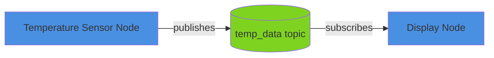

# Implementation Plan: Module 1 (ROS 2) Content Creation

**Branch**: `004-content-module-1` | **Date**: 2025-12-11 | **Spec**: [spec.md](./spec.md)
**Input**: Feature specification from `/specs/004-content-module-1/spec.md`

## Summary

Create comprehensive, beginner-friendly educational content for Module 1 (ROS 2 Fundamentals) consisting of 6 lessons across 3 weeks. Each lesson follows a 5-part structure: (1) Real-World Analogy, (2) Technical Concept, (3) Code Example (Python), (4) Diagram (Mermaid), (5) Hands-on Exercise. Content must be accessible to beginners (8th-grade reading level) while maintaining technical accuracy for ROS 2 Humble.

**Primary Requirement**: Write 6 educational lessons with working code examples, diagrams, and exercises.

**Technical Approach**: Follow the lesson template defined in spec.md, ensuring all code runs on ROS 2 Humble, all diagrams render in Docusaurus, and content meets readability standards.

## Technical Context

**Content Format**: Markdown with frontmatter (Docusaurus-compatible)
**Code Language**: Python 3.10+ (ROS 2 Humble requirement)
**ROS 2 Version**: Humble Hawksbill (LTS)
**Diagram Format**: Mermaid syntax (flowchart, sequence, class diagrams)
**Target Platform**: Docusaurus static site (already deployed)
**Testing Requirements**:
- Code examples must run on ROS 2 Humble without errors
- Mermaid diagrams must render correctly
- Flesch-Kincaid reading level ≤ 8th grade
- Manual beta testing with beginner students

**Project Type**: Content creation (educational textbook)
**Performance Goals**:
- Lesson completion time: 30-45 minutes per lesson
- Exercise completion time: 15-30 minutes per exercise
- Reading time: 10-15 minutes per lesson (theory sections)

**Constraints**:
- Must follow 5-part lesson structure (FR-001)
- All code must be Python 3 (FR-002)
- All diagrams must use Mermaid (FR-003)
- Real-world analogies required (RA-001 to RA-005)
- 8th-grade reading level (WS-002)

**Scale/Scope**:
- 6 lessons (Week 3-5)
- ~3000-4000 words per lesson
- 2-3 code examples per lesson
- 1-2 Mermaid diagrams per lesson
- 1 hands-on exercise per lesson
- Total: ~18,000-24,000 words

## Constitution Check

*GATE: Must pass before Phase 0 research. Re-check after Phase 1 design.*

**Note**: This is a content creation project for an educational textbook. Traditional software development constitution checks (library-first, CLI interface, TDD) do not directly apply. Instead, we follow content-specific quality gates:

### Content Quality Gates

✅ **I. Beginner-First Principle**
- Every lesson starts with real-world analogy before technical content
- No assumptions about prior robotics knowledge
- Progressive disclosure of complexity
- **Status**: Enforced by lesson template structure

✅ **II. Technical Accuracy Principle**
- All code examples tested on ROS 2 Humble
- Best practices demonstrated
- Peer review by ROS 2 experts required
- **Status**: To be validated in Phase 1 (code example creation)

✅ **III. Consistency Principle**
- All lessons follow 5-part structure
- Consistent formatting, terminology, and style
- Template-driven content creation
- **Status**: Enforced by lesson template

✅ **IV. Accessibility Principle**
- 8th-grade reading level (Flesch-Kincaid)
- Diagrams with alt text
- Self-paced learning support
- **Status**: To be validated during content creation

✅ **V. Validation Principle**
- Beta testing with target audience
- Code examples runnable
- Exercises completable independently
- **Status**: To be validated in Phase 2 (validation phase)

## Project Structure

### Documentation (this feature)

```text
specs/004-content-module-1/
├── plan.md              # This file (/sp.plan command output)
├── spec.md              # Feature specification (already created)
├── research.md          # Phase 0 output: Research findings on ROS 2 concepts
├── lesson-outlines.md   # Phase 1 output: Detailed outlines for all 6 lessons
├── code-examples/       # Phase 1 output: Tested Python code examples
│   ├── week3_lesson1_publisher.py
│   ├── week3_lesson1_subscriber.py
│   ├── week3_lesson2_package_example/
│   ├── week4_lesson1_service_example.py
│   ├── week4_lesson1_action_example.py
│   ├── week4_lesson2_custom_interfaces/
│   ├── week5_lesson1_launch_example/
│   └── week5_lesson2_humanoid_arm.urdf
├── diagrams.md          # Phase 1 output: All Mermaid diagrams with captions
└── tasks.md             # Phase 2 output (/sp.tasks command - NOT created by /sp.plan)
```

### Content Output (repository root)

```text
docs/module-1-ros2/
├── intro.md                                    # Module overview (already exists)
├── week-3-lesson-1-ros2-architecture.md       # T001 (to be written)
├── week-3-lesson-2-nodes-packages.md          # T002 (to be written)
├── week-4-lesson-1-services-actions.md        # T003 (to be written)
├── week-4-lesson-2-building-packages.md       # T004 (to be written)
├── week-5-lesson-1-launch-files.md            # T005 (to be written)
├── week-5-lesson-2-urdf-humanoids.md          # T006 (to be written)
└── assessments/
    └── ros2-package-project.md                 # Assessment (already exists)
```

**Structure Decision**: Content-focused structure with lesson files in docs/ and preparation materials in specs/. Code examples developed in specs/004-content-module-1/code-examples/ and embedded in lesson files.

## Complexity Tracking

> This is a content creation project, not a software development project. Traditional complexity violations (e.g., "4th project", "Repository pattern") do not apply. Content-specific complexity is managed through:

| Complexity Factor | Justification | Mitigation Strategy |
|-------------------|---------------|---------------------|
| 5-part lesson structure | Required for consistent beginner experience across all lessons | Template enforcement, quality checklist |
| Real-world analogies | Critical for beginner accessibility (P1 user story) | Analogy validation with beta testers |
| Code example testing | Ensures technical accuracy (success criterion SC-004) | Manual testing on ROS 2 Humble environment |
| Reading level validation | Accessibility requirement (8th grade, WS-002) | Flesch-Kincaid score checking tools |

## Phase 0: Research & Preparation

**Goal**: Gather authoritative ROS 2 information, validate analogies, and prepare detailed lesson outlines.

### Research Tasks

#### R001: ROS 2 Humble Documentation Review
**Objective**: Compile authoritative sources for ROS 2 concepts covered in Module 1.

**Research Questions**:
- What are the official ROS 2 Humble docs for: nodes, topics, services, actions, packages, launch files, URDF?
- What are the recommended Python APIs for each concept?
- What are common beginner mistakes documented in ROS 2 community forums?

**Output**: Annotated bibliography in `research.md` with:
- Official ROS 2 documentation links
- Tutorial references
- Common beginner pitfalls
- Best practices for each lesson topic

---

#### R002: Real-World Analogy Validation
**Objective**: Validate effectiveness of proposed analogies with sample audience.

**Analogies to Validate**:
1. **ROS 2 Nodes** → Restaurant kitchen (chef, sous chef, line cook)
2. **Topics** → Office bulletin boards
3. **Services** → Customer service desk (request-response)
4. **Actions** → Food delivery with tracking
5. **Packages** → Company departments
6. **Launch Files** → Computer startup scripts
7. **URDF** → Robot blueprint/assembly instructions

**Validation Method**:
- Test with 3-5 non-robotics individuals
- Ask: "Does this analogy help you understand [concept]?"
- Collect alternative analogies if original doesn't resonate

**Output**: Analogy validation report in `research.md` with:
- Validated analogies (approved for use)
- Alternative analogies (for concepts that failed validation)
- Notes on cultural considerations

---

#### R003: Code Example Patterns Research
**Objective**: Identify minimal, beginner-friendly code patterns for each ROS 2 concept.

**Research Questions**:
- What's the simplest "Hello World" publisher/subscriber in ROS 2 Humble Python?
- What's the minimal service client/server example?
- What's the minimal action client/server example?
- What package structure is required for colcon build?
- What's the simplest launch file syntax?
- What's a minimal humanoid arm URDF (7-DOF)?

**Output**: Code pattern library in `research.md` with:
- Minimal working examples for each concept
- Explanation of required boilerplate
- Common error messages and solutions

---

#### R004: Mermaid Diagram Best Practices
**Objective**: Establish diagram style guide for consistent visual communication.

**Research Questions**:
- What Mermaid diagram types best represent: ROS graph, message flow, node communication, package structure, robot kinematic tree?
- What color scheme is colorblind-accessible and meets WCAG 2.1 AA?
- What label lengths ensure readability in Docusaurus?

**Output**: Diagram style guide in `research.md` with:
- Approved diagram types for each concept
- Color palette (blue=nodes, green=topics, orange=services, purple=actions)
- Label conventions (1-3 words max)
- Caption format

---

#### R005: Hands-on Exercise Design Patterns
**Objective**: Design exercise templates that are independently completable with clear validation.

**Research Questions**:
- What exercise structure ensures independent completion?
- How to provide validation without giving away the solution?
- What troubleshooting format is most helpful for beginners?

**Output**: Exercise template in `research.md` with:
- Step-by-step instruction format
- Validation criteria (expected output format)
- Common mistakes section template
- Extension ideas format for advanced learners

---

### Research Consolidation

**Output File**: `specs/004-content-module-1/research.md`

**Structure**:
```markdown
# Module 1 Content Research

## ROS 2 Documentation Sources
[R001 output]

## Validated Analogies
[R002 output]

## Code Example Patterns
[R003 output]

## Diagram Style Guide
[R004 output]

## Exercise Design Template
[R005 output]

## Key Decisions
- Decision: [What was chosen]
- Rationale: [Why chosen]
- Alternatives Considered: [What else evaluated]
```

## Phase 1: Content Design & Asset Creation

**Prerequisites**: `research.md` complete with all research tasks validated

**Goal**: Create detailed lesson outlines, code examples, and diagrams ready for integration into lesson files.

### D001: Lesson Outline Creation

**Objective**: Create detailed, section-by-section outlines for all 6 lessons.

**For Each Lesson**:
1. Extract learning objectives from spec.md
2. Draft real-world analogy (100-200 words) using validated analogies from R002
3. Outline technical concept sections with subheadings
4. Specify which code examples to include
5. Specify which diagrams to include
6. Design hands-on exercise with steps and validation criteria

**Output**: `specs/004-content-module-1/lesson-outlines.md`

**Structure**:
```markdown
# Lesson Outlines

## Week 3 Lesson 1: ROS 2 Architecture

### Learning Objectives
- [List from spec]

### 1. Real-World Analogy
[Full analogy text ready for insertion]

### 2. Technical Concept Outline
#### 2.1 What is ROS 2?
[Key points to cover]

#### 2.2 ROS 2 Graph
[Key points to cover]

[... more sections ...]

### 3. Code Examples
- Example 1: Simple publisher (file: week3_lesson1_publisher.py)
  - Purpose: [What it demonstrates]
  - Key concepts: [List]

- Example 2: Simple subscriber (file: week3_lesson1_subscriber.py)
  - Purpose: [What it demonstrates]
  - Key concepts: [List]

### 4. Diagrams
- Diagram 1: ROS 2 Graph (flowchart)
  - Shows: [Elements]
  - Caption: [Caption text]

### 5. Hands-on Exercise
- Objective: [What student builds]
- Steps: [Numbered list]
- Validation: [Expected output]

[... repeat for all 6 lessons ...]
```

---

### D002: Code Example Development

**Objective**: Write, test, and document all Python code examples for Module 1.

**For Each Code Example**:
1. Write minimal, runnable code following patterns from R003
2. Test on ROS 2 Humble environment
3. Add inline comments explaining each significant line
4. Document how to run (command-line instructions)
5. Capture expected output

**Code Examples List** (from spec.md):

**Week 3 Lesson 1**:
- `week3_lesson1_publisher.py` - Simple temperature publisher
- `week3_lesson1_subscriber.py` - Simple temperature subscriber

**Week 3 Lesson 2**:
- `week3_lesson2_package_example/` - Complete ROS 2 package structure

**Week 4 Lesson 1**:
- `week4_lesson1_service_example.py` - Calculator service (client + server)
- `week4_lesson1_action_example.py` - Movement action with feedback

**Week 4 Lesson 2**:
- `week4_lesson2_custom_interfaces/` - Package with custom messages/services

**Week 5 Lesson 1**:
- `week5_lesson1_launch_example/` - Multi-node launch file

**Week 5 Lesson 2**:
- `week5_lesson2_humanoid_arm.urdf` - 7-DOF humanoid arm URDF

**Output**: `specs/004-content-module-1/code-examples/` directory with all code files

**Testing Checklist** (per code example):
- [ ] Code runs without errors on clean ROS 2 Humble install
- [ ] Follows PEP 8 style (run: `flake8 <file>`)
- [ ] Includes header comment explaining purpose
- [ ] Includes inline comments for complex logic
- [ ] Produces expected output (captured in comments)

---

### D003: Mermaid Diagram Creation

**Objective**: Create all Mermaid diagrams with consistent styling and clear captions.

**For Each Diagram**:
1. Follow diagram style guide from R004
2. Use approved color palette
3. Keep complexity low (max 10 elements)
4. Label arrows to show data flow
5. Write descriptive caption

**Diagrams List** (from spec.md):

**Week 3 Lesson 1**:
- ROS 2 Graph showing node communication via topics (flowchart)

**Week 3 Lesson 2**:
- ROS 2 workspace structure (flowchart)
- Package organization (flowchart)

**Week 4 Lesson 1**:
- Service request-response pattern (sequence diagram)
- Action pattern with feedback (sequence diagram)

**Week 4 Lesson 2**:
- Package dependency tree (flowchart)

**Week 5 Lesson 1**:
- Launch file execution flow (flowchart)

**Week 5 Lesson 2**:
- Robot kinematic tree (flowchart)
- Joint hierarchy (flowchart)

**Output**: `specs/004-content-module-1/diagrams.md`

**Structure**:
```markdown
# Mermaid Diagrams

## Week 3 Lesson 1 - Diagram 1: ROS 2 Graph



**Caption**: This diagram shows how two ROS 2 nodes communicate. The Temperature Sensor Node publishes data to the temp_data topic, and the Display Node subscribes to receive that data.

[... all diagrams ...]
```

---

### D004: Hands-on Exercise Detailed Design

**Objective**: Design complete exercises with step-by-step instructions, validation, and troubleshooting.

**For Each Exercise** (6 total):
1. Define clear objective
2. List prerequisites and setup steps
3. Write numbered instructions
4. Specify expected output for validation
5. Document common mistakes and solutions
6. Create extension ideas for advanced learners

**Output**: Embedded in `lesson-outlines.md` (D001)

**Exercise Template**:
```markdown
### Exercise: [Title]

**Objective**: [What student will build]
**Time**: [Estimated minutes]

#### Setup
1. [Setup step 1]
2. [Setup step 2]

#### Instructions
1. [Detailed step 1]
2. [Detailed step 2]
...

#### Validation
Run the following to verify:
```bash
[Command]
```

**Expected Output**:
```
[Sample output]
```

#### Common Mistakes
- **Mistake**: [Common error]
  - **Solution**: [How to fix]

#### Extension Ideas
- [Advanced challenge 1]
- [Advanced challenge 2]
```

---

### D005: Agent Context Update

**Objective**: Update Claude Code context with Module 1 content standards.

**Action**: Run agent context update script (if applicable to content project)

```bash
.specify/scripts/bash/update-agent-context.sh claude
```

**Note**: This step may not apply to content creation. Skip if script is software-focused.

---

## Phase 2: Content Writing & Validation

**Prerequisites**:
- `lesson-outlines.md` complete
- `code-examples/` directory complete with tested code
- `diagrams.md` complete with all Mermaid diagrams

**Goal**: Write complete lesson files and validate against success criteria.

### Phase 2 Tasks (High-Level Overview)

**Note**: Detailed tasks will be generated by `/sp.tasks` command. This section provides overview only.

#### T001: Write Week 3 Lesson 1 - ROS 2 Architecture
- Assemble lesson from outline, code examples, and diagrams
- Follow lesson template from spec.md
- Validate reading level (Flesch-Kincaid)
- Output: `docs/module-1-ros2/week-3-lesson-1-ros2-architecture.md`

#### T002: Write Week 3 Lesson 2 - Nodes and Packages
- Same process as T001
- Output: `docs/module-1-ros2/week-3-lesson-2-nodes-packages.md`

#### T003: Write Week 4 Lesson 1 - Services and Actions
- Same process as T001
- Output: `docs/module-1-ros2/week-4-lesson-1-services-actions.md`

#### T004: Write Week 4 Lesson 2 - Building Packages
- Same process as T001
- Output: `docs/module-1-ros2/week-4-lesson-2-building-packages.md`

#### T005: Write Week 5 Lesson 1 - Launch Files
- Same process as T001
- Output: `docs/module-1-ros2/week-5-lesson-1-launch-files.md`

#### T006: Write Week 5 Lesson 2 - URDF for Humanoids
- Same process as T001
- Output: `docs/module-1-ros2/week-5-lesson-2-urdf-humanoids.md`

#### T007: Content Validation
- Run Flesch-Kincaid readability check on all lessons
- Verify all code examples run on ROS 2 Humble
- Verify all Mermaid diagrams render in Docusaurus
- Beta test with 3-5 beginner students
- Collect feedback and iterate

---

## Success Criteria Validation

### How to Measure Success Criteria from Spec

**SC-001**: 90% of beta testers successfully complete Week 3 Lesson 1 exercise
- **Measurement**: Track completion rate during beta testing (T007)
- **Pass**: 9 out of 10 beta testers complete without help

**SC-002**: Average Flesch-Kincaid reading level ≤ 8th grade
- **Measurement**: Run readability checker on all lessons
- **Tool**: https://readable.com or https://hemingwayapp.com
- **Pass**: Average FK grade level across 6 lessons ≤ 8.0

**SC-003**: 100% of lessons follow 5-part structure
- **Measurement**: Manual checklist review of each lesson
- **Pass**: All 6 lessons have all 5 sections (analogy, concept, code, diagram, exercise)

**SC-004**: 100% of code examples run on ROS 2 Humble
- **Measurement**: Manual testing on clean ROS 2 Humble environment
- **Pass**: All code examples execute without errors

**SC-005**: All diagrams render correctly in Docusaurus
- **Measurement**: Build Docusaurus site and verify visual rendering
- **Command**: `npm run build && npm run serve`
- **Pass**: All Mermaid diagrams display correctly

**SC-006**: 85% student satisfaction ("well" or "very well")
- **Measurement**: Post-lesson survey during beta testing
- **Pass**: ≥85% of beta testers rate understanding as "well" or "very well"

**SC-007**: Average completion time matches estimate ± 20%
- **Measurement**: Track time during beta testing
- **Pass**: If estimate is 40 min, actual should be 32-48 min

**SC-008**: Zero broken code examples in first month
- **Measurement**: Issue tracker monitoring post-publication
- **Pass**: No bug reports about code examples for 30 days

---

## Quality Checklist (Per Lesson)

Before marking a lesson as complete, verify:

- [ ] **Structure**: Follows 5-part template (analogy, concept, code, diagram, exercise)
- [ ] **Frontmatter**: Includes title, sidebar_label, sidebar_position, description, tags
- [ ] **Learning Objectives**: Listed at beginning (3-5 clear objectives)
- [ ] **Real-World Analogy**: 100-200 words, universally understandable, explicit connection
- [ ] **Technical Concept**: Broken into subheadings, progressive complexity
- [ ] **Code Examples**:
  - [ ] Python 3, PEP 8 compliant
  - [ ] Header comment explaining purpose
  - [ ] Inline comments for complex logic
  - [ ] Run instructions provided
  - [ ] Expected output shown
  - [ ] Tested on ROS 2 Humble (passes without errors)
- [ ] **Diagrams**:
  - [ ] Mermaid syntax
  - [ ] Uses approved color palette
  - [ ] ≤10 elements
  - [ ] Labeled arrows
  - [ ] Descriptive caption
  - [ ] Renders correctly in Docusaurus
- [ ] **Hands-on Exercise**:
  - [ ] Clear objective
  - [ ] Estimated time
  - [ ] Setup instructions
  - [ ] Numbered steps
  - [ ] Expected output for validation
  - [ ] Common mistakes section
  - [ ] Extension ideas for advanced learners
- [ ] **Check Your Understanding**: 3+ questions with collapsible answers
- [ ] **Additional Resources**: Links to ROS 2 docs, related tutorials
- [ ] **Navigation**: Link to next lesson
- [ ] **Reading Level**: Flesch-Kincaid ≤ 8th grade
- [ ] **Accessibility**: Alt text on diagrams, WCAG 2.1 AA color contrast
- [ ] **Cross-references**: All internal links valid

---

## Risk Analysis & Mitigation

### Risk 1: Code Examples Fail on ROS 2 Humble
**Probability**: Medium | **Impact**: High | **Blast Radius**: Lesson unusable

**Mitigation**:
- Test all code in isolated ROS 2 Humble Docker container
- Document exact dependencies (rosdep, package.xml)
- Include troubleshooting for common environment issues
- **Kill Switch**: Provide working Docker environment with code pre-installed

---

### Risk 2: Analogies Confuse Rather Than Clarify
**Probability**: Medium | **Impact**: Medium | **Blast Radius**: Single lesson accessibility

**Mitigation**:
- Validate analogies with non-robotics individuals (R002)
- Provide escape hatch: "If this analogy doesn't help, here's the technical definition..."
- Include alternative explanation paths for different learning styles
- **Guardrail**: Beta testing with 5+ beginners, iterate based on feedback

---

### Risk 3: Content Becomes Outdated (ROS 2 Updates)
**Probability**: Low (using LTS) | **Impact**: Medium | **Blast Radius**: Specific code examples

**Mitigation**:
- Use ROS 2 Humble (LTS until 2027)
- Mark version-specific code with comments: `# ROS 2 Humble specific`
- Use evergreen analogies that remain valid across versions
- **Guardrail**: Quarterly review cycle, version compatibility matrix

---

### Risk 4: Reading Level Too High (Accessibility Failure)
**Probability**: Medium | **Impact**: High | **Blast Radius**: All lessons

**Mitigation**:
- Check Flesch-Kincaid score during writing (not at end)
- Use Hemingway Editor for real-time feedback
- Peer review by non-technical reader
- **Kill Switch**: Simplify complex sentences, add glossary links

---

### Risk 5: Exercise Difficulty Mismatch
**Probability**: High | **Impact**: Medium | **Blast Radius**: Student frustration, low completion

**Mitigation**:
- Provide multiple difficulty levels (basic + extensions)
- Include expected completion time
- Extensive beta testing with target audience
- Common mistakes section addresses 80% of issues
- **Guardrail**: If beta completion rate <70%, redesign exercise

---

## Dependencies & Prerequisites

### Tools Required
- **ROS 2 Humble**: For code example testing
- **Python 3.10+**: For code development
- **Docusaurus**: For Mermaid rendering preview
- **Readability Checker**: Flesch-Kincaid scoring (Hemingway App or readable.com)
- **PEP 8 Linter**: `flake8` or `black`

### Knowledge Prerequisites
- Understanding of ROS 2 architecture
- Python programming proficiency
- Technical writing skills
- Instructional design basics

### External Dependencies
- ROS 2 official documentation (docs.ros.org)
- ROS 2 community forums (answers.ros.org)
- Mermaid documentation (mermaid.js.org)

---

## Architectural Decisions

### AD001: 5-Part Lesson Structure
**Decision**: Use consistent 5-part structure for all lessons

**Rationale**:
- Provides predictable learning flow
- Accommodates multiple learning styles (visual, hands-on, theoretical)
- Meets spec requirement FR-001

**Alternatives Considered**:
- Traditional textbook format (theory → examples)
  - Rejected: Less engaging for beginners
- Tutorial-only format (just code)
  - Rejected: Insufficient conceptual foundation

**Impact**: All 6 lessons must follow template rigidly

---

### AD002: Python-Only Code Examples
**Decision**: Use Python exclusively for code examples (no C++)

**Rationale**:
- Lower barrier to entry for beginners
- Cleaner syntax, easier to understand
- ROS 2 Python API is mature and well-documented
- Meets spec requirement FR-002

**Alternatives Considered**:
- Python + C++ for comparison
  - Rejected: Adds complexity, longer lessons
- C++ only (traditional ROS)
  - Rejected: Too difficult for beginners

**Impact**: Advanced learners may want C++ examples (addressed via "Extension Ideas")

---

### AD003: Mermaid for Diagrams
**Decision**: Use Mermaid syntax for all diagrams (no external image files)

**Rationale**:
- Version-controlled (text-based)
- Consistent styling
- Easy to update
- Renders natively in Docusaurus
- Meets spec requirement FR-003

**Alternatives Considered**:
- Draw.io / Excalidraw images
  - Rejected: Not version-controlled, harder to maintain
- ASCII art
  - Rejected: Limited visual appeal, accessibility issues

**Impact**: Diagrams are limited to Mermaid capabilities (sufficient for ROS 2 concepts)

---

### AD004: Real-World Analogies Required
**Decision**: Every lesson must start with real-world analogy

**Rationale**:
- Critical for beginner accessibility (P1 user story)
- Provides mental model before technical details
- Validated approach in instructional design
- Meets spec requirement RA-001

**Alternatives Considered**:
- Optional analogies
  - Rejected: Inconsistent experience, beginners may skip
- Technical-first approach
  - Rejected: Alienates beginners without robotics background

**Impact**: Analogies must be culturally universal and validated (R002 research task)

---

## Next Steps

1. **Phase 0**: Execute research tasks (R001-R005) to create `research.md`
2. **Phase 1**: Execute design tasks (D001-D005) to create outlines, code, and diagrams
3. **Phase 2**: Run `/sp.tasks` command to generate detailed task breakdown for content writing
4. **Implementation**: Execute tasks T001-T007 to write and validate lessons
5. **Publication**: Merge to main branch, deploy to Docusaurus site

---

## Appendix: Lesson Template Reference

**Location**: `specs/004-content-module-1/spec.md` (lines 363-445)

**Quick Reference** (sections required per lesson):
1. Frontmatter (YAML)
2. Title + Metadata (time, prerequisites)
3. Learning Objectives (3-5 bullets)
4. Real-World Analogy (100-200 words + explicit connection)
5. Technical Concept (subheadings, progressive complexity)
6. Code Example (Python, commented, with run instructions)
7. Diagram (Mermaid, with caption)
8. Hands-on Exercise (objective, steps, validation, troubleshooting, extensions)
9. Check Your Understanding (3+ questions, collapsible answers)
10. Additional Resources (links)
11. Next Lesson (navigation)

---

**Plan Complete**: Ready for Phase 0 research execution.

**Created**: 2025-12-11
**Author**: Claude (Sonnet 4.5)
**Status**: Draft - Awaiting research phase execution
